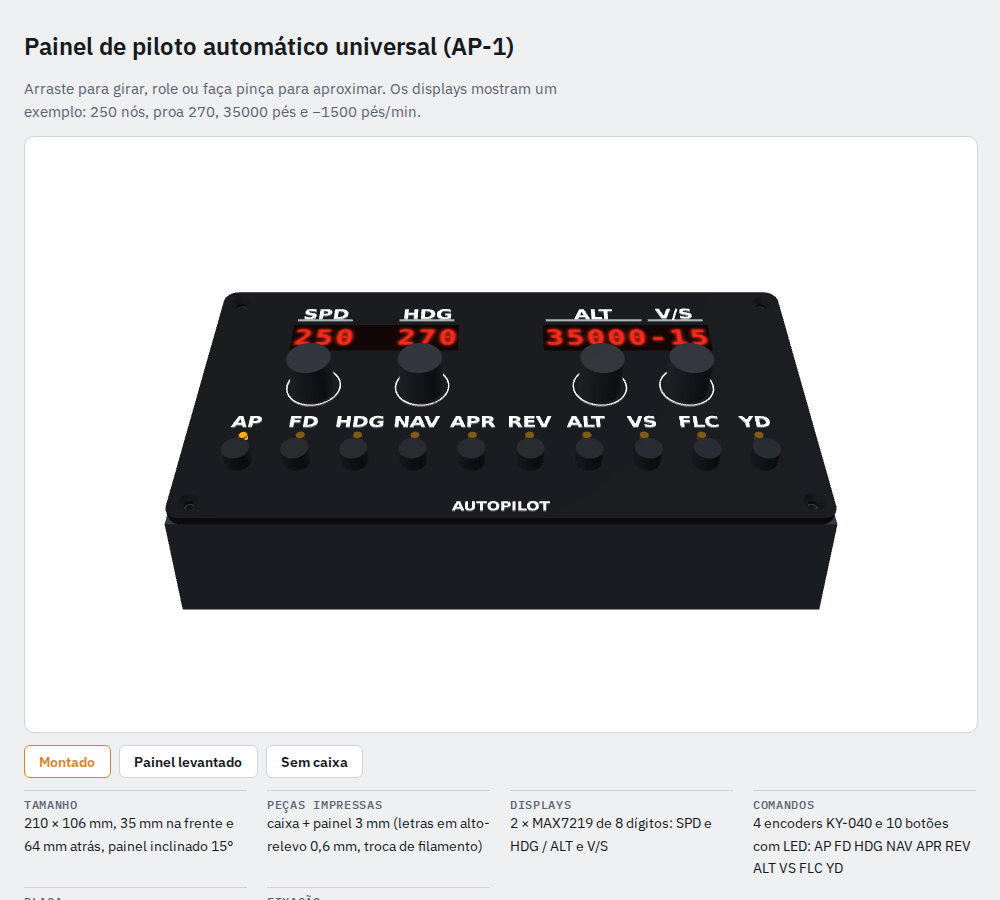

# Painel de piloto automático universal (AP-1)

Painel USB para Microsoft Flight Simulator 2020/2024 (e X-Plane) feito com impressão 3D e o programa gratuito
**MobiFlight** (Windows). Não precisa escrever código: o MobiFlight grava o firmware no Arduino e a configuração é
feita clicando.

- **Displays:** 2 × MAX7219 de 8 dígitos. Display 1 mostra SPD (3 dígitos à esquerda) e HDG (3 à direita).
  Display 2 mostra ALT (5 à esquerda) e V/S em centenas (3 à direita: "-15" = −1500 pés/min).
- **Botões giratórios:** 4 encoders KY-040 (SPD, HDG, ALT, V/S). Apertar o de HDG alinha a proa com a do avião;
  apertar o de V/S zera a razão.
- **Botões:** 10, cada um com LED que acende quando o modo está ligado: AP, FD, HDG, NAV, APR, REV, ALT, VS, FLC, YD.
- **Tamanho:** 210 × 106 mm de base, 35 mm na frente, 64 mm atrás, painel inclinado 15°.

## Peças compradas

Preços vistos em 09/10/2026 (pesquisa "Top 10 com preços reais" + LED conferido hoje):

| Peça | Qtd | R$ unit. | Loja |
|---|---|---|---|
| Arduino Mega 2560 R3 compatível + cabo USB | 1 | 169,90 | [Autocore](https://www.autocorerobotica.com.br/produto/arduino-mega-2560-r3-compativel-cabo-usb.html) |
| Display 7 segmentos 8 dígitos MAX7219 | 2 | 17,91 | [Autocore](https://www.autocorerobotica.com.br/modulo-display-de-7-segmentos-8-digitos-max7219) |
| Encoder rotativo KY-040 | 4 | 9,12 (Pix) | [Usinainfo](https://www.usinainfo.com.br/modulo-potenciometro/modulo-encoder-360-sem-limite-ky-040-5604.html) |
| Knob estriado 6 mm | 4 | 1,00 | [Autocore](https://www.autocorerobotica.com.br/knob-para-potenciometro-estriado-6mm-branco) |
| Push button PBS-102/104 | 10 | 1,76 (Pix) | [Usinainfo](https://www.usinainfo.com.br/interruptores-e-pulsadores/chave-push-button-pbs-102-104-preta-na-1a-6218.html) |
| LED difuso amarelo 3 mm | 10 | 0,20 | [Curto Circuito](https://curtocircuito.com.br/led-difuso-amarelo-3mm.html) |
| Resistor 330 Ω (kit 10) | 1 | 2,21 | [Usinainfo](https://www.usinainfo.com.br/resistor-14-watt/resistor-330r-14w-kit-com-10-unidades-2977.html) |
| Jumper macho-fêmea 20 cm (kit 20) | 3 | 5,79 (Pix) | [Usinainfo](https://www.usinainfo.com.br/jumper/jumper-premium-para-protoboard-macho-femea-20cm-kit-c-20-pecas-2314.html) |
| **Soma das peças** | | **285,38** | |

**Filamento:** o volume das peças é 192 cm³ (caixa 130, painel 62, letras 0,4). Mesmo 100 % sólido daria 244 g de
PETG, ou R$ 24,38 a R$ 99,90/kg ([Autocore](https://www.autocorerobotica.com.br/filamento-petg-masterprint-1kg-1-75mm-preto)).
Total no pior caso: **R$ 309,76**. Confira o peso real no fatiador.

**Sem preço conferido:** 4 parafusos M3 × 10 cabeça chata (painel), 6 parafusos M3 × 6 (Arduino), 4 pés de
borracha adesivos de 10 mm, um pouco de fio fino e cola quente.

## Peças impressas (`stl/`)

| Arquivo | Material | Como imprimir |
|---|---|---|
| `caixa.stl` | PETG ou PLA, qualquer cor | Fundo na mesa, sem suporte. Parede 2,4 mm, 3 perímetros, 15–20 % de preenchimento. |
| `painel.stl` + `letras.stl` | **preto** + **branco** (ou bronze) | Carregue os dois arquivos juntos no fatiador como **um objeto só** (as letras ficam em cima do painel). Face de cima para cima, sem suporte. Troque o filamento na altura **3,0 mm** (camada 0,2: depois da 15ª camada). |

A fonte do desenho é `cad/painel.scad` (OpenSCAD): `part = "painel" | "letras" | "caixa" | "montagem" | "explodida"`.
**Antes de imprimir, meça seus displays e encoders**: a janela do display é 61 × 14 mm e os furos são 7,4 mm
(encoder), 7,2 mm (botão) e 3,1 mm (LED). Se as suas peças forem diferentes, mude no início do arquivo.

## Ligações (Arduino Mega)

| O quê | Pinos do Mega |
|---|---|
| Displays MAX7219 (em cadeia: DOUT do 1º → DIN do 2º) | DIN **2**, CS **3**, CLK **4**, VCC 5V, GND |
| Encoder SPD (CLK, DT, SW) | **22, 23, 24** |
| Encoder HDG | **25, 26, 27** |
| Encoder ALT | **28, 29, 30** |
| Encoder V/S | **31, 32, 33** |
| Botões AP, FD, HDG, NAV, APR, REV, ALT, VS, FLC, YD | **34 a 43** (nessa ordem), o outro lado no GND |
| LEDs dos mesmos botões | **44 a 53** (nessa ordem) → resistor 330 Ω → perna longa do LED; perna curta no GND |

Encoders: "+" no 5V e GND no GND. Todos os GND podem ser ligados em cadeia (um fio passando de botão em botão).
Os jumpers vão na placa e nos módulos; nos botões e LEDs, corte o jumper e solde.

## Montagem

1. Encaixe os botões (porca por baixo) e os encoders (porca por cima, depois o knob) no painel.
2. Cole os LEDs nos furos de 3 mm com uma gota de cola quente por baixo.
3. Cole os displays por baixo das janelas com cola quente nas pontas da placa (os dígitos virados para a janela;
   o display 1, SPD/HDG, fica à esquerda).
4. Parafuse o Mega nos 6 apoios do fundo, com a entrada USB-B no furo da lateral esquerda.
5. Faça as ligações da tabela acima, feche o painel com os 4 parafusos M3 e cole os pés de borracha.

## Configuração do MobiFlight (MSFS 2020/2024)

1. Instale o MobiFlight Connector ([mobiflight.com](https://www.mobiflight.com)), ligue o Mega na USB e aceite
   gravar o firmware MobiFlight quando ele perguntar.
2. Em **Extras → Settings → MobiFlight Modules**, adicione os dispositivos com os pinos da tabela:
   1 **LED Module** (MAX7219, 2 módulos em cadeia), 4 **Encoder**, 14 **Button** (os 10 botões + os botões dos 4
   encoders) e 10 **Output** (LEDs). Clique em **Upload**.
3. Na aba **Input**, crie uma linha por comando. Em "Action type" escolha **MSFS2020 - Custom Input** e cole o código:

| Comando | Código |
|---|---|
| SPD girar direita / esquerda | `(>K:AP_SPD_VAR_INC)` / `(>K:AP_SPD_VAR_DEC)` |
| HDG girar | `(>K:HEADING_BUG_INC)` / `(>K:HEADING_BUG_DEC)` |
| HDG apertar (alinha a proa) | `(A:PLANE HEADING DEGREES MAGNETIC, degrees) (>K:HEADING_BUG_SET)` |
| ALT girar | `(>K:AP_ALT_VAR_INC)` / `(>K:AP_ALT_VAR_DEC)` |
| V/S girar | `(>K:AP_VS_VAR_INC)` / `(>K:AP_VS_VAR_DEC)` |
| V/S apertar (zera) | `0 (>K:AP_VS_VAR_SET_ENGLISH)` |
| AP, FD, HDG, NAV | `(>K:AP_MASTER)`, `(>K:TOGGLE_FLIGHT_DIRECTOR)`, `(>K:AP_PANEL_HEADING_HOLD)`, `(>K:AP_NAV1_HOLD)` |
| APR, REV, ALT, VS | `(>K:AP_APR_HOLD)`, `(>K:AP_BC_HOLD)`, `(>K:AP_ALT_HOLD)`, `(>K:AP_PANEL_VS_HOLD)` |
| FLC, YD | `(>K:FLIGHT_LEVEL_CHANGE)`, `(>K:YAW_DAMPER_TOGGLE)` |

4. Na aba **Output**, crie uma linha por display e por LED, com **MSFS2020 - Custom Output** (Sim Variable):

| Saída | Variável | Onde mostrar |
|---|---|---|
| SPD | `(A:AUTOPILOT AIRSPEED HOLD VAR, knots)` | Display 1, 3 dígitos da esquerda |
| HDG | `(A:AUTOPILOT HEADING LOCK DIR, degrees)` | Display 1, 3 dígitos da direita, zeros à esquerda |
| ALT | `(A:AUTOPILOT ALTITUDE LOCK VAR, feet)` | Display 2, 5 dígitos da esquerda |
| V/S | `(A:AUTOPILOT VERTICAL HOLD VAR, feet per minute) 100 / near` | Display 2, 3 dígitos da direita |
| LEDs | `(A:AUTOPILOT MASTER, bool)`, `(A:AUTOPILOT FLIGHT DIRECTOR ACTIVE, bool)`, `(A:AUTOPILOT HEADING LOCK, bool)`, `(A:AUTOPILOT NAV1 LOCK, bool)`, `(A:AUTOPILOT APPROACH HOLD, bool)`, `(A:AUTOPILOT BACKCOURSE HOLD, bool)`, `(A:AUTOPILOT ALTITUDE LOCK, bool)`, `(A:AUTOPILOT VERTICAL HOLD, bool)`, `(A:AUTOPILOT FLIGHT LEVEL CHANGE, bool)`, `(A:AUTOPILOT YAW DAMPER, bool)` | Output do LED correspondente |

5. Salve a configuração (arquivo `.mcc`) e clique em **Run** com o simulador aberto.

Esses códigos usam o piloto automático padrão do simulador: funcionam com os aviões de fábrica e a maioria dos
gratuitos. Aviões avançados (Fenix, PMDG, FlyByWire) usam comandos próprios: procure o avião no
[HubHop](https://hubhop.mobiflight.com) e troque só o código da linha. No X-Plane, o MobiFlight usa "datarefs" no
lugar dessas variáveis (também listados no HubHop).

Se um encoder pular ou contar dobrado, troque o "Encoder type" dele no passo 2.

**Não testado:** não há um painel montado; a configuração foi escrita a partir da documentação do MobiFlight e do
SDK do MSFS, sem rodar no simulador. Não existe ainda um arquivo `.mcc` pronto porque ele precisaria ser gerado e
testado no próprio MobiFlight.
