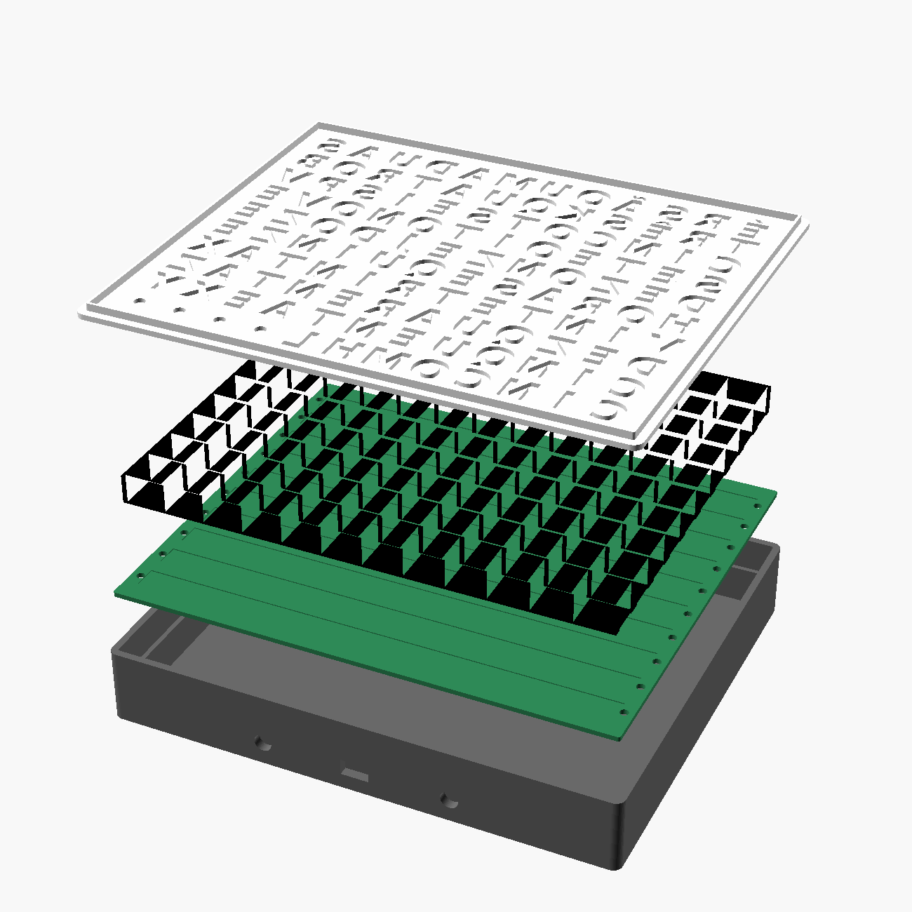

# Relógio de palavras em português

Mostra a hora por extenso, no jeito digital: **"SÃO DUAS E QUARENTA E CINCO"**. Anda de 5 em 5 minutos; os 4 pontos
da última linha contam os minutos de 1 a 4. Sem Wi-Fi e sem Bluetooth (não precisa de Anatel), alimentado por USB 5 V.


## A grade (12 × 10 = 120 letras, uma LED em cada)

```
É R S Ã O U M A D U A S
T R Ê S K Q U A T R O B
C I N C O T S E I S P V
S E T E O I T O N O V E
D E Z O N Z E J D O Z E
H O R A S E Q U I N Z E
V I N T E T R I N T A X
D E Z Q U A R E N T A Z
C I N Q U E N T A E X Y
C I N C O M H L · · · ·
```

Exemplos: "É UMA HORA", "SÃO DUAS HORAS", "É UMA E DEZ", "SÃO TRÊS E VINTE E CINCO", "SÃO DOZE E TRINTA".
A grade usa exatamente 2 m de fita de 60 LEDs/m, cortada em 10 pedaços de 12 LEDs. O passo da fita (16,67 mm)
define o tamanho: frente de **218 × 185 mm** (cabe numa mesa de 220 × 220), 32 mm de espessura.

## Peças compradas

Preços vistos em 09/10/2026 (pesquisa "Top 10 com preços reais"):

| Peça | Qtd | R$ | Loja |
|---|---|---|---|
| Fita WS2812B 1 m, 60 LEDs | 2 | 59,90 cada | [RoboCore](https://www.robocore.net/led/fita-de-led-rgb-ws2812-5050-1m) |
| Módulo RTC DS3231 (com bateria CR2032) | 1 | 21,00 | [Curto Circuito](https://curtocircuito.com.br/modulo-real-time-clock-rtc-ds3231.html) |
| Arduino Nano V3 USB-C | 1 | 29,60 | [Usinainfo](https://www.usinainfo.com.br/placas-arduino-compativel/placa-nano-v3-compativel-arduino-com-usb-c-5v-16mhz-ch340c-8732.html) |
| Capacitor 1000 µF 16 V | 1 | 2,04 | [Usinainfo](https://www.usinainfo.com.br/capacitor-eletrolitico/capacitor-eletrolitico-1000uf-16v-3052.html) |
| Resistor 330 Ω (kit 10) | 1 | 2,21 | [Usinainfo](https://www.usinainfo.com.br/resistor-14-watt/resistor-330r-14w-kit-com-10-unidades-2977.html) |
| Botão 12 × 12 mm | 2 | 1,19 cada | [Usinainfo](https://www.usinainfo.com.br/push-buttons/push-button-chave-tactil-12x12x4-para-projetos-2985.html) |
| Fonte USB 2 A com cabo USB-C | 1 | 25,50 | [Usinainfo](https://www.usinainfo.com.br/fonte-chaveada-usb-e-p4/carregador-fonte-usb-2a-com-cabo-usb-c-para-arduino-e-esp32-8591.html) |
| **Soma** | | **202,53** | (177,03 sem a fonte) |

Sem preço conferido: LDR + resistor de 10 kΩ (opcional, brilho automático), fios finos, 4 parafusos M3 × 8 (opcional),
filamento. Volume das peças impressas no modelo: 378 cm³ no total (seria ~480 g se fosse 100% sólido; com 3 paredes
e 15 % de preenchimento sai bem menos, confira o peso no fatiador).

## Peças impressas (`stl/`)

| Arquivo | Material | Como imprimir |
|---|---|---|
| `frente.stl` | PETG ou PLA **branco** até 0,6 mm, depois **preto** | Já está espelhada: imprima como está, face lisa na mesa. Pause/troque o filamento na altura **0,6 mm** (3 camadas de 0,2). O branco vira o difusor; o preto, a máscara com as letras vazadas. Camada 0,2, 100 % nas 3 primeiras camadas. |
| `grade.stl` | **preto** (opaco) | Colmeia de 120 células, 12 mm de altura, impede a luz de vazar para a letra vizinha. Sem suporte. |
| `placa_leds.stl` | qualquer | Placa onde se colam as 10 tiras; tem marcas para alinhar e furos nas pontas para os fios. |
| `caixa.stl` | qualquer (preto fica bonito) | Fundo na mesa, sem suporte. Furos para USB-C, 2 botões, LDR e 2 fechaduras para pendurar. |

A fonte do desenho é `cad/relogio.scad` (OpenSCAD): `part = "frente" | "grade" | "placa_leds" | "caixa" | "explodida"`.



## Montagem

1. **Corte a fita** em 10 pedaços de 12 LEDs (corte só sobre a linha com os 3 contatos cobreados).
2. **Cole as tiras** na `placa_leds`, uma em cada marca, **todas com a seta de dados no zigue-zague**: linha 0 (de
   cima) da esquerda para a direita *olhando de frente*, linha 1 da direita para a esquerda, e assim por diante.
   Atenção: a placa é vista de frente quando você cola; a seta tem que seguir o sentido de leitura na linha 0.
3. **Solde os 3 fios** (5 V, DIN→DOUT, GND) entre o fim de uma linha e o começo da próxima, passando pelos furos.
4. **Ligações:** D6 → resistor 330 Ω → DIN da linha 0. 5 V e GND da fita direto no 5V/GND do Nano, com o
   capacitor de 1000 µF entre 5 V e GND na entrada da fita (perna "−" no GND). DS3231: VCC→5V, GND, SDA→A4, SCL→A5.
   Botões: D2 (hora) e D3 (minuto), o outro lado de cada um no GND. LDR (opcional): entre 5 V e A0, com 10 kΩ de A0 ao GND.
5. Prenda o Nano com o USB-C alinhado ao furo da caixa (fita dupla face ou cola quente), os botões nos furos de baixo e
   o LDR no furo de cima.
6. Encaixe a `placa_leds` no degrau da caixa, a `grade` por cima (os canais de baixo passam sobre as tiras) e
   a `frente` por último (a aba entra na caixa; 2 pingos de cola se quiser fixar).

## Programa (`firmware/relogio_palavras/relogio_palavras.ino`)

Arduino IDE → instale as bibliotecas **FastLED** e **RTClib** (Adafruit) → placa "Arduino Nano" (processador
ATmega328P, se não gravar tente "Old Bootloader"). Na primeira gravação o relógio pega a hora do computador.

- Botão de baixo da esquerda (D2): +1 hora. Da direita (D3): +1 minuto.
- Brilho automático pelo LDR (mude `USA_LDR` para `false` se não usar).
- **Limite de corrente em 1,5 A** (`LIMITE_MA`): a fita toda acesa puxaria ~7 A, mais do que a USB aguenta.
  Não aumente acima do que a fonte fornece.
- Se as letras acenderem embaralhadas, a fita começou do outro lado: troque `COMECA_DIREITA` para `true`.
- Se o DS3231 não for encontrado, o "É" pisca em vermelho.

## Por que é um bom produto

Na pesquisa de 09/10/2026 não apareceu nenhum relógio de palavras em português à venda no Brasil. O importado mais
barato (Stiles, em inglês) estava a R$ 274,76 na Amazon.
