# UMEH-2 — Engineering design report (40–60 mm drivers)

Universal Modular Ear-mounted Headphone, second design iteration. Scope: dynamic drivers of **40, 45, 50, 55 and 60 mm only**; nothing above 60 mm is designed or claimed.

Every number in this report is written by `calc/make_report.py` from `results/*.json`, which `calc/run_all.py`, `calc/legs_liner.py`, `calc/tune_eye.py`, `calc/shakedown.py` and `calc/sweeps.py` compute. The CAD (`cad/umeh2.scad`) reads `cad/generated_params.scad` / `cad/params_<D>.scad`, which the same calculation writes, and the mass properties are integrated over the meshes that CAD exports — so the printed geometry is the calculated geometry, and the calculated masses are those of that geometry at the stated densities and fill factors (a printed part will scatter around them; weigh the first print). Re-run: `cd calc && python3 legs_liner.py && python3 tune_eye.py && python3 run_all.py && python3 shakedown.py && python3 sweeps.py && python3 figures.py && python3 build_stl.py && python3 bom.py && python3 make_report.py`.

**What was NOT done, stated up front:** no finite-element analysis (structural or acoustic), no boundary-element analysis and no physical test was run. Structure is closed-form beam, joint and contact theory with Peterson stress-concentration factors; the ear attachment is a 6-DOF rigid-body model with elastic arms on compliant unilateral frictional contacts, solved by incremental energy minimisation without linearising the contact or friction laws (§6); acoustics is a lumped electro-mechano-acoustic model with exact baffled-piston radiation. §21 lists exactly where FEA/BEM or a test is needed. Driver Thiele/Small parameters, tissue properties and friction coefficients are literature ranges or assumptions and are tagged as such everywhere. Full precision is kept in the calculation; only final dimensions are rounded (§3 gives each rounding and its justification).

## Source tags

| tag | meaning |
|---|---|
| STD | standard / handbook value (ISO, ASTM, Shigley, Peterson, Roark) |
| DS | typical manufacturer datasheet (generic grade — your spool/part may differ) |
| LIT | published test literature, approximate range |
| A | engineering assumption — no reliable data; chosen conservatively; replace by measurement |
| C | calculated in this report |
| CAD | measured on the CAD mesh (exact volume integration) |
| E | estimate (order of magnitude, stated method) |
| EMP | empirical relation (e.g. Gent E(Shore), Findley creep, nut factor) |
| SIM | simulated — none: no FEA/BEM was run (§21) |
| M | measured — none yet; the test plan in §22 produces them |

## 1. Summary

Final design, per driver size (driver masses and geometry are placeholders [A] until measured):

| driver | mass/side g [CAD+DS] | COM off skin mm [C] | normal-use criteria [C] | auricle-root p in use kPa (≤ 4) [C] | static μ demand / μ design [C] | 2 g: % combos released | 3 g: % | 5 g: % | 5 g onset λ min | 10 N handling min SF | 5 g envelope min SF | max driver g: normal (1 g grid) | max driver g: dynamic (≤ 10 % released) | max driver g: max design |
|---|---|---|---|---|---|---|---|---|---|---|---|---|---|---|
| 40 mm | 156 | 29.6 | PASS | 18.0 | 0.846 | 1.94 | 35.4 | 96.8 | 0.0625 | 1.72 | 1.87 | 27.7 | 27.7 | 126.0 |
| 45 mm | 163 | 30.4 | PASS | 18.4 | 0.785 | 1.26 | 33.4 | 96.7 | 0.0625 | 1.72 | 1.79 | 34.4 | 34.4 | 122.9 |
| 50 mm | 173 | 31.3 | PASS | 19.4 | 0.799 | 1.42 | 34.9 | 96.7 | 0.0625 | 1.72 | 1.58 | 31.8 | 31.8 | 84.6 |
| 55 mm | 182 | 32.2 | PASS | 20.5 | 0.848 | 2.08 | 37.9 | 96.7 | 0.0625 | 1.72 | 1.40 | 41.2 | 41.2 | 54.9 |
| 60 mm | 190 | 33.0 | PASS | 21.4 | 0.874 | 2.52 | 39.7 | 96.7 | 0.0625 | 1.72 | 1.44 | 45.2 | 45.2 | 109.2 |

Definitions: *normal-use criteria* = all pads loaded at rest, sustained skin and auricle-root pressure ≤ 4 kPa as donned (A), static friction demand ≤ design μ, the 1 g grid, its dense check and the local refinement without gross slip, with the tripod kept and tilt ≤ 2° (§8), and the link wire within its criteria on the module (§11). *Max driver g*: 'normal' = the static criteria + the 1 g grid, 'dynamic' = that + the 2 g set, 'max design' = static hold + the 5 g structural envelope (§10); the dense check and its refinement run at the nominal driver only. *Released* = no bounded equilibrium within 3 mm / 5° (gross slip). *Onset λ* = fraction of the 5 g load increment at which gross slip begins (§12). *Handling* = 10 N at one pad in any of 302 directions (§12). *Auricle-root p in use* = after the head-motion shakedown of the 1 g set (§6), the sustained state once the headphone is worn. Required SF ≥ γM = 1.6.

Headline findings (each is derived in the section named):

1. **Design B could not stay on the head** (§4, §6): static hold **FAIL**, 1 g released 89.5 % — the link eye on the mastoid pad puts the preload through the lowest contact, so nothing resists the tipping moment of the COM; Design A (UMEH-1 mass) is worse.
2. **Normal use (static + the 1 g grid, its dense check and the local refinement) passes for 40, 45, 50, 55, 60 mm** (all five sizes) with an eye position per module and a common link preload of 5.00 N tuned together (§7). The first Final, tuned on a quasi-uniform 1 g sample at 4.20 N, fails the 1 g grid at 5 of 5 modules (§4 change 19, §8).
3. **In use the auricle root carries the weight — the sustained root-pressure target is NOT met** (§6): the pads micro-slip under normal head motion and hand the side's weight to the saddle; after that shakedown the root carries 18.0–21.4 kPa (4.50–5.35 × 4 kPa), against 2.96–3.61 kPa as donned. None of the levers studied (pad friction, preload, root bearing area, liner, arms, eye position) meets it at 60 mm; the 60 mm side would have to weigh ≤ 60.3 g. This is the limit of an ear-mounted cradle at this mass. Wear trials must measure it first (§22).
4. **Ear-mounted retention has a hard physical limit above 1 g** (§8, §10): under the 2 g set 1.26–2.52 % of the combinations release; the head-motion cases with the most releases are roll (tilt) alpha 94.7 %, yaw (turn) alpha 4.99 %, pitch (nod) alpha 0.217 % of all 2 g releases. The strict 'no 2 g combination may slip' condition fails even with a massless driver (40, 45, 50, 55, 60 mm). The released fractions are reported, not hidden. After a release the cradle still surrounds the pinna and hangs on the link; that catch is not modelled (§22), so no retention credit is taken for it.
5. **Structure:** the governing structural load is the 5 g onset envelope (lowest SF 1.40, §12); the 10 N handling load at one pad gives SF 1.72.
6. **Joints:** serrations carry the radial load, wave washers keep the clamp after the PETG creeps, and the cable anchor keeps M3 inserts (SF 1.16 at the highest cable load, §13, §14); M2.5 inserts would reach SF 0.699 there (§5, W1b).
7. **Driver mass range** (§10), normal use: 40 mm 0.0–27.7 g, 45 mm 0.0–34.4 g, 50 mm 0.0–31.8 g, 55 mm 0.0–41.2 g, 60 mm 0.0–45.2 g; maximum design condition: 40 mm 0.0–126.0 (interior point fails!) g, 45 mm 0.0–122.9 (interior point fails!) g, 50 mm 0.0–84.6 (interior point fails!) g, 55 mm 0.0–54.9 g, 60 mm 0.0–109.2 (interior point fails!) g.
8. **Limiting components** (§19): retention friction under 2 g and above (released fractions, not a utilisation); then, by utilisation (demand / allowed): auricle-root pressure in use, after the head-motion shakedown (60 mm) — arch zones: 5.35 (≤ 4.00 kPa sustained; NOT met (§6)); root pressure if hung on the ear before clamping (donning B, 60 mm) — arch zones: 4.65 (≤ 4.00 kPa sustained (as donned); not met → clamp-first donning (A) is the instruction); arm section, 5 g onset envelope, 40 °C — 55 mm, mastoid: bar at clamp edge (slot end) (vM): 1.14 (SF ≥ γM 1.60); arm section, fatigue 1e7 cycles (2 g held envelope, zero-to-peak) — 60 mm, mastoid: bar at clamp edge (slot end): 0.938.

## 2. Inputs and assumptions

### 2.1 Materials

| material | property | value (SI) | tag | note |
|---|---|---|---|---|
| PETG | rho | 1270 | DS | bulk density, kg/m3 |
| PETG | E_xy | 1.9e+09 | LIT | FDM PETG in-layer tensile modulus, typical 1.7–2.1 GPa |
| PETG | E_z | 1.6e+09 | LIT | across layers, ~0.8–0.9 x E_xy |
| PETG | nu | 0.380 | LIT |  |
| PETG | S_xy | 4.5e+07 | LIT | in-layer (perimeter-dominated) tensile strength, printed; 40–50 MPa range, lower bound-ish |
| PETG | S_z | 2.2e+07 | LIT | interlayer tensile strength, printed; 15–35 MPa range, conservative |
| PETG | S_shear_il | 1.4e+07 | LIT | interlayer shear strength, conservative (~0.6 x S_z) |
| PETG | S_bear | 5.5e+07 | DS | compressive yield, short-term |
| PETG | Tg | 80.0 | DS | glass transition, °C |
| PETG | kT_40C | 0.850 | LIT | strength/modulus retention at 40 °C vs 23 °C |
| PETG | kT_55C | 0.700 | LIT | retention at 55 °C (car / direct sun) |
| PETG | fat_ratio | 0.200 | A | Se/S_xy at 1e7 cycles; printed-PETG fatigue data is scarce, 0.2 is conservative |
| PETG | fat_b | -0.0850 | A | Basquin exponent of normalized S-N curve (typical thermoplastics −0.07…−0.12) |
| PETG | creep_n | 0.200 | LIT | Findley exponent for amorphous copolyesters, 0.15–0.25 |
| PETG | creep_tau_h | 40.0 | A | time (h) at which creep strain equals elastic strain at 23 °C; 40 °C divides by 4 |
| PETG | cte | 6.8e-05 | DS | 1/K |
| PETG | shrink | 0.004 | LIT | as-printed linear shrinkage, 0.2–0.6 % |
| TPU 95A | rho | 1210 | DS |  |
| TPU 95A | E | 2.6e+07 | DS | 95A Young's modulus at small strain, typical 20–35 MPa |
| TPU 95A | nu | 0.480 | LIT |  |
| TPU 95A | elong | 4.50 | DS | elongation at break, 450 % |
| TPU 95A | compression_set | 0.250 | DS | 22 h at 70 °C, ISO 815 typical 20–35 %; at 40 °C for 8 h use 0.10 (A) |
| TPU 95A | creep_n | 0.120 | LIT |  |
| TPU 95A | creep_tau_h | 8.00 | A |  |
| music wire | E | 2.07e+11 | STD |  |
| music wire | rho | 7850 | STD |  |
| music wire | Sy_ratio | 0.750 | STD | bending yield ~0.75 Sut for cold-drawn wire (Shigley, torsion 0.45, bending ~0.75) |
| music wire | Se_bend_ratio | 0.300 | A | fully-reversed bending endurance / Sut for unpeened music wire, conservative |
| music wire | min_bend_radius_d | 1.50 | STD | minimum inside bend radius ~ 1–2 x d for music wire (supplier practice) |
| music wire | nu | 0.290 | STD | Poisson's ratio of carbon spring steel |
| music wire | Sut_A | 2.21e+09 | STD | ASTM A228 tensile strength Sut = A / d^m (d in mm), A in Pa·mm^m (Shigley Table 10-4) |
| music wire | Sut_m | 0.145 | STD | exponent m of Sut = A / d^m, ASTM A228, 0.10–6.5 mm |
| silicone Shore 10–30A (pad facing, link sleeve) | rho | 1100 | DS | platinum-cure casting silicone Shore 10-30A, 1.07-1.15 g/cm3 |
| silicone Shore 10–30A (pad facing, link sleeve) | E | 600000 | LIT | Young's modulus of Shore ~20A silicone, 0.3-1.0 MPa (Gent: E = 0.0981(56+7.62336 S)/(0.137505(254-2.54 S)) MPa) |
| silicone Shore 00-30 (saddle liner) | rho | 1070 | DS | Shore 00-30 platinum silicone, specific gravity 1.07 |
| silicone Shore 00-30 (saddle liner) | sigma100 | 68900 | DS | 100 % tensile modulus 10 psi (Ecoflex 00-30 technical bulletin) |
| silicone Shore 00-30 (saddle liner) | E | 118114 | C | small-strain Young's modulus from the neo-Hookean fit to the 100 % modulus |
| silicone Shore 00-30 (saddle liner) | k_gent | 1.00 | LIT | Gent-Lindley bonded-layer constant, incompressible limit |
| brass | rho | 8500 | DS | CuZn37 / CuZn39Pb3 brass, 8.4–8.5 g/cm3 |
| brass | E | 1e+11 | LIT | Young's modulus of brass, 97–110 GPa |
| brass | nu | 0.340 | LIT |  |
| brass | Sy | 2.5e+08 | LIT | half-hard brass tube, yield ~200–300 MPa |
| foam | rho | 240 | A | microcellular PU foam sheet, 200–400 kg/m3; mass is negligible (< 0.1 g) |
| foam | cfd_exp | 0.300 | A | plateau shape sigma(eps) = CFD25*(eps/0.25)^n, n 0.2–0.5 for microcellular PU, 10–60 % strain |
| foam | eps_dens | 0.750 | A | onset of densification (strain) |
| foam | comp_set | 0.100 | A | compression set after long-term squeeze at 40 °C (PU microcellular: 2–10 % typical) |
| foam | mu | 0.800 | A | friction PU-foam skin on printed PETG, 0.5–1.0 (upper value used for the assembly torque) |
| foam | t_tol_rel | 0.100 | A | die-cut sheet thickness tolerance +-10 % |
| PETG | partial factor γM | 1.60 | A | covers perimeter defects, voids, moisture, spool variation |
| PETG | sustained-load factor | 0.500 | LIT | creep rupture, 1e4 h |
| inserts | partial factor γ_insert | 2.00 | A | partial factor on insert pull-out (installation quality dominates) |
| screws | nut factor K | 0.280 | LIT | T = K F d for dry stainless on brass, 0.2–0.35 |

| insert | pull-out N (characteristic) | tag | note |
|---|---|---|---|
| M2 | 250 | LIT | N characteristic; published hobby/industry tests 200–500 N |
| M2.5 | 380 | LIT | N; 300–700 N |
| M3 | 550 | LIT | N; 400–1000 N in PLA/PETG at proper install temperature |
| M4 | 900 | LIT | N |

Music-wire strength: Sut = 2211 MPa / d^0.145 (d in mm) [STD, ASTM A228, Shigley Table 10-4]. FDM anisotropy: in-layer strength S_xy, across-layer tension S_z and interlayer shear are separate allowables; every section check states which one applies from the part's print orientation (§20).

### 2.2 Tissue, comfort thresholds and friction

| quantity | value | tag | note |
|---|---|---|---|
| E_mastoid | 120000 | LIT | soft tissue over bone, indentation modulus 50–300 kPa |
| t_mastoid | 0.004 | LIT | skin + subcutis over mastoid, 3–6 mm |
| E_temporal | 100000 | LIT |  |
| t_temporal | 0.006 | LIT | incl. temporalis fascia edge, 4–10 mm |
| E_root | 150000 | LIT | auricle root / sulcus skin over cartilage-bone junction |
| t_root | 0.003 | LIT |  |
| p_sustained | 4000 | LIT | sustained contact pressure target; capillary closure ~4.3 kPa (32 mmHg) |
| p_transient | 8000 | A | tolerated for seconds (walking peaks) |
| p_pain | 150000 | LIT | pressure-pain threshold over bone ~150–400 kPa (algometry) |

| pair | μ low | μ nominal | μ high | tag |
|---|---|---|---|---|
| TPU/dry skin | 0.350 | 0.550 | 0.800 | LIT |
| silicone/dry skin | 0.450 | 0.700 | 1.00 | LIT |
| TPU/sweaty or oily skin | 0.200 | 0.350 | 0.500 | LIT |
| TPU/hair (over temporal) | 0.150 | 0.250 | 0.350 | LIT |
| TPU/silicone (sleeve on wire) | 0.500 | 0.800 | 1.10 | LIT |
| PETG/PETG (bayonet) | 0.180 | 0.250 | 0.350 | LIT |

Design friction = nominal / γ_μ = nominal / 1.25 [A]; the low and high values and several skin states are run as sensitivity (§9).

### 2.3 Drivers (placeholders — measure and re-run)

| D mm | rim OD mm [A] | front open mm [A] | rim t [A] | depth [A] | rear Ø [A] | mass g [A] | Fs Hz [A] | Mms g [A] | Sd cm² [C] | Vas cm³ [C] | Qts [A] | Bl T·m [C] |
|---|---|---|---|---|---|---|---|---|---|---|---|---|
| 40.0 | 40.5 | 35.2 | 1.80 | 10.0 | 33.6 | 15.0 | 120 | 0.300 | 8.04 | 536 | 0.400 | 3.68 |
| 45.0 | 45.5 | 39.6 | 1.80 | 11.0 | 37.8 | 19.0 | 104 | 0.375 | 10.2 | 916 | 0.400 | 3.83 |
| 50.0 | 50.5 | 44.0 | 2.00 | 12.0 | 42.0 | 26.0 | 90.0 | 0.450 | 12.6 | 1551 | 0.400 | 3.91 |
| 55.0 | 55.5 | 48.4 | 2.00 | 13.0 | 46.2 | 33.0 | 79.4 | 0.535 | 15.2 | 2456 | 0.400 | 4.00 |
| 60.0 | 60.5 | 52.8 | 2.00 | 14.0 | 50.4 | 40.0 | 70.0 | 0.620 | 18.1 | 3859 | 0.400 | 4.04 |

T/S basis [A]: D_eff = 0.8 D, Qms = 2, Qes = 0.5, Re = 30 Ω, Le = 50 µH; Mms/Fs anchored at 40/50/60 mm and interpolated (Mms linear, Fs log-linear in D). Cms = 1/((2πFs)² Mms), Rms = 2πFs Mms/Qms, Bl = √(2πFs Mms Re/Qes), Vas = ρc² Sd² Cms [C].

### 2.4 Anthropometry [A/LIT]

| quantity | value mm |
|---|---|
| pinna_protrusion_mean | 20.0 |
| pinna_protrusion_p95 | 26.0 |
| pinna_length_p95 | 72.0 |
| concha_depth | 12.0 |
| head_half_width | 75.0 |
| occiput_r | 95.0 |

## 3. Frame, architecture and final dimensions (with rounding)

Frame: origin on the ring axis in the skin plane of the pads; x forward, y up, z lateral (away from the head); right side (left mirrors x). Architecture (Final): common cradle = PETG ring with the UMI-2 twist-lock + four arms (saddle, temporal, mastoid, posterior-superior) with serrated clamps; TPU pads (temporal and mastoid with a cast silicone facing); arched TPU saddle cap with a cast soft-silicone liner on the auricle root; driver module = baffle + cup (+ bonded rear felt) locked in the ring; occipital spring link clamped on the cup end at a module-specific eye; cable anchor + clip on the ring.

| item | value | value 2 | rounding / source |
|---|---|---|---|
| interface spigot / bore Ø | 77.0 | 77.4 | 0.5 mm grid on the radius (FDM ±0.15 mm; the fit is set by the radial clearance, §17) |
| ring OD | 88.7 |  | follows the groove + lip (C) |
| tab radius / thickness | 63.2 | 11.0 | C: insert pitch + walls; not rounded (derived) |
| standoff skin → ring face | 29.0 |  | C: p95 pinna protrusion 26 + 3 mm, 0.5 mm grid |
| temporal pad angle / radius | 20.0 | 57.5 | max–min layout search (§7), rounded 0.5°/0.5 mm; re-checked with the current model (§8) |
| mastoid pad angle / radius | 229 | 58.0 | same |
| post-sup pad angle / radius | 164 | 59.0 | same |
| pad sizes T / M (a×b) | 33.8×39.0 / 39.0×49.4 | P 33.8×39.0 | pad_scale 1.3 (0.1 steps) on the Base pads: skin pressure ≤ 4 kPa |
| pad height (TPU 15 % gyroid) / silicone facing | 6.00 | 0.800 | §18 sweep / §9 (0.1 mm: casting) |
| saddle arch R / half-angle | 22.0 | 35.0 | A (anthropometry) + §18 sweep |
| saddle liner (silicone Shore 00-30) | 2.50 | E 118 kPa | thinnest liner in 0.5 mm casting steps with ≥ 5 % root margin at 60 mm (§6 lever table: 2 mm → 3.96 kPa); thicker hands weight to the pads' friction (3 mm → μ demand 0.899) and loosens the saddle's location (§18: 1 g tilt 0.405 → 0.405°, 2 g released 3.52 → 3.60 %) |
| link preload on the 50 mm module (N) | 5.00 |  | eye tune (§7): the lowest of the preload levels (layout 4.20 N + 0.400 N steps) at which every module has an eye meeting the tune's normal-use criteria (static + the 1 g grid) that also passes the dense check and its local refinement (stage 4); P(D) per module below |
| link wire Ø / apex coils | 2.50 | 4.00 | stock music-wire Ø (A: assumed stocked, confirm with the wire supplier); for each Ø the fewest apex turns that meet every link criterion on all five modules at their eyes, then the Ø with the largest smallest margin (§11) |
| arm bar / leg / foot t | 5.50 | 5.5 / 4.5 | bar: handling SF at −0.15 mm tolerance (§5, §12); legs and liner chosen together (§6); 0.1 mm |
| arm screws / torque N·m | M3 | 0.100 | §13: insert pull-out at the highest preload of the torque scatter (torque-driver resolution 0.01 N·m) |
| arm-screw insert pitch / wave washer | 11.0 | ≥ 100 N flat, ≤ 200 N/mm | §13: pry lever of the clamp (0.5 mm); washer keeps the serrations engaged after PETG creep |
| rear felt: hole on the eye boss / PSA rim | Ø7.50 | 2.00 | hole 0.500 mm under the boss Ø (seals, §17); rim outside the grille (§13) |
| anchor screws / torque N·m | M3 | 0.100 | §14 |
| serration pitch / height | 1.20 | 0.600 | 3 × nozzle-width rule (C) |
| cup wall | 1.20 |  | 3 perimeters of 0.42 mm lines (§5, §20) |
| driver pocket clearance / side | 0.220 |  | centres the MC band of the fit (§17), 0.01 mm |

Per-module values (the cradle and link are common; each module has its own eye and therefore its own preload P(D) = P_ref + k_side·Δz_cuptop, §7):

| D | eye x mm | eye y mm | eye r_max mm | P(D) N [C] | cup R_o mm | cup h mm | cup top z mm |
|---|---|---|---|---|---|---|---|
| 40 | -15.0 | 7.00 | 17.2 | 4.67 | 21.7 | 18.2 | 53.1 |
| 45 | -18.0 | 7.00 | 19.7 | 4.84 | 24.2 | 19.2 | 54.1 |
| 50 | -19.0 | 7.00 | 22.2 | 5.00 | 26.7 | 20.0 | 55.1 |
| 55 | -18.0 | 7.00 | 24.7 | 5.16 | 29.2 | 21.0 | 56.1 |
| 60 | -18.0 | 7.00 | 27.2 | 5.33 | 31.7 | 22.0 | 57.1 |

## 4. Iteration record: Design A → Design B → Final

| design (50 mm) | mass g | static hold | 1 g: % released | 1 g worst tilt deg | 2 g: % released | 1 g no-slip |
|---|---|---|---|---|---|---|
| A (UMEH-1 mass on B geometry) | 194 | **FAIL** | 95.2 | 4.98 | 97.8 | **FAIL** |
| B | 147 | **FAIL** | 89.5 | 4.99 | 96.2 | **FAIL** |
| Final | 173 | PASS | 0 | 0.390 | 1.42 | PASS |

Each change was forced by a calculated failure, not by taste:

| # | change | failure that forced it | evidence |
|---|---|---|---|
| 1 | Module re-sized for 40–60 mm only (interface Ø from the 60 mm driver + insert walls) | UMEH-1 interface Ø118 served 40–600 mm: mass | §5 |
| 2 | Link eye moved from the mastoid pad to the cup end, one eye position per module | preload through the lowest contact gives no restoring moment → tilt/slide under 1 g; heavier modules need the eye higher | §6, §7 |
| 3 | Saddle bar curved to the auricle-root arch (R, ±φ) | straight bar: fore–aft held by friction only → gross slip | §6 |
| 4 | Posterior-superior pad added; pads re-positioned and enlarged; preload re-set | support polygon must contain the preload line with margin; skin pressure ≤ 4 kPa | §7, §18 |
| 5 | Helix contact no longer relied on | its stiffness is unknown (150–1000 N/m [A]) | §9 |
| 6 | Serrated arm clamps, low torque, wave washers | friction clamp loses most of its preload by creep; insert pull-out caps preload | §13 |
| 7 | Link wire re-derived (Ø, apex coil turns) | higher preload + longer path around the module | §11 |
| 8 | Cable clip made a routing guide; 2-pin plug is the fuse; anchor keeps M3 | interference grip cannot be controlled within FDM tolerance; M2.5 anchor inserts fail at the fuse load | §14 |
| 9 | Solver replaced by a convex incremental energy minimisation (residual checked); donning sequences A/B | the earlier return-mapping solver stalled at its round-off floor and reported false releases | §6 |
| 10 | Cast silicone facing on the temporal and mastoid pads | static friction demand of the mastoid pad above the TPU design μ | §9 |
| 11 | Arm bar 4.0 → 5.5 mm; feet 5.0 → 4.5 mm; cup wall 1.6 → 1.2 mm | 10 N handling load at one pad; then weight optimisation | §5, §12 |
| 12 | Ring tab extended to a full round end around the outer insert | the tab ended at the outer insert centre (half the insert outside the part) — CAD defect found by the mesh check | §20 |
| 13 | Twist lock: rigid floor + foam anti-rattle strips instead of a squeezed TPU gasket | gasket squeeze under the FDM stack-up spans zero to over-tight | §13, §17 |
| 14 | Arm joint back to M3 (inserts 11 mm apart) at 0.10 N·m; tightening scatter carried explicitly (nut factor 0.20–0.35); cable anchor at 0.10 N·m | the M2.5 weight option: serration engagement SF 0.806, insert pull-out SF 0.637 under the 10 N handling load with the preload scatter (§5, W1); M3 at 0.15 N·m: insert pull-out SF 0.854 at the highest preload (§13) | §5, §13 |
| 15 | Arms modelled as elastic beams in series with the contacts; legs 5.0 → 5.5 mm | the rigid-arm assumption was false: in-plane bending of the mastoid leg let the pad shed weight onto the auricle root (root pressure per leg thickness: §5 weight table, §6 lever table) | §5, §6, §12 |
| 16 | Link-eye boss restored inside the cup; rear felt bonded by a PSA rim instead of a press-fit ring | CAD defect: the bore cut removed the boss above the 2 mm cup end, leaving the 4 mm eye insert 2 mm of material; the PETG ring's sustained hoop SF was below 1 at the upper interference tolerance and it would clash with the boss | §13, §20 |
| 17 | Solver: Newton steps below the floating-point resolution of Π accepted on the model's word | with the arm degrees of freedom the energy line search stalled at the round-off floor of Π instead of converging | §6 |
| 18 | 2.5 mm soft silicone liner (Shore 00-30) cast into the saddle bar's bearing face | without a liner the donning-A auricle-root pressure stays above the 4 kPa limit at every eye position on the cup (4 mm grid) at 55 mm (best eye 4.33 kPa) and 60 mm (best eye 4.54 kPa). Of the other single levers (thicker arms, larger pads, arch angle, preload) none reaches the 5 % root margin at 60 mm (§6 lever table) | §6 |
| 19 | 1 g load set made a deterministic grid (edges of the tilt and cable cones included) with a dense check; link preload tuned together with the eyes (4.20 → 5.00 N), eyes moved Δy -7.00–-5.00 mm, Δx -3.00–1.00 mm; link wire Ø2.00 mm / 8 coils → Ø2.50 mm / 4 coils (A: assumed stocked, confirm with the wire supplier), re-sized for the preload (§11) | on the 1 g grid (§8) the first Final fails at 5 of 5 modules (54 released, 153 tripod-lost, 135 over-tilted of 28050 combinations; worst tilt 4.98°): head tilted 45.0–45.0° from upright; 331 of 331 with this side hanging outward (head tilted towards it, this ear down) and 317 of 331 with the cable pulling outward (317 both); its tune had passed those eyes on a quasi-uniform sample (§8); with the grid (and each level's link wire, §11), lower preload levels left modules without a passing eye: 4.20 N (every module); 4.60 N (every module) | §7, §8, §11 |
| 20 | Solver: a load increment whose minimisation stops at a bounded position is cut in halves (up to 3 times) before a release is declared | without the cuts the solver released these combinations of the dense 1 g check, which hold with more increments or a load changed by 1e-4 — stalled minimisations, not releases: 40 mm: released at 4 increments (stopped at a bounded position, 0.175 mm / 0.113°), held at 5, 8, 16, 32 increments and at the load × (1 ± 1e-4); with the cuts it holds (tilt 0.146°); 45 mm: released at 4 increments (stopped at a bounded position, 0.178 mm / 0.0671°), held at 5, 8, 16, 32 increments and at the load × (1 ± 1e-4); with the cuts it holds (tilt 0.0243°) (`results/solver_stall_check.json`, `calc/check_stall.py`) | §6, §8 |
| 21 | 1 g grid azimuth steps halved; local refinement added to the dense check; the eye tune verifies its choice on both (stage 4) and was re-run | with the grid every 45.0° (gravity) / 45.0° (cable) the tuned eyes failed at 60 mm (dense check: 0 released, 1 tripod lost, 0 over-tilted, smallest seating margin -0.000789 N; refinement: 46 of 3102 failing, smallest -0.0121 N); the worst combination is not a point of that grid (§8), eyes moved Δy 0–2.00 mm, Δx 0–1.00 mm | §7, §8 |

After the last iteration the Final was checked for the state in use (§6, frictional shakedown under the 1 g head-motion set): the auricle root then carries 18.0–21.4 kPa, above the 4 kPa sustained target that the leg and liner changes (15, 18) had met as donned. The lever study there finds no change within this concept that meets it, so the iteration stops here with that requirement open.

## 5. Mass properties from the CAD, weight breakdown and optimisation

Method: every part is exported by OpenSCAD in its assembled position; volume V, centroid and the full inertia tensor are integrated exactly over the triangle mesh (signed tetrahedra, divergence theorem) [CAD]. Printed mass m = ρ f V with the shell + infill fill factor f = s + (1 − s)·infill, s = min(1, A_surf·n_perim·w_line / V) (A_surf from the mesh) [C]. Hardware are point masses at their CAD positions [DS]. The driver is a mass-equivalent solid of its CAD envelope scaled to the driver mass [A]. The COM used by every load case is this CAD COM.

Final, 50 mm (one side):

| part | mass g | fill f | x mm | y mm | z mm | source |
|---|---|---|---|---|---|---|
| ring | 33.9 | 1.00 | -3.07 | -0.494 | 34.7 | CAD |
| gasket_umi | 0.0350 | 1.00 | 5.05 | 6.54e-06 | 35.9 | CAD |
| arm_saddle | 8.47 | 1.00 | -4.94 | 56.4 | 13.0 | CAD |
| arm_temporal | 3.16 | 1.00 | 58.1 | 21.1 | 18.8 | CAD |
| arm_mastoid | 3.36 | 1.00 | -40.4 | -46.5 | 18.3 | CAD |
| arm_post | 3.08 | 1.00 | -59.6 | 17.1 | 19.1 | CAD |
| pad_post | 2.75 | 0.559 | -56.7 | 16.3 | 3.74 | CAD |
| saddle_cap | 6.83 | 0.830 | -2.20 | 25.2 | 2.66 | CAD |
| pad_temporal | 2.40 | 0.618 | 54.0 | 19.7 | 4.04 | CAD |
| pad_mastoid | 3.49 | 0.602 | -38.1 | -43.8 | 4.05 | CAD |
| baffle | 15.3 | 1.00 | 0.204 | 0.278 | 33.0 | CAD |
| gasket_driver | 0.556 | 1.00 | 4.17e-14 | -8.87e-14 | 33.9 | CAD |
| cup | 23.5 | 1.00 | -0.162 | 0.135 | 46.4 | CAD |
| cable_anchor | 3.92 | 1.00 | 15.6 | -58.2 | 22.0 | CAD |
| cable_clip | 0.933 | 1.00 | 20.7 | -77.2 | 16.0 | CAD |
| pad_face_temporal | 0.948 | 1.00 | 54.0 | 19.7 | 2.61 | CAD |
| pad_face_mastoid | 1.30 | 1.00 | -38.1 | -43.8 | 2.52 | CAD |
| saddle_liner | 0.922 | 1.00 | -1.19 | 13.7 | 3.31 | CAD |
| driver | 26.0 | 1468 | -4.55e-16 | -7.24e-16 | 39.8 | CAD |
| M3 screw+insert @95° | 1.28 | 1.00 | -4.55 | 52.0 | 34.5 | DS |
| M3 wave washer @95° | 0.0476 | 1.00 | -4.55 | 52.0 | 40.0 | C |
| M3 screw+insert @95° | 1.28 | 1.00 | -5.51 | 63.0 | 34.5 | DS |
| M3 wave washer @95° | 0.0476 | 1.00 | -5.51 | 63.0 | 40.0 | C |
| M3 screw+insert @20° | 1.28 | 1.00 | 49.1 | 17.9 | 34.5 | DS |
| M3 wave washer @20° | 0.0476 | 1.00 | 49.1 | 17.9 | 40.0 | C |
| M3 screw+insert @20° | 1.28 | 1.00 | 59.4 | 21.6 | 34.5 | DS |
| M3 wave washer @20° | 0.0476 | 1.00 | 59.4 | 21.6 | 40.0 | C |
| M3 screw+insert @229° | 1.28 | 1.00 | -34.2 | -39.4 | 34.5 | DS |
| M3 wave washer @229° | 0.0476 | 1.00 | -34.2 | -39.4 | 40.0 | C |
| M3 screw+insert @229° | 1.28 | 1.00 | -41.5 | -47.7 | 34.5 | DS |
| M3 wave washer @229° | 0.0476 | 1.00 | -41.5 | -47.7 | 40.0 | C |
| M3 screw+insert @285° | 1.28 | 1.00 | 14.5 | -54.2 | 34.5 | DS |
| M3 wave washer @285° | 0.0476 | 1.00 | 14.5 | -54.2 | 40.0 | C |
| M3 screw+insert @285° | 1.28 | 1.00 | 16.4 | -61.0 | 34.5 | DS |
| M3 wave washer @285° | 0.0476 | 1.00 | 16.4 | -61.0 | 40.0 | C |
| M3 screw+insert @164° | 1.28 | 1.00 | -50.2 | 14.4 | 34.5 | DS |
| M3 wave washer @164° | 0.0476 | 1.00 | -50.2 | 14.4 | 40.0 | C |
| M3 screw+insert @164° | 1.28 | 1.00 | -60.8 | 17.4 | 34.5 | DS |
| M3 wave washer @164° | 0.0476 | 1.00 | -60.8 | 17.4 | 40.0 | C |
| clip M3 screw+nut | 1.23 | 1.00 | 17.8 | -66.4 | 12.0 | DS |
| pad M2.5 screw+nut @20° | 0.720 | 1.00 | 54.0 | 19.7 | 10.5 | DS |
| pad M2.5 screw+nut @229° | 0.720 | 1.00 | -38.1 | -43.8 | 10.5 | DS |
| pad M2.5 screw+nut @164° | 0.720 | 1.00 | -56.7 | 16.3 | 10.5 | DS |
| saddle-cap pin M2 + nut | 0.450 | 1.00 | -2.79 | 31.9 | 3.25 | DS |
| cup M2.5 screw+insert | 1.30 | 1.00 | 29.7 | 17.1 | 46.1 | DS |
| cup M2.5 screw+insert | 1.30 | 1.00 | -29.7 | 17.1 | 46.1 | DS |
| cup M2.5 screw+insert | 1.30 | 1.00 | -6.3e-15 | -34.3 | 46.1 | DS |
| felt disc | 0.584 | 1.00 | 0 | 0 | 52.1 | C |
| 2-pin socket + wires + JST | 2.00 | 1.00 | 15.3 | -57.2 | 24.0 | A |
| link eye M2.5 screw + insert + washer + sleeve | 2.16 | 1.00 | -19.0 | 7.00 | 56.1 | DS |
| occipital link, share carried by the cradle | 6.17 | 1.00 | -44.0 | -3.00 | 41.1 | C |

| D | M g | x̄ mm | ȳ mm | z̄ mm | Ixx g·mm² | Iyy | Izz | Ixy | Ixz | Iyz |
|---|---|---|---|---|---|---|---|---|---|---|
| 40 | 156 | -4.54 | 0.0313 | 29.6 | 204915 | 178708 | 322413 | -11115 | -1891 | 4863 |
| 45 | 163 | -4.51 | 0.0271 | 30.4 | 208964 | 184351 | 327765 | -11118 | -1803 | 4872 |
| 50 | 173 | -4.30 | 0.0266 | 31.3 | 214904 | 191055 | 334904 | -11112 | -2050 | 4869 |
| 55 | 182 | -4.07 | 0.0266 | 32.2 | 221076 | 196898 | 341514 | -11095 | -2405 | 4856 |
| 60 | 190 | -3.89 | 0.0215 | 33.0 | 228223 | 204202 | 350273 | -11089 | -2686 | 4856 |

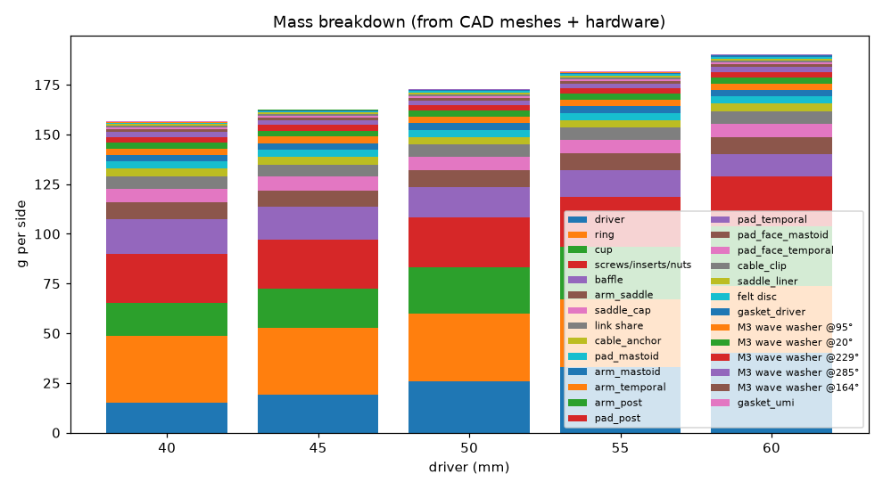

Weight optimisation at 50 mm — each option alone against the pre-optimisation baseline (CAD mass), with the check it moves:

| option | mass g | Δ g | check moved | decision |
|---|---|---|---|---|
| baseline (M3 arm screws 0.15 N·m, cup wall 1.6, legs/feet 5/5; saddle liner as the Final) | 175 |  | handling SF 1.72 (saddle: bar at clamp edge (slot end)); auricle-root p at 60 mm 3.83 kPa |  |
| W1 arm screws M3 -> M2.5 (insert pitch 11 -> 7 mm) at 0.10 N·m | 165 | -9.91 | F_i 114–200 N (torque scatter), insert pull-out SF 0.950 at the highest preload alone; 10 N handling: min SF engage 0.806, min SF pull-out 0.637 (≥ 1) | rejected: insert pull-out SF 0.950 < 1 at the highest preload; arm-joint SF 0.637 < 1 |
| W1b anchor screws M3 -> M2.5 at 0.10 N·m | 174 | -1.43 | F_i 114–200 N (torque scatter), insert pull-out SF 0.950 at the highest preload alone; anchor insert SF 0.699 at the upper fuse load | rejected: insert pull-out SF 0.950 < 1 at the highest preload; anchor insert SF 0.699 < 1 at the upper fuse load |
| W3 cup wall 1.6 -> 1.2 mm | 173 | -1.62 | 2.86 perimeters; eye r_max 22.2 mm | adopted |
| W4a feet 5 -> 4.5 mm | 174 | -0.863 | handling SF 1.72 (saddle: bar at clamp edge (slot end)) | adopted |
| W4b legs 5 -> 4.5 mm | 175 | -0.299 | handling SF 1.72 (saddle: bar at clamp edge (slot end)); auricle-root p at 60 mm 4.06 kPa (≤ 4) | rejected: auricle-root p 4.06 > 4 kPa |
| W4c legs 5 -> 6.5 mm | 176 | 0.898 | handling SF 1.72 (saddle: bar at clamp edge (slot end)); auricle-root p at 60 mm 3.46 kPa (≤ 4) | not taken |
| W4e legs 5 -> 5.5 mm | 175 | 0.299 | handling SF 1.72 (saddle: bar at clamp edge (slot end)); auricle-root p at 60 mm 3.66 kPa (≤ 4) | adopted (mass added) |
| W4d legs/feet 5/5 -> 4/4 mm | 173 | -2.35 | handling SF 1.45 (saddle: leg bottom fillet); auricle-root p at 60 mm 4.34 kPa (≤ 4) | rejected: handling SF 1.45 < γM 1.6; auricle-root p 4.34 > 4 kPa |
| W5 arm-screw insert pitch 11 -> 10 mm at 0.10 N·m | 173 | -1.49 | ; 10 N handling: min SF engage 1.08, min SF pull-out 1.13 (≥ 1) | not taken: lowest joint SF 1.08 against 1.15 in the Final (§13) |
| W2 ring infill 30 -> 20 % |  | 0 | ring shell fraction 1.00 | not taken: no mass saving (ring shell fraction 1.00) |
| Final (W3 + W4a + W4e, M3 arm screws at 0.10 N·m, M3 anchor screws at 0.10 N·m, tab fix, saddle liner) | 173 | -2.17 | handling SF 1.72 (saddle: bar at clamp edge (slot end)); auricle-root p at 60 mm 3.61 kPa; joints min SF engage 1.15, pull-out 1.15 |  |

Arm bar thickness vs the 10 N handling load: 5.50 mm → SF 1.72, 5.35 mm → SF 1.64, 5.40 mm → SF 1.66, 5.25 mm → SF 1.58. At the −0.15 mm XY print tolerance the 5.5 mm bar keeps SF 1.64 (≥ γM 1.6); one 0.1 mm step thinner, its tolerance section gives 1.58 (< γM), so the bar is the thinnest 0.1 mm step that keeps γM at the tolerance.

## 6. Ear attachment — the statically indeterminate frictional contact model

The ring is a rigid body; each arm is an elastic beam (foot, leg and bar with axial, both shear, torsion and both bending
compliances, E and G at 40 °C, built in at its clamp) in series with its contacts, which are compliant, **unilateral** and
frictional; plus the occipital link (lateral spring k_side with preload P, small in-plane stiffness 40 N/m). An arm carrying one
pad adds a 3-DOF node at the pad contact with stiffness K = (L C_tip Lᵀ)⁻¹; the saddle arm (both root zones and the scalp contact
on one cap) adds a 6-DOF node at its tip with K = C_tip⁻¹ (C_tip: unit-load method over the arm centreline,
`structure.arm_tip_compliance`; L maps the tip motion to the contact point). Generalised displacement q = [u, θ, arm nodes]
(6 + 15 DOF in the Final); for contact i with normal n_i and lever r_i the row j_i = [n_i, r_i × n_i, n_i·L_i], compression
δ_i = −j_i·q, tangential slip t_i = J_t,i q. The problem is statically indeterminate (6 contacts in the Final × 3 force components +
link against 6 equations), so the load sharing follows from compatibility and the stiffness of each contact in series with its
arm — no support is assumed to carry an equal share. The arm flexibility matters (computed below, "What sets the auricle-root
load", and §12 table of arm vs contact compliance).

**Solution (per load step):** the incremental potential

    Π(q) = ½ qᵀ K_L q − q·W + Σ_i ½ k_n,i ⟨δ_i⟩₊² + Σ_i H_i(|J_t,i q − s_i|)

is minimised, where ⟨·⟩₊ keeps compression only (unilateral contact), s_i is the accumulated slip and H is the Huber function
of the tangential spring with the friction bound g_i = μ F_n,i (stick ½ k_t t², slide g t − g²/2k_t). For a given friction bound
Π is convex and C¹, so a stationary point is its global minimum and satisfies all six equilibrium equations ΣF = 0, ΣM = 0
together with the contact and friction laws; the printed residual is the check. The friction bound follows F_n by a fixed point (Tresca → Coulomb). Newton steps are truncated at
the first contact or stick/slip change (backtracking only as a safeguard; a step whose predicted energy change is below the
floating-point resolution of Π is taken on the model's word and the gradient decides convergence); the load is applied in 4
ramp steps with a return mapping of the slip. **Gross slip /
release** = no bounded minimiser (the minimisation runs away beyond 9 mm or 15°), or the converged
minimiser beyond 3 mm or 5° (the cradle has left its seat). A minimisation that stops at a bounded position
without converging (line search out of representable decrease, iteration or Coulomb fixed-point limit) is a numerical failure of the
increment, not a release: that increment is cut in halves, solved in turn from the last converged state, down to 1/8 of a
step (change 20); one that still fails is counted as a release and flagged as numerical.

**Donning:** a head-mounted cradle is put on by hand, so the static state depends on the sequence. A: the hand holds the cradle
in place while the link is clamped (the preload settles without friction), then lets go — the weight is added with friction
active (conservative for slip; base state of every load case). B: the cradle is hung on the ear root first, then clamped — the
upper bound of the root (saddle) load. Both are reported.

Contact stiffness = pad core in series with the facing and the tissue: k = 1/(h_core/(E_core A) + t_face/(E_face A) + t_tissue/(E_tissue A)),
E_core = 0.045·E_TPU (15 % gyroid [LIT]), A = 50 % of the pad ellipse [A]; k_t = 0.5 k_n [A] (below the Mindlin
ratio 2(1−ν)/(2−ν) = 0.67 of an incompressible half-space, ν = 0.5, for the compliant skin shear layer). Saddle: two bearing zones on the auricle-root arch at ±φ, normals tilted fore/aft; each zone is the TPU cap wall,
the cast soft-silicone liner and the root tissue in series, k = 1/(t_cap/(E_cap A) + t_L/(E_c A) + t_root/(E_root A)). The liner
is a thin, nearly incompressible layer bonded to the cap and gripping the skin, so its compression modulus is E_c = E (1 + 2 k S²)
(Gent–Lindley, k = 1 at the incompressible limit, the stiffer end), S = w l / (2 (w + l) t_L) for the loaded patch w × l; E = 3 σ₁₀₀ / 1.75
from the datasheet 100 % modulus (neo-Hookean) [DS → C]. The liner makes the root contact silicone on skin.

Pressure: the 4 kPa sustained target is applied to the MEAN contact pressure F_n/A [A: design convention]. The dome centre
carries more: a paraboloid on a thin soft layer over bone (Winkler bed, p = k(δ − r²/2R)) peaks at 2 × the mean [C] (a Hertz
half-space would give 1.5). Peaks are reported in every table; where they exceed 4 kPa that is a comfort risk to check in wear
trials, not a pass.

| contact | x mm | y mm | z mm | normal | k_n N/m [C] | area mm² [A] | μ design | pair |
|---|---|---|---|---|---|---|---|---|
| T temporal | 54.0 | 19.7 | 0 | (0.00, 0.00, 1.00) | 7870 | 518 | 0.560 | silicone/dry skin |
| M mastoid | -38.1 | -43.8 | 0 | (0.00, 0.00, 1.00) | 19344 | 757 | 0.560 | silicone/dry skin |
| P post-sup | -56.7 | 16.3 | 0 | (0.00, 0.00, 1.00) | 7948 | 518 | 0.200 | TPU/hair (over temporal) |
| S root F | 11.6 | 11.8 | 3.25 | (0.50, 0.87, 0.00) | 2417 | 70.0 | 0.560 | silicone/dry skin |
| S root B | -13.5 | 9.63 | 3.25 | (-0.64, 0.77, 0.00) | 2417 | 70.0 | 0.560 | silicone/dry skin |
| S scalp | -2.09 | 23.9 | 0 | (0.00, 0.00, 1.00) | 3725 | 224 | 0.200 | TPU/hair (over temporal) |

Static, head upright, 1 g, Final 40 mm, donning A — link force (5.72e-05, 0.000725, -4.65) N, rotation (-0.0746, -0.00591, -0.0268) deg, equilibrium residual 4.43e-09 (N, N·m):

| contact | Fn N | Ft N | μ required | p mean kPa | p peak kPa | sliding |
|---|---|---|---|---|---|---|
| T temporal | 1.29 | 0.415 | 0.323 | 2.49 | 4.97 | False |
| M mastoid | 1.59 | 0.503 | 0.317 | 2.10 | 4.20 | False |
| P post-sup | 1.38 | 0.233 | 0.169 | 2.67 | 5.33 | False |
| S root F | 0.207 | 0.0724 | 0.350 | 2.96 | 5.92 | False |
| S root B | 0.185 | 0.0608 | 0.329 | 2.64 | 5.27 | False |
| S scalp | 0.360 | 0.0720 | 0.200 | 1.61 | 3.21 | True |

Static, head upright, 1 g, Final 50 mm, donning A — link force (0.00097, 0.000469, -4.97) N, rotation (-0.0859, -0.0296, -0.0300) deg, equilibrium residual 5.15e-09 (N, N·m):

| contact | Fn N | Ft N | μ required | p mean kPa | p peak kPa | sliding |
|---|---|---|---|---|---|---|
| T temporal | 1.19 | 0.461 | 0.388 | 2.30 | 4.60 | False |
| M mastoid | 1.76 | 0.551 | 0.313 | 2.33 | 4.65 | False |
| P post-sup | 1.61 | 0.257 | 0.160 | 3.11 | 6.21 | False |
| S root F | 0.229 | 0.0808 | 0.353 | 3.27 | 6.53 | False |
| S root B | 0.202 | 0.0672 | 0.333 | 2.88 | 5.76 | False |
| S scalp | 0.378 | 0.0757 | 0.200 | 1.69 | 3.38 | True |

Static, head upright, 1 g, Final 60 mm, donning A — link force (0.000619, 0.00118, -5.30) N, rotation (-0.0757, -0.0205, -0.0339) deg, equilibrium residual 5.98e-09 (N, N·m):

| contact | Fn N | Ft N | μ required | p mean kPa | p peak kPa | sliding |
|---|---|---|---|---|---|---|
| T temporal | 1.31 | 0.511 | 0.391 | 2.52 | 5.05 | False |
| M mastoid | 1.96 | 0.601 | 0.307 | 2.59 | 5.17 | False |
| P post-sup | 1.60 | 0.280 | 0.175 | 3.10 | 6.20 | False |
| S root F | 0.253 | 0.0898 | 0.355 | 3.61 | 7.22 | False |
| S root B | 0.223 | 0.0740 | 0.331 | 3.19 | 6.38 | False |
| S scalp | 0.391 | 0.0782 | 0.200 | 1.75 | 3.49 | True |

Donning sequence B (hung on the ear root, then clamped) — the most root load a donning sequence gives (head motion then moves the load further, see the shakedown below):

| D | root ΣFn N | root p mean kPa | root p peak kPa | max skin p kPa |
|---|---|---|---|---|
| 40 | 1.93 | 15.4 | 30.8 | 2.70 |
| 45 | 2.00 | 16.0 | 32.0 | 3.02 |
| 50 | 2.12 | 17.0 | 33.9 | 3.14 |
| 55 | 2.23 | 17.8 | 35.6 | 3.09 |
| 60 | 2.33 | 18.6 | 37.2 | 3.13 |

In sequence B the mean root pressure exceeds the 4.00 kPa sustained target at 40, 45, 50, 55, 60 mm even with the liner, so the donning instruction is clamp first, then let go (sequence A). Neither donned state lasts once the head moves: see *The sustained state in use* at the end of this section.

**What sets the auricle-root load.** At rest (donning A) the weight is shared by compatibility: the root zones carry it by normal force, the pads by their tangential springs through the arms. The root's share therefore follows its normal stiffness against the pads' tangential stiffness, and the soft-tissue layers dominate both, so stiffer arms move it little. Every row keeps the Final CAD mass properties of its size; static, head upright:

| variant | root p 55 mm kPa | root p 60 mm kPa | root share of the weight % (60) | max skin p kPa (60) | static μ demand (60) | 60 mm: root ≤ 4.00 kPa and μ ≤ 1 |
|---|---|---|---|---|---|---|
| Final (liner 2.5 mm) | 3.44 | 3.61 | 20.9 | 3.10 | 0.874 (posterior-superior) | PASS |
| no liner (Final otherwise) | 4.41 | 4.63 | 26.9 | 3.10 | 0.800 (posterior-superior) | **FAIL** |
| liner 2 mm | 3.77 | 3.96 | 22.9 | 3.10 | 0.849 (posterior-superior) | PASS |
| liner 3 mm | 3.12 | 3.28 | 19.0 | 3.10 | 0.899 (posterior-superior) | PASS |
| no liner, arms rigid | 3.37 | 3.54 | 20.4 | 2.99 | 0.811 (posterior-superior) | PASS |
| liner 2.5 mm, arms rigid | 2.55 | 2.68 | 15.5 | 2.97 | 0.880 (posterior-superior) | PASS |
| liner 2.5 mm, legs 5 mm | 3.60 | 3.78 | 21.9 | 3.11 | 0.886 (posterior-superior) | PASS |
| no liner, legs 5.0 mm | 4.60 | 4.83 | 28.1 | 3.12 | 0.811 (posterior-superior) | **FAIL** |
| no liner, legs 8.0 mm | 4.03 | 4.22 | 24.4 | 3.06 | 0.791 (posterior-superior) | **FAIL** |
| no liner, legs 9.0 + bar 7.5 mm | 3.80 | 3.99 | 23.1 | 3.05 | 0.786 (posterior-superior) | PASS |
| no liner, arch half-angle 45° | 4.01 | 4.21 | 21.1 | 3.11 | 0.828 (posterior-superior) | **FAIL** |
| no liner, temporal pad 1.1 × 1.5 larger (needs a backing plate) | 3.82 | 4.01 | 23.4 | 3.16 | 0.834 (posterior-superior) | **FAIL** |
| no liner, preload +0.8 N | 4.41 | 4.63 | 26.8 | 3.79 | 0.650 (posterior-superior) | **FAIL** |

With rigid arms the root would carry 20.4 % of the weight instead of 26.9 % (no liner, 60 mm) — but the mastoid pad would then need 0.811 × its design friction: the arm compliance is not a free error. The liner lowers the root share to 20.9 % and moves the difference onto the pads' friction; the Final therefore uses the thinnest liner that leaves a 5 % root margin at 60 mm (2.5 mm). The temporal-pad row is the model's answer for a pad that is fully backed; with the present 10 mm wide foot the extra area would not carry load, so it would need a PETG backing plate (and it would reach the zygomatic arch).
 Rows that pass with less than 5 % root margin at 60 mm were not taken, because the tissue stiffnesses behind the share are literature values [A]: no liner, legs 9.0 + bar 7.5 mm (0.272 %).
 Rows that add material (thicker legs or bar) keep the Final mass properties, so they are optimistic by their own added mass.
 Single changes of the pad layout without the liner (each pad angle ±10°, each radius −4 mm or up to its search bound; 10 of 12 inside the layout constraints of §7) give at best 4.46 kPa at 60 mm (mastoid_a 229 → 239, static μ demand 0.739; all rows in results/root_levers.json).
 Without the liner no eye position on the 60 mm cup (82 positions, 4 mm grid) brings the root below 4.54 kPa.

**Arm legs and saddle liner, chosen together** (`calc/legs_liner.py`, results/legs_liner.json). Both move weight between the auricle root and the pads' friction: thinner legs send it to the root, a thicker liner sends it to the pads. Every pair got its own CAD mass properties and the static criteria of the eye tune on the 4 mm eye grid of the 55 and 60 mm cups (where the root limit binds). Cells: smallest static margin at the best eye, worse of 55/60 mm (root / friction margin in brackets; ≥ 0 passes, the liner rule asks ≥ 5 % on the root):

| legs \ liner | 1.5 mm | 2 mm | 2.5 mm | 3 mm |
|---|---|---|---|---|
| legs 4.5 mm | -16.4 % (-16.4 / 24.5) | -8.28 % (-8.28 / 21.7) | 0.714 % (0.714 / 19.6) | 9.57 % (9.57 / 18.7) ◀ |
| legs 5 mm | -9.47 % (-9.47 / 18.4) | -1.67 % (-1.67 / 16.5) | 6.95 % (6.95 / 13.6) ◀ | 14.5 % (14.5 / 15.1) |
| legs 5.5 mm | -4.70 % (-4.70 / 14.0) | 2.90 % (2.90 / 12.2) | 10.8 % (11.4 / 11.3) ◀ | 16.0 % (18.3 / 16.0) |
| legs 6 mm | -1.17 % (-1.17 / 11.7) | 6.28 % (6.28 / 9.90) ◀ | 13.8 % (13.8 / 21.0) | 16.5 % (21.0 / 16.5) |
| legs 6.5 mm | 1.26 % (1.26 / 9.38) | 8.65 % (8.65 / 8.74) ◀ | 15.0 % (15.0 / 18.9) | 16.6 % (23.0 / 16.6) |

◀ = the liner rule for that leg thickness (thinnest liner with ≥ 5 % root margin at both sizes). Those pairs were then run through the eye tune's evaluation (static + its 1 g set) at every eye that meets the static criteria with the 5 % root margin, and its full evaluation (+ the reduced 2 g set) at the 3 best eyes of each size that meet normal use, at a link preload of 5.00 N with the link wire the tune uses at that preload (Ø2.50 mm, 4 coils) and the 1 g grid of 5610 combinations:

| legs / liner mm | mass at 60 mm g | 55 mm eye | 55 mm min normal-use margin | 55 mm 2 g released % (subset) | 60 mm eye | 60 mm min normal-use margin | 60 mm 2 g released % (subset) | normal use | tune score, worse size |
|---|---|---|---|---|---|---|---|---|---|
| 4.5 / 3 | 189.64 | (-19, 8) | 0.0806 | 5.31 | (-15, 8) | 0.0223 | 6.56 | PASS | 2.05 |
| 5 / 2.5 | 189.85 | (-19, 8) | 0.104 | 4.62 | (-15, 8) | 0.0583 | 5.69 | PASS | 2.12 |
| 5.5 / 2.5 | 190.15 | (-19, 8) | 0.143 | 4.50 | (-19, 8) | 0.0835 | 4.56 | PASS | 2.17 |
| 6 / 2 | 190.36 | (-19, 8) | 0.0906 | 4.25 | (-7, 16) | -1.05 | – | **FAIL** | -1.05 |
| 6.5 / 2 | 190.67 | (-19, 8) | 0.111 | 4.25 | (-19, 8) | 0.0675 | 4.31 | PASS | 2.17 |

Choice: legs 5.5 mm with a 2.5 mm liner — every normal-use criterion met at both sizes and the highest tune score of the worse size (pairs within 0.02 of it count as equal and the lightest of those wins). The lighter pairs save up to 0.51 g per side but release 5.7–6.6 % of the reduced 2 g set at the worse size, against 4.6 %. The eye itself is then tuned per module for this pair (§7).

**The sustained state in use: frictional shakedown under head motion** (`calc/shakedown.py`, `support.shakedown`, results/shakedown.json). The donned state is only where friction starts. Worn, the head moves: each combination of the 1 g normal set that the eye tune uses (5610 combinations: 33 gravity directions within the 45° head-tilt cone, 10 head-rotation phases, 17 cable directions) is applied from the current state and removed again, cycle after cycle, with the same path-dependent friction (at most 25 cycles; converged when no contact normal force changes by more than 0.2 % of the weight over a cycle). Wherever a pad reaches its friction limit during a combination it slips a little and keeps that offset when the load is removed, so the weight the pads held by friction is handed on, cycle by cycle, to the only supports that carry it by normal force: the saddle's root zones, until the contact forces repeat from one cycle to the next (the pads may go on slipping back and forth, but the load no longer moves). Checks of the procedure at 60 mm: zero amplitude: root 3.61 → 3.61 kPa; non-slipping pads (μ = 10): root 3.61 → 11.3 kPa (a skin pad still slips in 5–6 of the 5610 combinations per cycle, so μ = 10 does not make the pads non-slipping in this set).

| D | root p donned (A) kPa | root p in use (from A) kPa | vertical share of the weight on the root in use % | cycles | root p donned (B) kPa | root p in use (from B) kPa | max pad p in use kPa | released applications |
|---|---|---|---|---|---|---|---|---|
| 40 | 2.96 | 18.0 | 117 | 6 | 15.4 | 18.0 | 2.72 | 0 of 33660 |
| 45 | 3.07 | 18.4 | 116 | 5 | 16.0 | 18.3 | 3.04 | 0 of 28050 |
| 50 | 3.27 | 19.4 | 116 | 5 | 17.0 | 19.4 | 3.16 | 0 of 28050 |
| 55 | 3.44 | 20.5 | 115 | 5 | 17.8 | 20.5 | 3.12 | 0 of 28050 |
| 60 | 3.61 | 21.4 | 114 | 5 | 18.6 | 21.4 | 3.16 | 0 of 28050 |

In use the root zones carry 114–117 % of the side's weight (vertical component) at 18.0–21.4 kPa mean pressure, 4.50–5.35 × the 4 kPa sustained target — **the sustained root-pressure requirement is NOT met in use at 40, 45, 50, 55, 60 mm**; the donned value (A) holds only until the head moves. From sequence B the end state is 18.0–21.4 kPa: the donning order stops mattering once the head has moved. At 60 mm the root zones then carry 2.59 N; at 4 kPa that needs 6.46 cm² of bearing, against the 1.40 cm² of the two root zones (support.ROOT_W × ROOT_LEN of the superior auricle root [A]).

Levers at 60 mm, each row the Final with the change named (shakedown from A):

| lever | root p donned kPa | root p in use kPa | vertical share on the root % | max pad p in use kPa | root and pads ≤ 4 kPa in use |
|---|---|---|---|---|---|
| Final | 3.61 | 21.4 | 114 | 3.16 | **FAIL** |
| pad friction × 1.25 (the nominal μ: no γμ) | 3.61 | 23.0 | 108 | 3.11 | **FAIL** |
| pad friction × 2 (faced pads μ 1.12, above the 1.00 upper literature value for silicone on dry skin) | 3.61 | 20.4 | 86.4 | 3.09 | **FAIL** |
| post-sup pad faced too (μ 0.56) | 3.61 | 19.8 | 102 | 3.13 | **FAIL** |
| link preload × 1.2 | 3.61 | 21.2 | 105 | 3.99 | **FAIL** |
| link preload × 1.4 | 3.60 | 19.3 | 90.7 | 4.82 | **FAIL** |
| root bearing area × 2 (stiffness in proportion) | 2.92 | 10.3 | 116 | 3.14 | **FAIL** |
| root bearing area × 3 (stiffness in proportion) | 2.46 | 6.62 | 113 | 3.13 | **FAIL** |
| root bearing area × 2 and pad friction × 2 | 2.92 | 10.7 | 92.1 | 3.09 | **FAIL** |
| frictionless root | 3.74 | 15.1 | 91.2 | 3.17 | **FAIL** |
| root 4 × softer (liner) | 1.13 | 20.9 | 102 | 3.20 | **FAIL** |
| rigid arms | 2.68 | 19.9 | 109 | 3.00 | **FAIL** |

No lever in the table meets the target in use; the lowest is 'root bearing area × 3 (stiffness in proportion)' at 6.62 kPa. Scaling the side's mass and inertia (COM kept), the 60 mm side meets the 4 kPa target in use only up to 60.3 g, 31.7 % of its 190 g. The pads micro-slip in normal use (§8: the 1 g criterion is no gross slip, not no slip at all; in the first cycle a skin pad slides at the peak of 17.3–20.7 % of the combinations, in the last 16.9–20.2 %), and every micro-slip moves weight onto the root; an ear-mounted cradle of this mass therefore needs either pads that do not slip at all under head motion or a weight-bearing support of the area above. Neither exists in this design, so this is the limit of the concept at this mass, and the first thing wear trials must measure (pressure film at the auricle root after wear with head motion, §22).

Design B, same case: **no static equilibrium** (the cradle tips off the ear).

## 7. Support layout, preload line and the per-module link eye

Tipping moment per g: M₁ = m g z̄. For the preload P (acting along −z at the eye) and the weight to leave every pad loaded,
the resultant of P and the weight couple must lie inside the pad polygon with margin: y_eye ≈ y_centroid + M₁/P. Under a dynamic
factor n the resultant moves by (n−1)M₁/P, so a larger P gives robustness, capped by the skin-pressure limit. The ring rim cannot
reach that point; the cup end can. The cradle layout (pad angles/radii, pad size) is common to every module (max–min search,
`umeh2/layout.py`: random sampling of its bounds, then a coordinate pattern search). That search ran during the iterations on the model and load sample of its time; `calc/final_layout.json` holds its result rounded to 0.5°/0.5 mm (its preload, 4.20 N, is the first preload level of the eye tune), it is not part of the re-run pipeline, and every result in this report re-checks the layout with the current model. The eye is part of the module and was tuned for each driver size by `calc/tune_eye.py` with the current model, together with the link preload (one value for every module: the link is common). The preload runs through levels from the layout's 4.20 N in 0.400 N steps, each with the link wire sized for it; the lowest level is taken at which every module has candidates on the 4 mm eye grid of stage 1 meeting every normal-use criterion of the tune (static + the 1 g grid) and an eye of stages 1–3 (grid or refinement point) that also passes the dense check and its refinement [design rule: the least preload keeps the pad pressures and the wire stress lowest], and the later stages run at that level: a 4 mm grid over the cup end
(static + the 1 g grid of 33 gravity directions × 10 head-motion cases × 17 cable directions = 5610 load cases per candidate, §8), the 2 g set for the best candidates meeting normal use (at most 10: 2 on the 40 mm module, 3 on the 45 mm module, 3 on the 50 mm module, 2 on the 55 mm module, 2 on the 60 mm module), then 2 and 1 mm refinement around the best; finally (stage 4) the dense 1 g check and its local refinement (§8) on the best candidates in score order until one passes (at most 4 per module) — that candidate is the module's eye;
score = the smallest normalised normal-use margin, then the 2 g released fraction (weight 2) and the 1 g pad micro-slip fraction (0.5).
A candidate stops at its first failing 1 g case (it can no longer pass). The eye positions therefore lie on a 1 mm grid (no further rounding; print XY tolerance ±0.15 mm). The 2 g column is
the reduced tuning subset (10 dynamic directions × 4 gravity × 10 head-motion × 4 cable = 1600 load cases); §8 gives the full 2 g set of the Final.

Preload levels of the tune (stage 1, the whole 4 mm eye grid of each module; the link wire of each level sized on every module at the layout's reference eye, pulled inside the module's eye limit where it lies outside; candidates meeting every normal-use criterion / evaluated):

| P N | link wire | 40 mm | 45 mm | 50 mm | 55 mm | 60 mm |  |
|---|---|---|---|---|---|---|---|
| 4.20 | Ø2.50 mm, 3 coils | 0/– | 0/– | 0/– | 0/– | 0/– |  |
| 4.60 | Ø2.50 mm, 3 coils | 0/– | 0/– | 0/– | 0/– | 0/– |  |
| 5.00 | Ø2.50 mm, 4 coils | 2/– | 3/– | 3/– | 2/– | 2/– | **chosen** |

Layout constraints [A] (`layout.geometric_ok`, `layout.BOUNDS`): pads, saddle and cable clip at least 30° apart on the ring (tab width, screw access); pad centres inside the search bounds. Checked on the Final: the inner edge of every pad (centre radius − a/2) clears the p95 pinna half-length 36 mm + 2 mm = 38.0 mm from the canal axis — temporal 40.6, mastoid 38.5, posterior-superior 42.1 mm.

**Record of the eye tune.** The tune's own output (results/eye_tuning.json) was lost with the machine that ran it. Chosen eyes and preload: calc/final_layout.json; preload levels and stage-1 pass counts: results/eye_tuning_partial.log; per-module values: the tune objective re-scored at the chosen eye with the Final's inputs (results/eye_check.json); verification: run_all.py dense 1 g check + refinement (results/dense_1g.json). The tune ran with wire Ø2.50 mm / 4 coils, legs 5.50 mm, liner 2.50 mm; the per-candidate tables of the tune (candidates evaluated, top five, stage-4 checks of the other modules) are not available. The table below is the tune's objective at each chosen eye with the Final's own inputs; the dense check of §8 is the pass/fail evidence.

| D | eye x mm | eye y mm | min normal-use margin | 2 g released (subset) | 1 g pad micro-slip | static-friction margin | tilt margin | seating margin |
|---|---|---|---|---|---|---|---|---|
| 40 | -15.0 | 7.00 | 0.141 | 0.0475 | 0.663 | 0.154 | 0.794 | 0.141 |
| 45 | -18.0 | 7.00 | 0.215 | 0.0406 | 0.635 | 0.215 | 0.814 | 0.410 |
| 50 | -19.0 | 7.00 | 0.183 | 0.0394 | 0.641 | 0.201 | 0.805 | 0.232 |
| 55 | -18.0 | 7.00 | 0.140 | 0.0425 | 0.646 | 0.152 | 0.803 | 0.181 |
| 60 | -18.0 | 7.00 | 0.0978 | 0.0450 | 0.650 | 0.126 | 0.797 | 0.175 |

## 8. Load cases, vector combination and worst-orientation search

| case | gravity within ° of upright | dynamic accel (g, any direction) | head α rad/s² [A] | head ω rad/s [A] | cable pull N [A] |
|---|---|---|---|---|---|
| 1 g normal | 45.0 | 0 | 50.0 | 3.00 | 0.500 |
| 2 g dynamic | 30.0 | 1.00 | 100 | 6.00 | 1.00 |
| 3 g severe | 30.0 | 2.00 | 200 | 10.0 | 2.00 |
| 5 g accidental | any (resultant) | 5.00 | 1000 | 20.0 | 20.0 |

Effective gravity g_eff = g + a (vector sum, every direction of a on a Fibonacci sphere); head angular motion about the
yaw/pitch/roll axes through anthropometric pivots [A] adds the d'Alembert loads F = −m[α×ρ + ω×(ω×ρ)] and M = −I_G α − ω×(I_G ω).
For oscillatory head motion the angular-acceleration peak and the angular-velocity peak are in quadrature, so they are applied
as two separate phases (α-peak with ω = 0, ω-peak with α = 0); the squared inertial load is convex in the phase, so the two end
phases bound every intermediate one. Cable weight (0.35 m × 22 g/m [A]) along g_eff plus a cable pull at the clip in any
direction within 80° of straight down [A]. **Every** combination of a set (gravity direction × dynamic direction × axis/sign/phase × cable direction)
is solved; the worst orientation is searched, not assumed. How the directions are chosen depends on what the category is used for:

* **1 g (pass/fail criteria): a deterministic grid** that contains the edges of both cones (`support.GRID_1G`): upright + head tilt
  22.5, 45° × every 22.5° of azimuth; cable straight down + at 80° from
  straight down × every 22.5°. Its resolution is checked on every module by a **dense check** (`support.DENSE_1G`, nested: head tilt
  11.25, 22.5, 33.75, 45° × every 11.25°, cable 20, 40, 60, 80° × every 11.25°) and a **local
  refinement** of the dense check (`analysis.refine_1g_chunk`): around every failing and each of the 8 lowest-seating-margin and 8
  largest-tilt dense combinations, its dense-grid cell (± half a dense step in head tilt, gravity azimuth, cable angle and cable azimuth) is
  searched on a 5-point grid per coordinate with the same head motion; the change from the dense to the refined worst values
  measures what a still finer search could add. Both belong to the normal-use criteria of the Final (tables below).
* **2 g, 3 g, 5 g (reported as released fractions): a quasi-uniform (Fibonacci) sample** of the gravity, dynamic and cable directions;
  a released fraction is a property of that sample, not a worst case. Where a sweep or mass table gives "1 g %", it is the released
  fraction of the 1 g grid (5610 combinations per evaluation).

Dense check of the Final (`results/dense_1g.json`; azimuth 0° = forward, 90° = outward, away from the head: gravity at azimuth 90° means the head is tilted towards this side, this ear down, so the side hangs outward; seating margin = third-largest skin contact force − 0.1 N):

| D | combinations | released | tripod lost | tilt > 2° | worst tilt ° | worst-tilt case | smallest seating margin N | its case |
|---|---|---|---|---|---|---|---|---|
| 40 | 166410 | 0 | 0 | 0 | 0.411 | tilt 45.0° at azimuth 90.0°, roll (tilt) +alpha, cable 80° at 90.0° | 0.0337 | tilt 45.0° at azimuth 56.3°, roll (tilt) −alpha, cable 80° at 281.2° |
| 45 | 166410 | 0 | 0 | 0 | 0.373 | tilt 45.0° at azimuth 180.0°, roll (tilt) +alpha, cable 80° at 101.2° | 0.116 | tilt 45.0° at azimuth 33.7°, roll (tilt) −alpha, cable 80° at 281.2° |
| 50 | 166410 | 0 | 0 | 0 | 0.391 | tilt 45.0° at azimuth 180.0°, roll (tilt) +alpha, cable 80° at 101.2° | 0.0631 | tilt 45.0° at azimuth 123.7°, roll (tilt) −alpha, cable 80° at 112.5° |
| 55 | 166410 | 0 | 0 | 0 | 0.395 | tilt 45.0° at azimuth 180.0°, roll (tilt) +alpha, cable 80° at 101.2° | 0.0513 | tilt 33.7° at azimuth 45.0°, roll (tilt) −alpha, cable 80° at 281.2° |
| 60 | 166410 | 0 | 0 | 0 | 0.406 | tilt 45.0° at azimuth 180.0°, roll (tilt) +alpha, cable 80° at 101.2° | 0.0387 | tilt 33.7° at azimuth 56.3°, roll (tilt) −alpha, cable 80° at 281.2° |

Local refinement around the dense check's critical combinations (`results/dense_1g.json` "refine"; dense → refined worst value):

| D | seeds | combinations | failing | worst tilt ° | smallest seating margin N |
|---|---|---|---|---|---|
| 40 | 16 | 3279 | 0 | 0.411 → 0.415 | 0.0337 → 0.0308 |
| 45 | 16 | 3873 | 0 | 0.373 → 0.374 | 0.116 → 0.115 |
| 50 | 16 | 2790 | 0 | 0.391 → 0.391 | 0.0631 → 0.0604 |
| 55 | 16 | 3366 | 0 | 0.395 → 0.396 | 0.0513 → 0.0476 |
| 60 | 16 | 3438 | 0 | 0.406 → 0.407 | 0.0387 → 0.0379 |

History (§4 change 21): the eyes tuned on the 1 g grid at every 45.0° (gravity) / 45.0° (cable) — preload 5 N, wire Ø2.5 mm / 4 coils, eyes 40 mm (-15, 7), 45 mm (-18, 6), 50 mm (-19, 5), 55 mm (-19, 6), 60 mm (-19, 6) — in the dense check of that time (every 22.5° / 22.5°) and its local refinement (`results/dense_1g_grid45.json`; released / tripod lost / over-tilted):

| D | dense fails | seat margin dense N | refinement failing | seat margin refined N |  |
|---|---|---|---|---|---|
| 40 | 0 / 0 / 0 | 0.0451 | 0 of 3159 | 0.0417 | pass |
| 45 | 0 / 0 / 0 | 0.0676 | 0 of 3114 | 0.0574 | pass |
| 50 | 0 / 0 / 0 | 0.0422 | 0 of 3858 | 0.0335 | pass |
| 55 | 0 / 0 / 0 | 0.0338 | 0 of 3243 | 0.0246 | pass |
| 60 | 0 / 1 / 0 | -0.000789 | 46 of 3102 | -0.0121 | **fail** |

Change 21 halved the grid and dense-check azimuth steps and re-ran the tune with the stage-4 verification (§7): with the grid every 45.0° (gravity) / 45.0° (cable) the tuned eyes failed at 60 mm (dense check: 0 released, 1 tripod lost, 0 over-tilted, smallest seating margin -0.000789 N; refinement: 46 of 3102 failing, smallest -0.0121 N); the worst combination is not a point of that grid (§8), eyes moved Δy 0–2.00 mm, Δx 0–1.00 mm.

The Final before iteration change 19 on the 1 g grid (§4; `results/grid_1g_before_grid.json`): eyes tuned on a quasi-uniform 1 g sample (17 gravity × 10 head-motion × 5 cable directions = 850 combinations) at the layout preload 4.20 N, link wire Ø2.00 mm:

| D | combinations | released | tripod lost | tilt > 2° | worst tilt ° | worst-tilt case | smallest seating margin N | its case |
|---|---|---|---|---|---|---|---|---|
| 40 | 5610 | 15 | 0 | 51 | 4.66 | tilt 45.0° at azimuth 45.0°, roll (tilt) +alpha, cable 80° at 67.5° | 0.00115 | tilt 45.0° at azimuth 112.5°, roll (tilt) −alpha, cable 80° at 112.5° |
| 45 | 5610 | 9 | 7 | 20 | 4.97 | tilt 45.0° at azimuth 135.0°, roll (tilt) +alpha, cable 80° at 90.0° | -0.0897 | tilt 45.0° at azimuth 112.5°, yaw (turn) +alpha, cable 80° at 90.0° |
| 50 | 5610 | 12 | 28 | 31 | 4.72 | tilt 45.0° at azimuth 45.0°, roll (tilt) +alpha, cable 80° at 112.5° | -0.100 | tilt 45.0° at azimuth 90.0°, yaw (turn) +alpha, cable 80° at 90.0° |
| 55 | 5610 | 8 | 57 | 14 | 4.89 | tilt 45.0° at azimuth 67.5°, roll (tilt) +alpha, cable 80° at 67.5° | -0.100 | tilt 45.0° at azimuth 90.0°, yaw (turn) +alpha, cable 80° at 67.5° |
| 60 | 5610 | 10 | 61 | 19 | 4.98 | tilt 45.0° at azimuth 45.0°, roll (tilt) +alpha, cable 80° at 90.0° | -0.100 | tilt 45.0° at azimuth 90.0°, yaw (turn) +alpha, cable 80° at 67.5° |

The 331 failing combinations: head tilted 45.0–45.0° from upright; 331 of 331 with this side hanging outward (head tilted towards it, this ear down) and 317 of 331 with the cable pulling outward (317 both). On its own sample the first tune had passed these eyes (smallest normal-use margin 0.0760–0.166 over the modules, `results/eye_tuning_before_grid.json`). With the grid (change 19; the link wire re-sized for each preload level, §11) the tune moved to 5.00 N from 4.20 N, with the eyes lower (Δy -7.00–-5.00 mm) (§7).

| D | case | combinations | released | % | pad micro-slip % of held | tripod lost | worst tilt deg* | worst disp mm* | peak p kPa* |
|---|---|---|---|---|---|---|---|---|---|
| 40 | 1 g normal | 5610 | 0 | 0 | 66.3 | 0 | 0.411 | 1.25 | 48.0 |
| 40 | 2 g dynamic | 10000 | 194 | 1.94 | 74.2 | 986 | 4.99 | 2.99 | 88.6 |
| 40 | 3 g severe | 10000 | 3535 | 35.4 | 80.8 | 1890 | 4.99 | 2.99 | 137 |
| 40 | 5 g accidental | 6000 | 5807 | 96.8 | 79.8 | 4646 | 5.00 | 3.00 | 199 |
| 45 | 1 g normal | 5610 | 0 | 0 | 63.5 | 0 | 0.372 | 1.32 | 51.5 |
| 45 | 2 g dynamic | 10000 | 126 | 1.26 | 73.4 | 847 | 4.96 | 2.35 | 91.7 |
| 45 | 3 g severe | 10000 | 3336 | 33.4 | 80.6 | 1951 | 4.98 | 3.00 | 137 |
| 45 | 5 g accidental | 6000 | 5800 | 96.7 | 79.5 | 4564 | 5.00 | 3.00 | 198 |
| 50 | 1 g normal | 5610 | 0 | 0 | 64.1 | 0 | 0.390 | 1.41 | 55.2 |
| 50 | 2 g dynamic | 10000 | 142 | 1.42 | 73.8 | 880 | 4.98 | 2.51 | 97.2 |
| 50 | 3 g severe | 10000 | 3495 | 34.9 | 80.3 | 1926 | 4.98 | 3.00 | 135 |
| 50 | 5 g accidental | 6000 | 5802 | 96.7 | 81.8 | 4456 | 4.99 | 3.00 | 196 |
| 55 | 1 g normal | 5610 | 0 | 0 | 64.6 | 0 | 0.394 | 1.44 | 56.3 |
| 55 | 2 g dynamic | 10000 | 208 | 2.08 | 74.0 | 978 | 4.98 | 2.84 | 102 |
| 55 | 3 g severe | 10000 | 3789 | 37.9 | 80.3 | 1822 | 4.99 | 2.99 | 137 |
| 55 | 5 g accidental | 6000 | 5801 | 96.7 | 82.4 | 4406 | 5.00 | 3.00 | 196 |
| 60 | 1 g normal | 5610 | 0 | 0 | 65.0 | 0 | 0.405 | 1.49 | 58.4 |
| 60 | 2 g dynamic | 10000 | 252 | 2.52 | 74.2 | 1020 | 4.96 | 2.77 | 105 |
| 60 | 3 g severe | 10000 | 3972 | 39.7 | 80.1 | 1767 | 4.96 | 2.99 | 139 |
| 60 | 5 g accidental | 6000 | 5799 | 96.7 | 83.6 | 4331 | 5.00 | 3.00 | 196 |

*over combinations that stayed in equilibrium. Tilt = rotation about x and y (changes the driver–ear geometry). Pad micro-slip = a skin pad slides locally while the cradle as a whole stays in equilibrium; each combination here starts from the donned state, so the micro-slips do not add up in this table — repeated, they do (§6, the sustained state in use).

What drives the releases — released combinations per head-motion case, all five sizes summed (share of the category's releases). 'alpha' = angular-acceleration peak, 'omega' = angular-velocity peak; 'gravity tilted' = head tilted within the category's cone (not split for 5 g: its resultant acceleration has any direction):

| head motion | 1 g normal | 2 g dynamic | 3 g severe | 5 g accidental |
|---|---|---|---|---|
| no head rotation | 0 (– %) | 0 (0 %) | 710 (3.92 %) | 2977 (10.3 %) |
| pitch (nod) alpha | 0 (– %) | 2 (0.217 %) | 2649 (14.6 %) | 5946 (20.5 %) |
| pitch (nod) omega | 0 (– %) | 0 (0 %) | 689 (3.80 %) | 2947 (10.2 %) |
| roll (tilt) alpha | 0 (– %) | 873 (94.7 %) | 5998 (33.1 %) | 5144 (17.7 %) |
| roll (tilt) omega | 0 (– %) | 1 (0.108 %) | 2180 (12.0 %) | 2995 (10.3 %) |
| yaw (turn) alpha | 0 (– %) | 46 (4.99 %) | 4497 (24.8 %) | 6000 (20.7 %) |
| yaw (turn) omega | 0 (– %) | 0 (0 %) | 1404 (7.75 %) | 3000 (10.3 %) |
| of which: gravity upright | 0 (– %) | 191 (20.7 %) | 3681 (20.3 %) | – |
| of which: gravity tilted | 0 (– %) | 731 (79.3 %) | 14446 (79.7 %) | – |

Worst 1 g orientation found (50 mm): gravity direction (-0.707, -0.707, 8.66e-17), head roll (tilt) +alpha, cable pull along (6.03e-17, -0.174, 0.985).

## 9. Friction, minimum normal force, sensitivity

Static friction demand (donning A, the skin pads made non-slipping, root and scalp at design μ): μ_required / μ_design per pad; > 1 means the pad creeps at rest with the design coefficient:

| D | T temporal | M mastoid | P post-sup |
|---|---|---|---|
| 40 | 0.576 | 0.566 | 0.846 |
| 45 | 0.643 | 0.561 | 0.785 |
| 50 | 0.692 | 0.560 | 0.799 |
| 55 | 0.684 | 0.554 | 0.848 |
| 60 | 0.699 | 0.548 | 0.874 |

| friction case (50 mm) | 1 g: % released | 1 g tilt deg | 2 g: % released | static μ demand |
|---|---|---|---|---|
| design: nominal/1.25 | 0 | 0.390 | 3.05 | 0.799 |
| hair everywhere | 0 | 0.395 | 6.60 | 1.55 |
| high | 0 | 0.385 | 2.57 | 0.445 |
| low | 0 | 0.391 | 3.92 | 1.07 |
| no facing (TPU domes), 50 mm | 0 | 0.392 | 3.08 | 0.883 |
| no facing (TPU domes), 60 mm | 0 | 0.407 | 3.75 | 0.891 |
| nominal | 0 | 0.388 | 2.73 | 0.634 |
| silicone everywhere, nominal | 0 | 0.388 | 2.88 | 0.526 |
| sweaty skin, all contacts | 0 | 0.392 | 3.62 | 1.07 |
| sweaty, low | 1.03 | 0.397 | 11.6 | 1.98 |

Preload sweep — the minimum normal force is the smallest P with zero 1 g release (design μ, then the low-μ column):

| P N | 1 g % (μ design) | 1 g % (μ low) | 2 g % (μ design) | static μ demand | mastoid p kPa |
|---|---|---|---|---|---|
| 2.00 | 7.01 | 11.8 | 25.9 | 5.27 | 1.57 |
| 2.50 | 3.05 | 6.35 | 19.0 | 2.76 | 1.71 |
| 3.00 | 0.624 | 2.78 | 13.4 | 1.86 | 1.84 |
| 3.50 | 0.107 | 0.642 | 9.50 | 1.40 | 1.96 |
| 4.00 | 0 | 0.160 | 6.60 | 1.12 | 2.08 |
| 4.50 | 0 | 0 | 4.50 | 0.934 | 2.21 |
| 5.00 | 0 | 0 | 3.05 | 0.799 | 2.33 |
| 5.50 | 0 | 0 | 2.12 | 0.697 | 2.45 |
| 6.00 | 0 | 0 | 1.55 | 0.617 | 2.57 |

| tissue / helix case | 1 g % | 1 g tilt deg | 2 g % |
|---|---|---|---|
| helix contact also present (k=400 N/m) | 0 | 0.390 | 2.73 |
| nominal | 0 | 0.390 | 3.05 |
| tissue soft x0.5 | 0 | 0.698 | 4.23 |
| tissue stiff x2 | 0 | 0.231 | 2.77 |

## 10. Maximum driver mass

Driver-mass range over which one condition holds (the rest of the side keeps its CAD mass properties;
the driver keeps its CAD centroid, inertia scaled with its mass).
static:  the side stays on at rest with the design mu (static equilibrium, no gross slip)
normal:  static seated (all pads >= F_min) + skin and auricle-root pressure <= 4 kPa as donned + static friction
demand <= design mu AND the 1 g set: no gross slip, seated, tilt <= 2 deg
dynamic: 'normal' AND the 2 g set with a released fraction <= allow (allow = 0: strict); the 2 g sweep
stops as soon as the released count exceeds allow x n_cases
maximum: 'static' AND, in the 5 g accidental set (n_acc directions), the structure survives the envelope
loads (held cases + contact forces at the onset of gross slip for the cases that release):
structural_ok(). Slip/release allowed.
The condition is NOT monotonic in the mass: the link eye of each module is tuned for its nominal driver, so a
lighter driver also moves the load resultant off the tuned line. The search is therefore anchored at the
nominal driver mass m0 (design.DRIVERS): the condition is evaluated at m0 first; then bisection (to tol) on
[m0, hi_g] for the largest passing mass and on [lo_g, m0] for the smallest (skipped when hi_g / lo_g pass).
The passing masses are taken to form one interval around m0; this is checked at the interval quartiles
('interval_checked'). If m0 itself fails, the result says so, and the passing range below m0 (if lo_g
passes) is found by bisection on [lo_g, m0]. 'maximum': the static limit is found first (cheap) and the
structure is checked there; only if it fails there is the structural check bisected.
Returns dict(nominal_g, holds_at_nominal, max_driver_g, min_driver_g, capped (max = hi_g), governs,
interval_checked, n_eval).

| D | nominal driver g [A] | static: passing driver g | normal: passing driver g | dynamic (released <= 0%): passing driver g | dynamic (released <= 10%): passing driver g | maximum: passing driver g |
|---|---|---|---|---|---|---|
| 40 | 15.0 | 0.0–150.0+ | 0.0–27.7 | fails at the nominal 15 g; fails at 0 g too | 0.0–27.7 | 0.0–126.0 (interior point fails!) |
| 45 | 19.0 | 0.0–150.0+ | 0.0–34.4 | fails at the nominal 19 g; fails at 0 g too | 0.0–34.4 | 0.0–122.9 (interior point fails!) |
| 50 | 26.0 | 0.0–150.0+ | 0.0–31.8 | fails at the nominal 26 g; fails at 0 g too | 0.0–31.8 | 0.0–84.6 (interior point fails!) |
| 55 | 33.0 | 0.0–150.0+ | 0.0–41.2 | fails at the nominal 33 g; fails at 0 g too | 0.0–41.2 | 0.0–54.9 |
| 60 | 40.0 | 0.0–150.0+ | 0.0–45.2 | fails at the nominal 40 g; fails at 0 g too | 0.0–45.2 | 0.0–109.2 (interior point fails!) |

Each cell is the range of driver masses for which the condition holds, found from the nominal driver outwards. '+' = the upper search bound (150 g) was reached, so the condition does not limit the driver mass there. 'fails at the nominal' = the condition is not met with the driver the module is designed for; the range after it, if any, is where it would hold. Governing check of the maximum design condition: 40 mm: structure (5 g envelope); 45 mm: structure (5 g envelope); 50 mm: structure (5 g envelope); 55 mm: structure (5 g envelope); 60 mm: structure (5 g envelope).

These ranges use the normal-use criteria as donned. The in-use auricle-root pressure (§6 shakedown) sets a limit on the whole side instead: at 60 mm it is met only up to 60.3 g per side (mass and inertia scaled, COM kept), while the 60 mm side without its driver already weighs 150 g — no driver mass meets it.

| driver g (50 mm) | total g | static hold | 1 g % released | 2 g % | 3 g % |
|---|---|---|---|---|---|
| 0 | 147 | PASS | 0 | 2.81 | 33.8 |
| 10.0 | 157 | PASS | 0 | 2.96 | 36.6 |
| 20.0 | 167 | PASS | 0 | 3.23 | 39.7 |
| 26.0 | 173 | PASS | 0 | 3.42 | 41.6 |
| 40.0 | 187 | PASS | 0 | 4.19 | 45.5 |
| 60.0 | 207 | PASS | 0 | 5.58 | 50.8 |
| 80.0 | 227 | PASS | 0 | 8.12 | 55.8 |

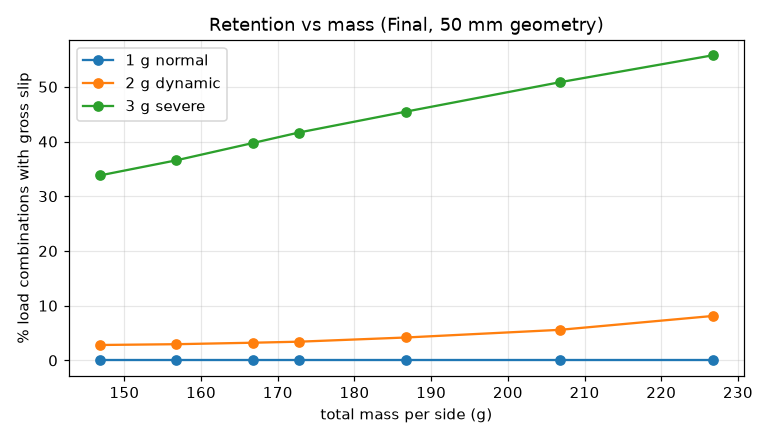
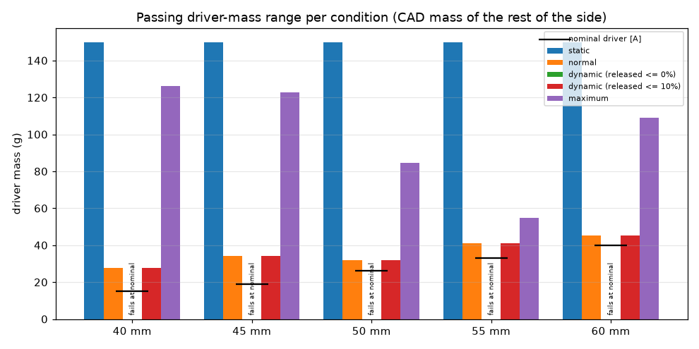

## 11. Occipital spring link — wire derived, not chosen

Occipital spring link — the wire diameter is DERIVED, not chosen.

Geometry: a planar wire in the head's transverse plane (X lateral, Y fore-aft), symmetric about the midline.
  * Final, eye on the cup end (support.link_path): from the eye the wire runs back across the cup face to
    hook_y, inward along the module side to the head (side_x), then around the occiput as a circular arc whose
    apex lies `apex` behind the eye line (SAGITTA + 15 mm [A]).
  * Design B, eye on the mastoid pad: a circular arc through both eyes; eye half-spacing w = head_half_width +
    eye height above skin, the occiput a sagitta s = SAGITTA [A] behind the eye line, R = (w^2 + s^2) / (2 s).

End forces +-P act along the chord (eye to eye). Moment at a point of the
wire is  M = P * x  with x the distance from the chord, so by Castigliano
    delta_pair = (P / EI) * integral( x^2 ds )      (bending; the axial and shear share is bounded below the tables)
    k_pair = P / delta_pair ,  k_side = 2 k_pair  (each eye moves delta_pair/2)
Max bending moment  M_max = P * x_max  at the apex (x_max: the apex distance from the chord).
Apex torsion coil (n turns, mean diameter Dc) sits where M = P x_max, so it adds
    delta_coil = P x_max^2 L_coil / (E I),  L_coil = pi Dc n
and k_pair = EI / (int x^2 ds + x_max^2 L_coil). The coil lowers the rate (preload
stays nearly constant across head sizes) without raising the stress, apart
from the coil curvature factor Ki = (4C^2 - C - 1)/(4C(C - 1)), C = Dc/d.
Bending stress      sigma = 32 M / (pi d^3)
Eye (end loop) stress, Shigley hook formula with the moment arm = mean eye radius r1:
    sigma_eye = P [ K_A * 32 r1 / (pi d^3) + 4 / (pi d^2) ],
    K_A = (4 C1^2 - C1 - 1) / (4 C1 (C1 - 1)),  C1 = 2 r1 / d
Strength: music wire ASTM A228, Sut = 2211 / d^0.145 MPa [STD]; bending
yield ~0.75 Sut [STD]; fully reversed bending endurance 0.3 Sut [A].

**B** (P = 1.20 N): chosen Ø1.50 mm, 3 apex coils (mean Ø12 mm).

| quantity | value |
|---|---|
| rate per side k (N/m) | 57.4 |
| preload range (p5–p95 head) N | 0.856 – 1.54 |
| max/min preload ratio | 1.81 |
| donning force N | 2.69 |
| Sut MPa (d) | 2085 |
| σ worn / σ donning MPa | 437 / 762 |
| eye stress (donning) MPa, K_A | 31.5, 1.23 |
| eye inner radius mm (≥ 1.5 d = minimum bend radius) | 2.25 |
| SF yield (≥ 1.5) | 2.05 |
| SF fatigue Goodman, 10 000 donning cycles (≥ 1.5) | 2.97 |
| free half-gap mm (form the wire to this) | 66.1 |
| wire length m | 0.269 |
| mass g | 5.31 |

**Final** (P = 5.00 N): chosen Ø2.50 mm, 4 apex coils (mean Ø12 mm).

| quantity | value |
|---|---|
| rate per side k (N/m) | 164 |
| preload range (p5–p95 head) N | 4.02 – 5.98 |
| max/min preload ratio | 1.49 |
| donning force N | 9.26 |
| Sut MPa (d) | 1936 |
| σ worn / σ donning MPa | 570 / 882 |
| eye stress (donning) MPa, K_A | 39.0, 1.23 |
| eye inner radius mm (≥ 1.5 d = minimum bend radius) | 3.75 |
| SF yield (≥ 1.5) | 1.65 |
| SF fatigue Goodman, 10 000 donning cycles (≥ 1.5) | 2.35 |
| free half-gap mm (form the wire to this) | 101 |
| wire length m | 0.443 |
| mass g | 22.9 |

Bending only: with the axial and shear forces taken as P along the whole 0.443 m arc (an upper bound), their compliance is 0.0138 % of the bending compliance of the Final wire (shear factor 1.11, ν = 0.29) [C].

The common link is formed on the 50 mm module; on the other modules the cup end sits Δz deeper or shallower, so P(D) = P_ref + k_side Δz (table in §3). The lowest yield SF over the five modules is 1.59 (60 mm) against the required 1.5: 6.05 % headroom. The preload itself comes from the eye tune (§7); stock diameters 1, 1.2, 1.4, 1.5, 1.6, 1.8, 2 mm [DS] and 2.25, 2.5 mm [A: assumed stocked, confirm with the wire supplier] are considered.

The same wire on every module: each module's eye sets its own path across the cup face (and its own P(D)), so the wire is checked on each (link_design with that module's path):

| D | eye x mm | eye y mm | P(D) N | k_side N/m | max/min preload | SF yield (≥ 1.5) | SF fatigue (≥ 1.5) | all |
|---|---|---|---|---|---|---|---|---|
| 40 | -15.0 | 7.00 | 4.67 | 152 | 1.48 | 1.71 | 2.44 | PASS |
| 45 | -18.0 | 7.00 | 4.84 | 161 | 1.50 | 1.68 | 2.39 | PASS |
| 50 | -19.0 | 7.00 | 5.00 | 164 | 1.49 | 1.65 | 2.35 | PASS |
| 55 | -18.0 | 7.00 | 5.16 | 161 | 1.46 | 1.62 | 2.30 | PASS |
| 60 | -18.0 | 7.00 | 5.33 | 161 | 1.44 | 1.59 | 2.26 | PASS |

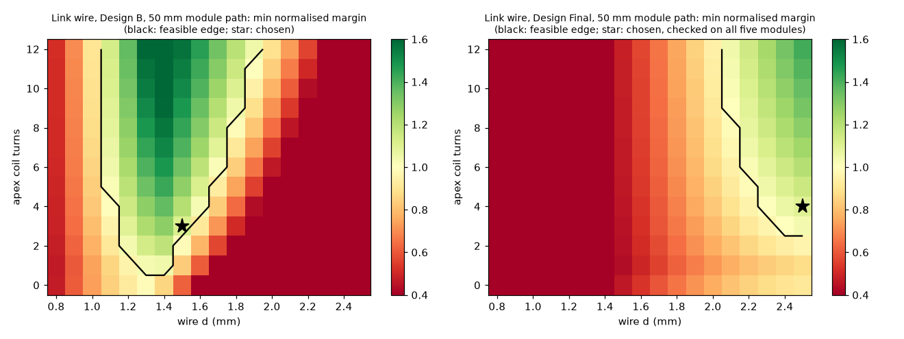

## 12. Structural analysis of the cradle arms

Structural checks of the cradle arms, joints, fasteners, inserts,
twist lock, link eye, press/snap fits, creep, temperature and fatigue.

NO FEA WAS RUN. Everything below is closed-form beam / joint theory with
Peterson stress-concentration factors. Where the geometry is not beam-like
(ring tab root, lug root, 45° lip, insert boss) the result is flagged as
"FEA recommended" in the report.

Beam model of an arm
--------------------
Centreline in the arm's own (r, z) plane at angle a:
    pad  (r_tip, z=0)  ->  foot  (z_f = pad_h + ft/2) out to the leg
    leg  (r_l = leg_r + leg_t/2) up to the bar (z_b = S - bar_t/2)
    bar  inwards to the clamp edge of the outer screw (built-in end)
Internal forces at a section located at point s, from the pad force F
applied at the pad contact point p (skin):
    F_int = F ,  M_int = (p - s) x F
decomposed into the section axes (axial a, in-plane h, tangential t):
    sigma = N/A + K_t [ |M_t| 6/(b h^2) + |M_h| 6/(h b^2) ]     (corner, both bending planes summed)
    tau   = T (3 + 1.8 h/b)/(b h^2)    (Roark, rectangle b >= h)  + 1.5 V/A
Printing: arms lie on their side, layers parallel to the (r, z) plane, so
all axial bending stress is IN-LAYER (S_xy); interlayer planes (normal t)
carry the transverse shear V_t and the torsion shear -> checked against
the interlayer shear strength.

Allowables at 40 °C: S_xy·kT = 38.2 MPa (in-layer), interlayer shear 11.9 MPa; sustained (1 g) × 0.5. Required SF ≥ γM = 1.6. Kt: fillet 1.25, hole in bending 2.0 [STD Peterson]. Combined loading: σ = |N|/A + Kt(|M_t|/Z_t + |M_h|/Z_h), τ = τ_torsion + 1.5 |V|/A, σ_vM = √(σ² + 3τ²); interlayer shear uses the shear acting on the layer planes (arms printed on their side).

Three structural load definitions:
* **1 g sustained** — every held 1 g combination, sustained allowables.
* **5 g accidental envelope** — every 5 g combination: when it stays in equilibrium, its contact forces; when it releases, the contact
  forces at the **onset of gross slip** (bisection on the load factor λ of the increment from the static state). Beyond the onset the
  cradle slides off and the arm loads cannot grow, so the envelope bounds the arm loads. λ_min per size is in §1.
* **10 N handling** — 10 N at one pad in any of 302 directions (a hand catching a pad, a collar, hair) [A]: the local load that the
  retention cannot limit. It sized the arm bar.
The whole-load-at-one-pad bound of the 5 g case (m·5g + 20 N snag on a single pad) is printed for information only: it cannot occur
because the cradle releases first.

50 mm, 1 g normal (sustained allowables), 6 lowest sections:

| arm | section | σ MPa | τ MPa | σ_vM MPa | SF vM | τ interlayer MPa | SF interlayer | N N | T N·mm | M_t N·mm | M_h N·mm |
|---|---|---|---|---|---|---|---|---|---|---|---|
| mastoid | bar at clamp edge (slot end) | 4.17 | 0.279 | 4.20 | 4.55 | 0.815 | 7.30 | -1.37 | 7.74 | 65.9 | 3.52 |
| temporal | bar at clamp edge (slot end) | 3.37 | 0.238 | 3.39 | 5.64 | 0.562 | 10.6 | -1.06 | 6.86 | 52.8 | 3.25 |
| post | bar at clamp edge (slot end) | 3.01 | 0.154 | 3.02 | 6.34 | 0.303 | 19.6 | -0.590 | 1.17 | 49.3 | 0.486 |
| saddle | leg bottom fillet | 0.263 | 0.807 | 1.42 | 13.5 | 0.797 | 7.46 | 0.504 | 103 | 13.3 | -9.55 |
| saddle | leg top fillet | 0.148 | 0.807 | 1.41 | 13.6 | 0.797 | 7.46 | 0.504 | 103 | -0.710 | -24.7 |
| saddle | bar at clamp edge (slot end) | 1.92 | 0.144 | 1.94 | 9.86 | 0.379 | 15.7 | 2.25 | -13.1 | -40.8 | -44.2 |

50 mm, 5 g accidental (short-term allowables, onset envelope), 6 lowest sections:

| arm | section | σ MPa | τ MPa | σ_vM MPa | SF vM | τ interlayer MPa | SF interlayer | N N | T N·mm | M_t N·mm | M_h N·mm |
|---|---|---|---|---|---|---|---|---|---|---|---|
| mastoid | bar at clamp edge (slot end) | 23.8 | 2.21 | 24.1 | 1.58 | 4.36 | 2.73 | -7.48 | 71.5 | 366 | 32.6 |
| temporal | bar at clamp edge (slot end) | 20.8 | 3.26 | 21.6 | 1.77 | 3.20 | 3.72 | -1.78 | 106 | 304 | 50.4 |
| post | bar at clamp edge (slot end) | 11.7 | 2.39 | 12.4 | 3.08 | 1.88 | 6.32 | -0.170 | 78.1 | 168 | 32.6 |
| saddle | bar at clamp edge (slot end) | 11.5 | 0.358 | 11.5 | 3.33 | 0.884 | 13.5 | 9.15 | -31.4 | -317 | -97.0 |
| mastoid | leg top fillet | 8.28 | 0.593 | 8.34 | 4.59 | 1.14 | 10.5 | 14.2 | -28.5 | 294 | 53.1 |
| temporal | leg top fillet | 7.92 | 0.705 | 8.02 | 4.77 | 0.868 | 13.7 | 20.7 | -44.3 | 261 | 78.9 |

50 mm, handling 10 N (short-term allowables), 6 lowest sections:

| arm | section | σ MPa | τ MPa | σ_vM MPa | SF vM | τ interlayer MPa | SF interlayer | N N | T N·mm | M_t N·mm | M_h N·mm |
|---|---|---|---|---|---|---|---|---|---|---|---|
| saddle | bar at clamp edge (slot end) | 22.2 | 0.520 | 22.2 | 1.72 | 2.81 | 4.24 | 4.56 | -33.0 | -598 | 243 |
| post | bar at clamp edge (slot end) | 18.0 | 2.84 | 18.6 | 2.05 | 6.33 | 1.88 | -8.33 | -116 | 255 | -48.4 |
| temporal | bar at clamp edge (slot end) | 18.5 | 3.14 | 19.3 | 1.98 | 6.33 | 1.88 | -7.87 | 128 | 254 | 60.7 |
| mastoid | bar at clamp edge (slot end) | 18.3 | 3.00 | 19.1 | 2.01 | 6.32 | 1.88 | -7.94 | -122 | 255 | -55.5 |
| saddle | leg bottom fillet | 9.78 | 0.0521 | 9.78 | 3.91 | 4.58 | 2.60 | 9.94 | 4.45 | 580 | -127 |
| saddle | leg top fillet | 10.1 | 0.305 | 10.1 | 3.79 | 4.58 | 2.60 | 9.66 | -34.9 | 595 | 140 |

Information: whole 5 g load (28.5 N) at one pad → lowest SF 0.603 (saddle: bar at clamp edge (slot end) (vM)).

60 mm, 1 g normal (sustained allowables), 6 lowest sections:

| arm | section | σ MPa | τ MPa | σ_vM MPa | SF vM | τ interlayer MPa | SF interlayer | N N | T N·mm | M_t N·mm | M_h N·mm |
|---|---|---|---|---|---|---|---|---|---|---|---|
| mastoid | bar at clamp edge (slot end) | 4.60 | 0.340 | 4.64 | 4.12 | 0.897 | 6.64 | -1.40 | -9.57 | 72.3 | -4.36 |
| temporal | bar at clamp edge (slot end) | 3.71 | 0.295 | 3.74 | 5.11 | 0.612 | 9.72 | -1.13 | 8.94 | 57.6 | 4.24 |
| post | bar at clamp edge (slot end) | 3.07 | 0.267 | 3.11 | 6.15 | 0.313 | 19.0 | -0.570 | -6.17 | 48.7 | -2.57 |
| saddle | leg bottom fillet | 0.273 | 0.860 | 1.51 | 12.6 | 0.850 | 7.00 | 0.524 | 110 | 13.7 | -10.2 |
| saddle | leg top fillet | 0.161 | 0.860 | 1.50 | 12.8 | 0.850 | 7.00 | 0.524 | 110 | -0.978 | -26.4 |
| saddle | bar at clamp edge (slot end) | 2.04 | 0.142 | 2.06 | 9.31 | 0.405 | 14.7 | 2.40 | -12.9 | -44.6 | -43.7 |

60 mm, 5 g accidental (short-term allowables, onset envelope), 6 lowest sections:

| arm | section | σ MPa | τ MPa | σ_vM MPa | SF vM | τ interlayer MPa | SF interlayer | N N | T N·mm | M_t N·mm | M_h N·mm |
|---|---|---|---|---|---|---|---|---|---|---|---|
| mastoid | bar at clamp edge (slot end) | 26.2 | 2.35 | 26.5 | 1.44 | 4.02 | 2.96 | -8.19 | 75.0 | 404 | 34.2 |
| temporal | bar at clamp edge (slot end) | 24.7 | 2.02 | 24.9 | 1.53 | 2.42 | 4.91 | -5.07 | 52.1 | 388 | 24.7 |
| post | bar at clamp edge (slot end) | 14.0 | 2.63 | 14.8 | 2.59 | 2.06 | 5.78 | -0.784 | 85.3 | 204 | 35.6 |
| saddle | bar at clamp edge (slot end) | 11.2 | 0.180 | 11.2 | 3.42 | 0.843 | 14.1 | 8.33 | -12.7 | -337 | -32.8 |
| mastoid | leg top fillet | 9.10 | 0.631 | 9.16 | 4.17 | 1.05 | 11.3 | 15.8 | -29.9 | 325 | 55.7 |
| temporal | leg top fillet | 8.91 | 0.435 | 8.94 | 4.28 | 0.657 | 18.1 | 20.5 | -21.7 | 323 | 38.7 |

60 mm, handling 10 N (short-term allowables), 6 lowest sections:

| arm | section | σ MPa | τ MPa | σ_vM MPa | SF vM | τ interlayer MPa | SF interlayer | N N | T N·mm | M_t N·mm | M_h N·mm |
|---|---|---|---|---|---|---|---|---|---|---|---|
| saddle | bar at clamp edge (slot end) | 22.2 | 0.520 | 22.2 | 1.72 | 2.81 | 4.24 | 4.56 | -33.0 | -598 | 243 |
| post | bar at clamp edge (slot end) | 18.0 | 2.84 | 18.6 | 2.05 | 6.33 | 1.88 | -8.33 | -116 | 255 | -48.4 |
| temporal | bar at clamp edge (slot end) | 18.5 | 3.14 | 19.3 | 1.98 | 6.33 | 1.88 | -7.87 | 128 | 254 | 60.7 |
| mastoid | bar at clamp edge (slot end) | 18.3 | 3.00 | 19.1 | 2.01 | 6.32 | 1.88 | -7.94 | -122 | 255 | -55.5 |
| saddle | leg bottom fillet | 9.78 | 0.0521 | 9.78 | 3.91 | 4.58 | 2.60 | 9.94 | 4.45 | 580 | -127 |
| saddle | leg top fillet | 10.1 | 0.305 | 10.1 | 3.79 | 4.58 | 2.60 | 9.66 | -34.9 | 595 | 140 |

Information: whole 5 g load (29.3 N) at one pad → lowest SF 0.586 (saddle: bar at clamp edge (slot end) (vM)).

Arm compliance in series with each contact (Final 60 mm; the support model carries it, §6), in the contact frame (n = contact normal, t1/t2 = tangents), against the contact's own compliance:

| contact | arm | arm n mm/N [C] | arm t1 mm/N | arm t2 mm/N | contact n mm/N [C] | contact t mm/N | largest arm/contact ratio |
|---|---|---|---|---|---|---|---|
| T temporal | temporal | 0.0150 | 0.0366 | 0.0376 | 0.127 | 0.254 | 0.148 |
| M mastoid | mastoid | 0.0113 | 0.0329 | 0.0324 | 0.0517 | 0.103 | 0.318 |
| P post-sup | post | 0.0110 | 0.0322 | 0.0365 | 0.126 | 0.252 | 0.145 |
| S root F | saddle | 0.162 | 0.133 | 0.572 | 0.414 | 0.827 | 0.691 |
| S root B | saddle | 0.162 | 0.133 | 0.572 | 0.414 | 0.827 | 0.691 |
| S scalp | saddle | 0.285 | 0.0237 | 0.161 | 0.268 | 0.537 | 1.06 |

Where each arm's compliance sits at rest (60 mm; share of the arm's complementary energy under its own contact forces, `structure.arm_energy_split`): temporal — leg in-plane bending 42.2 %, foot in-plane bending 17.2 %; mastoid — leg in-plane bending 74.0 %, foot in-plane bending 10.1 %; post — leg in-plane bending 58.5 %, foot in-plane bending 19.6 %; saddle — foot in-plane bending 69.6 %, leg in-plane bending 28.4 %. 
Among the skin pads the arm is most compliant against its contact at the mastoid pad (ratio 0.318); where the arm compliance is comparable to the contact's, the pad sheds weight onto the auricle root (rigid against flexible arms: §6 lever table). Leg thickness and saddle liner were therefore chosen together (§6, 'Arm legs and saddle liner').

Temperature: at 55 °C (car, sun) strength ×0.700 [LIT] against ×0.850 at 40 °C: every short-term SF above scales by 0.824. Fatigue: walking/running 1e7 cycles [A]; each arm section is taken to cycle from zero to its largest von Mises stress over the held 2 g combinations (conservative: the steady 1 g part is not split off, Kt kept as the notch factor), Goodman on the normalised S-N curve (`structure.fatigue_strength`, fatigue ratio [A]) at 1e7 cycles, 40 °C: lowest SF 1.71 at 60 mm, mastoid bar at clamp edge (slot end) (σ_max 8.67 MPa, S_f 9.16 MPa). Creep rupture of the arms is covered by the sustained allowables (×0.5) in the 1 g tables; creep of the preload matters in the bolted joints (§13).

### 12.1 Contact stresses at every interface

50 mm:

| interface | case | F N | p mean kPa | p peak kPa | limit kPa | peak/limit | SF short | SF sustained |
|---|---|---|---|---|---|---|---|---|
| pad T temporal on skin | static (sustained) | 1.19 | 2.30 | 4.60 | 4.00 | 1.15 | – | – |
| pad T temporal on skin | 2 g max (transient) | 3.77 | 7.28 | 14.6 | 8.00 | 1.82 | – | – |
| pad T temporal on skin | 5 g max (accidental) | 21.3 | 41.1 | 82.2 | 150 | 0.548 | – | – |
| pad M mastoid on skin | static (sustained) | 1.76 | 2.33 | 4.65 | 4.00 | 1.16 | – | – |
| pad M mastoid on skin | 2 g max (transient) | 5.50 | 7.27 | 14.5 | 8.00 | 1.82 | – | – |
| pad M mastoid on skin | 5 g max (accidental) | 24.0 | 31.7 | 63.5 | 150 | 0.423 | – | – |
| pad P post-sup on skin | static (sustained) | 1.61 | 3.11 | 6.21 | 4.00 | 1.55 | – | – |
| pad P post-sup on skin | 2 g max (transient) | 4.06 | 7.85 | 15.7 | 8.00 | 1.96 | – | – |
| pad P post-sup on skin | 5 g max (accidental) | 15.2 | 29.4 | 58.7 | 150 | 0.392 | – | – |
| saddle zone S root F on the auricle root | static (sustained) | 0.229 | 3.27 | 6.53 | 4.00 | 1.63 | – | – |
| saddle zone S root F on the auricle root | 2 g max (transient) | 3.49 | 49.8 | 99.6 | 8.00 | 12.5 | – | – |
| saddle zone S root F on the auricle root | 5 g max (accidental) | 7.40 | 106 | 211 | 150 | 1.41 | – | – |
| saddle zone S root B on the auricle root | static (sustained) | 0.202 | 2.88 | 5.76 | 4.00 | 1.44 | – | – |
| saddle zone S root B on the auricle root | 2 g max (transient) | 2.61 | 37.3 | 74.5 | 8.00 | 9.32 | – | – |
| saddle zone S root B on the auricle root | 5 g max (accidental) | 5.55 | 79.3 | 159 | 150 | 1.06 | – | – |
| pad S scalp on skin | static (sustained) | 0.378 | 1.69 | 3.38 | 4.00 | 0.845 | – | – |
| pad S scalp on skin | 2 g max (transient) | 0.897 | 4.01 | 8.01 | 8.00 | 1.00 | – | – |
| pad S scalp on skin | 5 g max (accidental) | 3.86 | 17.2 | 34.5 | 150 | 0.230 | – | – |
| arm screw head (M3) on PETG arm | highest preload (K 0.20) | 167 | – | 11354 | – | – | 4.12 | 2.06 |
| anchor screw head (M3) on PETG anchor | highest preload (K 0.20) | 167 | – | 11354 | – | – | 4.12 | 2.06 |
| serration flanks (temporal arm, 10 mm) | highest preload (2 screws, K 0.20) | 333 | – | 2525 | – | – | 18.5 | 9.26 |
| serration flanks (saddle arm, 16 mm) | highest preload (2 screws, K 0.20) | 333 | – | 1578 | – | – | 29.6 | 14.8 |
| link wire on brass eye sleeve (Hertz line) | donning preload | 9.50 | – | 220512 | – | – | 1.89 | – |
| eye insert on PETG boss (lateral) | donning preload | 9.50 | – | 4157 | – | – | – | 5.62 |

60 mm:

| interface | case | F N | p mean kPa | p peak kPa | limit kPa | peak/limit | SF short | SF sustained |
|---|---|---|---|---|---|---|---|---|
| pad T temporal on skin | static (sustained) | 1.31 | 2.52 | 5.05 | 4.00 | 1.26 | – | – |
| pad T temporal on skin | 2 g max (transient) | 4.27 | 8.25 | 16.5 | 8.00 | 2.06 | – | – |
| pad T temporal on skin | 5 g max (accidental) | 22.7 | 43.9 | 87.7 | 150 | 0.585 | – | – |
| pad M mastoid on skin | static (sustained) | 1.96 | 2.59 | 5.17 | 4.00 | 1.29 | – | – |
| pad M mastoid on skin | 2 g max (transient) | 6.03 | 7.97 | 15.9 | 8.00 | 1.99 | – | – |
| pad M mastoid on skin | 5 g max (accidental) | 24.8 | 32.8 | 65.6 | 150 | 0.438 | – | – |
| pad P post-sup on skin | static (sustained) | 1.60 | 3.10 | 6.20 | 4.00 | 1.55 | – | – |
| pad P post-sup on skin | 2 g max (transient) | 4.42 | 8.54 | 17.1 | 8.00 | 2.13 | – | – |
| pad P post-sup on skin | 5 g max (accidental) | 17.1 | 32.9 | 65.9 | 150 | 0.439 | – | – |
| saddle zone S root F on the auricle root | static (sustained) | 0.253 | 3.61 | 7.22 | 4.00 | 1.80 | – | – |
| saddle zone S root F on the auricle root | 2 g max (transient) | 3.80 | 54.3 | 109 | 8.00 | 13.6 | – | – |
| saddle zone S root F on the auricle root | 5 g max (accidental) | 7.46 | 107 | 213 | 150 | 1.42 | – | – |
| saddle zone S root B on the auricle root | static (sustained) | 0.223 | 3.19 | 6.38 | 4.00 | 1.59 | – | – |
| saddle zone S root B on the auricle root | 2 g max (transient) | 2.73 | 38.9 | 77.9 | 8.00 | 9.74 | – | – |
| saddle zone S root B on the auricle root | 5 g max (accidental) | 5.60 | 80.0 | 160 | 150 | 1.07 | – | – |
| pad S scalp on skin | static (sustained) | 0.391 | 1.75 | 3.49 | 4.00 | 0.873 | – | – |
| pad S scalp on skin | 2 g max (transient) | 0.984 | 4.39 | 8.79 | 8.00 | 1.10 | – | – |
| pad S scalp on skin | 5 g max (accidental) | 4.31 | 19.3 | 38.5 | 150 | 0.257 | – | – |
| arm screw head (M3) on PETG arm | highest preload (K 0.20) | 167 | – | 11354 | – | – | 4.12 | 2.06 |
| anchor screw head (M3) on PETG anchor | highest preload (K 0.20) | 167 | – | 11354 | – | – | 4.12 | 2.06 |
| serration flanks (temporal arm, 10 mm) | highest preload (2 screws, K 0.20) | 333 | – | 2525 | – | – | 18.5 | 9.26 |
| serration flanks (saddle arm, 16 mm) | highest preload (2 screws, K 0.20) | 333 | – | 1578 | – | – | 29.6 | 14.8 |
| link wire on brass eye sleeve (Hertz line) | donning preload | 9.50 | – | 220512 | – | – | 1.89 | – |
| eye insert on PETG boss (lateral) | donning preload | 9.50 | – | 4157 | – | – | – | 5.62 |

Pads on skin: Winkler thin-layer peak = 2 × mean (paraboloid on a bed of springs) [C]; screw heads and serration flanks: bearing on PETG (S_bear) [DS]; link wire on the brass sleeve: Hertz line contact [STD]; eye insert: lateral bearing on the boss with the moment of the sleeve height [C].

## 13. Joints, fasteners, inserts, fits, twist lock

Arm-to-tab joint with serrations (Final design): n screws on the arm centreline at pitch p, arm width w.
    Section forces at the clamp edge (structure.section_stress, bar axis a = radial): F_r = N (radial),
    F_t = V_t (tangential), F_pull = pull-off normal to the joint face (V_h > 0), M_tilt = M_t (about the
    tangential axis), T_twist = T (about the radial axis = the screw line), M_inplane = M_h (about the
    joint normal).
    Preload from the tightening torque, F_i = T / (K d), with the nut-factor scatter K_lo..K_hi
    (materials.NUT_FACTOR_K_RANGE): F_i,max = T/(K_lo d) for the insert, F_i,min = T/(K_hi d) for engagement.
    Retained (aged) preload: retained_preload(F_i,min) (PETG creep, wave washer).
    External demand on the most loaded screw (lever rule, conservative bounds on the load factor Phi: the
    screw takes all of it for pull-out (Phi = 1), the clamp loses all of it for engagement (Phi = 0)):
        wedge   F_sep  = |F_r| tan(flank - phi), phi = atan(mu)     (radial load on the tooth flanks), shared by n
        prying  |M_t| / p                                          (couple of the two screws about the joint centre)
        twist   2 |T| / (n w)                                      (arm pivots on its edge, lever w/2)
        pull    F_pull / n
        D_screw = F_sep / n + |M_t| / p + 2 |T| / (n w) + F_pull / n
        SF_engage  = F_i,eff(min) / D_screw          (external loads can grow by SF before the teeth lift)
        SF_pullout = (pull-out / gamma_insert) / (F_i,max + D_screw)
    Tangential: the grooves run tangentially, so F_t and the in-plane moment go to the screw shanks bearing on
    the slot sides over the bar thickness t_bear: per screw |F_t| / n + |M_h| / p.
    Tooth root shear: tau = F_r / (n_teeth * w * p) (teeth in the arm, in-layer shear because the arm is
    printed on its side: the tooth profile lies in the print plane).

50 mm — minimum over every load combination of each category (F_i range, D_screw and the nominal-preload pull-out SF shown for the combination with the lowest engagement SF):

| case | arm | F_i range N (K 0.35–0.20) | F_i after creep (from the lowest) N | D_screw N | SF engage (≥1) | SF insert pull-out at the highest F_i (≥1) | pull-out SF at nominal F_i | SF slot bearing (≥1) | SF spin-out | SF tooth shear | plain joint: SF slip |
|---|---|---|---|---|---|---|---|---|---|---|---|
| 1 g normal | saddle | 95.2–167 | 82.8 | 5.31 | 15.6 | 1.60 | 2.21 | 74.6 | 10.0 | 1036 | 0.649 |
| 1 g normal | temporal | 95.2–167 | 82.8 | 5.98 | 13.8 | 1.59 | 2.20 | 525 | 10.0 | 1499 | 3.51 |
| 1 g normal | mastoid | 95.2–167 | 82.8 | 7.69 | 10.8 | 1.58 | 2.17 | 376 | 10.0 | 1747 | 2.19 |
| 1 g normal | post | 95.2–167 | 82.8 | 5.20 | 15.9 | 1.60 | 2.21 | 1078 | 10.0 | 3290 | 5.39 |
| 2 g dynamic | saddle | 95.2–167 | 82.8 | 18.7 | 4.44 | 1.48 | 2.00 | 43.3 | 10.0 | 649 | 0.312 |
| 2 g dynamic | temporal | 95.2–167 | 82.8 | 10.3 | 8.06 | 1.55 | 2.13 | 284 | 10.0 | 1503 | 1.43 |
| 2 g dynamic | mastoid | 95.2–167 | 82.8 | 13.7 | 6.04 | 1.52 | 2.07 | 290 | 10.0 | 616 | 1.31 |
| 2 g dynamic | post | 95.2–167 | 82.8 | 6.42 | 12.9 | 1.59 | 2.19 | 855 | 10.0 | 2291 | 4.62 |
| 3 g severe | saddle | 95.2–167 | 82.8 | 28.6 | 2.89 | 1.41 | 1.86 | 33.5 | 10.0 | 342 | 0.116 |
| 3 g severe | temporal | 95.2–167 | 82.8 | 17.0 | 4.87 | 1.50 | 2.02 | 198 | 10.0 | 750 | 0.814 |
| 3 g severe | mastoid | 95.2–167 | 82.8 | 19.0 | 4.35 | 1.48 | 1.99 | 221 | 10.0 | 429 | 0.813 |
| 3 g severe | post | 95.2–167 | 82.8 | 9.33 | 8.87 | 1.56 | 2.14 | 487 | 10.0 | 3427 | 2.52 |
| 5 g accidental | saddle | 95.2–167 | 82.8 | 34.9 | 2.37 | 1.36 | 1.79 | 34.5 | 10.0 | 255 | 0.0746 |
| 5 g accidental | temporal | 95.2–167 | 82.8 | 38.9 | 2.13 | 1.34 | 1.74 | 77.8 | 10.0 | 821 | 0.217 |
| 5 g accidental | mastoid | 95.2–167 | 82.8 | 43.0 | 1.92 | 1.31 | 1.70 | 66.2 | 10.0 | 195 | 0.102 |
| 5 g accidental | post | 95.2–167 | 82.8 | 23.1 | 3.58 | 1.45 | 1.93 | 173 | 10.0 | 8584 | 0.756 |
| handling 10 N | saddle | 95.2–167 | 82.8 | 72.4 | 1.14 | 1.15 | 1.44 | 12.9 | 10.0 | 755 | 0 |
| handling 10 N | temporal | 95.2–167 | 82.8 | 41.1 | 2.01 | 1.32 | 1.72 | 47.3 | 10.0 | 244 | 0.166 |
| handling 10 N | mastoid | 95.2–167 | 82.8 | 41.0 | 2.02 | 1.32 | 1.72 | 48.7 | 10.0 | 229 | 0.167 |
| handling 10 N | post | 95.2–167 | 82.8 | 40.7 | 2.04 | 1.33 | 1.72 | 51.6 | 10.0 | 223 | 0.179 |

60 mm — minimum over every load combination of each category (F_i range, D_screw and the nominal-preload pull-out SF shown for the combination with the lowest engagement SF):

| case | arm | F_i range N (K 0.35–0.20) | F_i after creep (from the lowest) N | D_screw N | SF engage (≥1) | SF insert pull-out at the highest F_i (≥1) | pull-out SF at nominal F_i | SF slot bearing (≥1) | SF spin-out | SF tooth shear | plain joint: SF slip |
|---|---|---|---|---|---|---|---|---|---|---|---|
| 1 g normal | saddle | 95.2–167 | 82.8 | 5.70 | 14.5 | 1.60 | 2.20 | 69.9 | 10.0 | 973 | 0.640 |
| 1 g normal | temporal | 95.2–167 | 82.8 | 6.66 | 12.4 | 1.59 | 2.19 | 474 | 10.0 | 1381 | 3.06 |
| 1 g normal | mastoid | 95.2–167 | 82.8 | 8.48 | 9.76 | 1.57 | 2.16 | 343 | 10.0 | 1508 | 1.98 |
| 1 g normal | post | 95.2–167 | 82.8 | 5.44 | 15.2 | 1.60 | 2.21 | 1044 | 10.0 | 3191 | 5.11 |
| 2 g dynamic | saddle | 95.2–167 | 82.8 | 20.2 | 4.10 | 1.47 | 1.97 | 39.3 | 10.0 | 532 | 0.358 |
| 2 g dynamic | temporal | 95.2–167 | 82.8 | 11.8 | 6.99 | 1.54 | 2.10 | 261 | 10.0 | 1211 | 1.22 |
| 2 g dynamic | mastoid | 95.2–167 | 82.8 | 14.9 | 5.56 | 1.51 | 2.05 | 268 | 10.0 | 561 | 1.18 |
| 2 g dynamic | post | 95.2–167 | 82.8 | 7.03 | 11.8 | 1.58 | 2.18 | 791 | 10.0 | 2332 | 3.90 |
| 3 g severe | saddle | 95.2–167 | 82.8 | 32.2 | 2.57 | 1.38 | 1.82 | 33.9 | 10.0 | 323 | 0.0856 |
| 3 g severe | temporal | 95.2–167 | 82.8 | 18.0 | 4.60 | 1.49 | 2.01 | 180 | 10.0 | 773 | 0.720 |
| 3 g severe | mastoid | 95.2–167 | 82.8 | 20.3 | 4.08 | 1.47 | 1.97 | 200 | 10.0 | 401 | 0.731 |
| 3 g severe | post | 95.2–167 | 82.8 | 10.4 | 7.96 | 1.55 | 2.12 | 454 | 10.0 | 1506 | 2.71 |
| 5 g accidental | saddle | 95.2–167 | 82.8 | 35.6 | 2.33 | 1.36 | 1.78 | 34.4 | 10.0 | 280 | 0.113 |
| 5 g accidental | temporal | 95.2–167 | 82.8 | 43.3 | 1.91 | 1.31 | 1.69 | 81.4 | 10.0 | 256 | 0.110 |
| 5 g accidental | mastoid | 95.2–167 | 82.8 | 47.1 | 1.76 | 1.29 | 1.66 | 61.6 | 10.0 | 178 | 0.0517 |
| 5 g accidental | post | 95.2–167 | 82.8 | 27.3 | 3.03 | 1.42 | 1.88 | 159 | 10.0 | 1859 | 0.554 |
| handling 10 N | saddle | 95.2–167 | 82.8 | 72.4 | 1.14 | 1.15 | 1.44 | 12.9 | 10.0 | 755 | 0 |
| handling 10 N | temporal | 95.2–167 | 82.8 | 41.1 | 2.01 | 1.32 | 1.72 | 47.3 | 10.0 | 244 | 0.166 |
| handling 10 N | mastoid | 95.2–167 | 82.8 | 41.0 | 2.02 | 1.32 | 1.72 | 48.7 | 10.0 | 229 | 0.167 |
| handling 10 N | post | 95.2–167 | 82.8 | 40.7 | 2.04 | 1.33 | 1.72 | 51.6 | 10.0 | 223 | 0.179 |

M3 arm joint under the 10 N handling load (50 mm, all arms): lowest engagement / pull-out SF over the insert pitch (rows) and the tightening torque (columns). Both must be ≥ 1: more torque helps engagement and hurts pull-out, a wider pitch helps both (shorter pry lever ratio) and costs 1.49 g per mm per side (§5, W5):

| insert pitch mm | 0.08 N·m: engage / pull-out | 0.10 N·m: engage / pull-out | 0.12 N·m: engage / pull-out | 0.15 N·m: engage / pull-out |
|---|---|---|---|---|
| 7.10 | 0.673 / 1.19 | 0.842 / 1.04 | 0.884 / 0.922 | 0.884 / 0.789 |
| 8.00 | 0.736 / 1.23 | 0.920 / 1.07 | 0.966 / 0.948 | 0.966 / 0.809 |
| 9.00 | 0.802 / 1.27 | 1.00 / 1.10 | 1.05 / 0.973 | 1.05 / 0.827 |
| 10.0 | 0.863 / 1.31 | 1.08 / 1.13 | 1.13 / 0.994 | 1.13 / 0.842 |
| 11.0 | 0.921 / 1.34 | 1.15 / 1.15 | 1.21 / 1.01 | 1.21 / 0.854 |

Chosen: 11 mm at 0.10 N·m, lowest SF 1.15; the best narrower combination (10 mm at 0.10 N·m) keeps 1.08. The margin is wanted on engagement, which rests on the least certain input (the 3-year creep of the clamped PETG).

10 N handling load at one pad (302 directions), 50 mm — minimum joint SFs per arm: saddle: engage 1.14, pull-out 1.15, slot 12.9; temporal: engage 2.01, pull-out 1.32, slot 47.3; mastoid: engage 2.02, pull-out 1.32, slot 48.7; post: engage 2.04, pull-out 1.33, slot 51.6.

'Plain joint' = the same section forces on a friction-only slotted clamp (Design A/B): where its SF is < 1 it slips — the reason for the serrations.

Heat-set insert bosses (the design walls: the rule or the 1.6 mm minimum wall, whichever is larger; ring tabs have 3.2 mm; and a 1.00 mm wall as the counter-example that the wall rule excludes):

| insert | role | wall mm | rule wall ≥ 0.5·OD | hoop MPa | SF (interlayer) |
|---|---|---|---|---|---|
| M3 | design | 2.30 | yes | 11.0 | 1.70 |
| M2.5 | design | 2.00 | yes | 10.9 | 1.71 |
| M2.5 | counter-example | 1.00 | NO | 17.0 | 1.10 |
| M3 | counter-example | 1.00 | NO | 19.0 | 0.982 |

Rear felt: a die-cut disc pushed over the link-eye boss (hole 0.5 mm under the boss diameter, so no air by-passes the felt there; §17 chain) and bonded to the inside of the cup end by an acrylic PSA rim outside the grille. It replaces the press-fit PETG retainer ring of the earlier iteration, which failed its own check (sustained hoop SF 0.591–0.898 at the upper interference tolerance) and would clash with the eye boss, which now stands inside the cup so the insert has its full length in solid material. Loads pulling the felt off: its inertia at 5 g plus a rear-cavity pressure amplitude of 89 Pa (130 dB SPL) [A] on its free area; capacity: the rim peels from its inner edge all round at ≥ 3 N/cm [A]:

| D | felt g | hole Ø mm | load N | peel capacity N | SF |
|---|---|---|---|---|---|
| 40 | 0.378 | 7.50 | 0.0840 | 29.4 | 350 |
| 45 | 0.478 | 7.50 | 0.109 | 33.4 | 306 |
| 50 | 0.584 | 7.50 | 0.135 | 37.3 | 276 |
| 55 | 0.721 | 7.50 | 0.170 | 41.9 | 247 |
| 60 | 0.882 | 7.50 | 0.211 | 46.7 | 222 |

Link eye on the cup (60 mm module: the largest donning load of the five): P = 5.00 N on the 50 mm reference, donning 9.50 N. The wire eye wraps a brass sleeve (r_i = 3.75 mm ≥ 1.5 d): line load q = P_don/r_i (wire tension on the pin, rope bound; a cosine pin-bearing distribution gives 2/π = 0.64 of it) = 2534 N/m, Hertz half-width 7.31 µm, p0 221 MPa, τ_max ≈ 0.3 p0 → SF 1.89 on brass shear yield (Tresca, 0.5 × 250 MPa [LIT]); the M2.5 insert bears laterally on the boss (rigid short pile in an elastic bed, peak p = P/(d L)·(4 + 6e/L), e = 2 mm, the sleeve mid-height) at 4.16 MPa (SF 5.62 sustained).

Twist lock (UMI-2): the lug bottoms bear on the rigid groove floor; PSA-backed foam strips on the lug tops only keep the module rattle-free off the head and set the assembly torque. Derived foam specification: CFD25 window 42.5–49.8 kPa over all modules (feasible: yes); specified 46.0 kPa (governing: 60 mm low end, 40 mm high end).

| D | module g | P N | foam F after set N | twist torque max N·m | hold torque on head N·m | SF floor (sustained) | lift-off accel g | SF cone bearing | SF lug root shear | SF lug root bending | SF Hertz spigot |
|---|---|---|---|---|---|---|---|---|---|---|---|
| 40 | 61.9 | 4.67 | 2.03 | 0.277 | 0.105 | 496 | 11.0 | 1527 | 425 | 394 | 243 |
| 45 | 68.1 | 4.84 | 2.03 | 0.277 | 0.106 | 479 | 10.3 | 1389 | 386 | 359 | 232 |
| 50 | 78.2 | 5.00 | 2.03 | 0.277 | 0.108 | 464 | 9.17 | 1209 | 353 | 345 | 222 |
| 55 | 87.0 | 5.16 | 2.03 | 0.277 | 0.109 | 449 | 8.43 | 1087 | 318 | 310 | 210 |
| 60 | 95.6 | 5.33 | 2.03 | 0.277 | 0.110 | 435 | 7.85 | 989 | 289 | 282 | 201 |

Design B's squeezed TPU gasket for comparison: nominal squeeze 0.05 mm, Monte-Carlo range -0.178 … 0.275 mm — from zero (rattle) to over-tight: lock torque at the high end 20.7 N·m.

## 14. Cable loads

Cable loads and the cable "mechanical fuse".

Load path: cable -> TPU clip (interference grip) on the clip post of the
cable anchor -> anchor (2 x M3 into the ring tab at cable_a) -> ring ->
arms -> head. Beyond the clip, the 0.78 mm 2-pin plug sits in the socket.

Design intent: under a snag the cable must let go BEFORE anything breaks.
  * the clip slips at F_clip (interference friction),
  * then the plug pulls out at F_plug (connector retention, [A] 4–15 N).
The cradle therefore never sees more than max(F_clip, F_plug) no matter how
hard the cable is snagged; that value, not the 20 N snag, is the design
cable load for the structure. F_clip is sized below F_plug so that a tug
first slides the cable in the clip (harmless) and the plug is the final fuse.

Clip grip (Lame, interference fit of a TPU ring on a compliant round cable):
  p = delta_r / ( R [ (1/E_r) ((ro^2 + R^2)/(ro^2 - R^2) + nu_r) + (1 - nu_c)/E_c ] )
  F_clip = mu * p * pi * D * L

B: cable weight 0.0755 N; clip grip 20.9 N (contact p 0.437 MPa); plug 8.00 N (upper 15.0 N); force reaching the cradle before release 20.9 N (upper 20.9 N); clip grip below the plug retention: NO.

Final: cable weight 0.0755 N; clip grip 5.22 N (contact p 0.109 MPa); plug 8.00 N (upper 15.0 N); force reaching the cradle before release 8.00 N (upper 15.0 N); clip grip below the plug retention: yes.

Clip grip across the FDM tolerance of the bore (interference 0 / 0.05 / 0.35 mm): 0, 5.22, 36.5 N — the grip cannot be set by interference within printing tolerance, so the clip is a routing guide and the plug is the fuse.

Tug limits while worn — the cable pull at the clip that the cradle takes before gross slip (support model, bisection):

| pull direction | 40 mm N | 50 mm N | 60 mm N |
|---|---|---|---|
| down | 9.56 | 9.52 | 9.62 |
| down-out 45 | 2.18 | 2.36 | 2.59 |
| down-in 45 | 2.83 | 3.22 | 3.24 |
| down-fwd 45 | 3.97 | 4.12 | 4.37 |
| down-back 45 | 2.16 | 2.30 | 2.48 |
| out (10 deg below horizontal) | 1.34 | 1.47 | 1.62 |
| fwd (10 deg below) | 1.76 | 1.85 | 2.02 |
| back (10 deg below) | 1.62 | 1.74 | 1.88 |
| minimum over the downward hemisphere | 1.36 | 1.46 | 1.57 |

Near-horizontal tugs (out, forward, back) of 1.34–2.02 N release the cradle, less than the 8.00 N that reaches the cradle before the plug lets go; straight down it takes 9.52–9.62 N. The cable must therefore be routed down the neck — a user instruction.
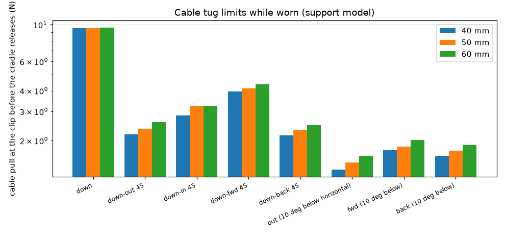

| D | plug action while worn | F_z N | cradle held | min skin-pad Fn N |
|---|---|---|---|---|
| 40 | insert (push towards head) | -10.0 | False | – |
| 40 | remove at 15 N (pull out) | 15.0 | False | – |
| 40 | remove at 8 N nominal | 8.00 | False | – |
| 50 | insert (push towards head) | -10.0 | False | – |
| 50 | remove at 15 N (pull out) | 15.0 | False | – |
| 50 | remove at 8 N nominal | 8.00 | False | – |
| 60 | insert (push towards head) | -10.0 | False | – |
| 60 | remove at 15 N (pull out) | 15.0 | False | – |
| 60 | remove at 8 N nominal | 8.00 | False | – |

Plug actions that release the worn cradle: insert (push towards head) (40, 50, 60 mm); remove at 15 N (pull out) (40, 50, 60 mm); remove at 8 N nominal (40, 50, 60 mm) — plug in and out off the head (instruction).

Cable anchor screws (prying about both axes, joint factor 1; capacity = pull-out / γ_insert):

| cable load case | screw | torque N·m | T_ext per screw N | F_i N | F_i aged N | SF initial | SF aged | lever mm |
|---|---|---|---|---|---|---|---|---|
| plug nominal (fuse) | M3 | 0.100 | 28.1 | 119 | 86.9 | 1.41 | 2.39 | 21.0 |
| plug upper (15 N) | M3 | 0.100 | 52.7 | 119 | 86.9 | 1.25 | 1.97 | 21.0 |
| clip + plug in series (upper) | M3 | 0.100 | 71.0 | 119 | 86.9 | 1.16 | 1.74 | 21.0 |
| snag 20 N | M3 | 0.100 | 70.3 | 119 | 86.9 | 1.16 | 1.75 | 21.0 |

Clip post (cantilever from the anchor block): printed on its side the bending is in-layer; upright it would load the layers in tension:

| cable load case | F N | SF printed on its side | SF if printed upright |
|---|---|---|---|
| plug nominal (fuse) | 8.00 | 12.7 | 11.6 |
| plug upper (15 N) | 15.0 | 6.75 | 6.18 |
| clip + plug in series (upper) | 20.2 | 5.01 | 4.59 |
| snag 20 N | 20.0 | 5.06 | 4.64 |

## 15. Natural frequencies and vibration isolation

Natural frequencies and vibration isolation. NO modal FEA was run.

1. Rigid-body modes of the headphone on its contacts (6 DOF):
       K q = w^2 M q,   M = [[m I, -m [c]x], [m [c]x, I_O]]
   K = tangent stiffness of the active contacts + link at the static
   upright equilibrium (support.Model), solved with scipy.linalg.eigh.
2. Arm (cantilever) first bending mode by Rayleigh: f = (1/2pi) sqrt(k_tip / m_eff),
   m_eff = pad + (33/140) x arm mass (uniform cantilever, Rayleigh tip-mass equivalent, ARM_MASS_FACTOR).
3. Driver-in-module isolation: the driver rim sits on a TPU gasket; the
   driver reaction force (moving mass x diaphragm acceleration) is passed
   to the module through it. Single-DOF base-isolation transmissibility
       T(f) = sqrt(1 + (2 zeta r)^2) / sqrt((1 - r^2)^2 + (2 zeta r)^2), r = f/f_n
   (isolation only above sqrt(2) f_n).
4. Head-to-headphone transmissibility of walking/running excitation
   through the contact springs (same SDOF form per mode; undamped, which
   bounds T from above below sqrt(2) f_n), over the head-motion band F_HEAD [A].

| D | mode 1 Hz | 2 | 3 | 4 | 5 | 6 |
|---|---|---|---|---|---|---|
| 40 | 34.3 (rotation about x) | 43.4 (translation x) | 58.7 (rotation about z) | 66.8 (translation z) | 87.4 (translation y) | 124 (rotation about y) |
| 45 | 33.4 (rotation about x) | 42.3 (translation x) | 58.2 (rotation about z) | 65.6 (translation z) | 87.0 (translation y) | 123 (rotation about y) |
| 50 | 32.1 (rotation about x) | 40.8 (translation x) | 57.5 (rotation about z) | 63.8 (translation z) | 86.3 (translation y) | 121 (rotation about y) |
| 55 | 31.1 (rotation about x) | 39.6 (translation x) | 56.9 (rotation about z) | 62.3 (translation z) | 85.8 (translation y) | 120 (rotation about y) |
| 60 | 30.1 (rotation about x) | 38.4 (translation x) | 56.2 (rotation about z) | 60.9 (translation z) | 85.1 (translation y) | 119 (rotation about y) |

| D | arm | k_z N/m | m_eff g | f1 Hz |
|---|---|---|---|---|
| all | temporal | 69795 | 3.15 | 750 |
| all | mastoid | 92963 | 4.29 | 741 |
| all | post | 96403 | 3.48 | 838 |
| all | saddle | 5764 | 8.82 | 129 |

| D | driver gasket k N/m | shape factor | f_n Hz | isolates above Hz |
|---|---|---|---|---|
| 40 | 6.41e+07 | 1.79 | 10405 | 14715 |
| 45 | 7.25e+07 | 1.79 | 9834 | 13908 |
| 50 | 8.1e+07 | 1.79 | 8882 | 12561 |
| 55 | 8.94e+07 | 1.79 | 8285 | 11716 |
| 60 | 9.78e+07 | 1.79 | 7872 | 11132 |

Driver mounting options at 50 mm (Gent E(Shore) [EMP] for the silicone rings, same shape factor):

| mount | E MPa | k N/m | f_n Hz | isolates above Hz | T(100 Hz) | T(1 kHz) | T(5 kHz) | 5 g sag µm |
|---|---|---|---|---|---|---|---|---|
| TPU 95A (Final) | 26.0 | 8.1e+07 | 8882 | 12561 | 1.00 | 1.01 | 1.45 | 0.0157 |
| silicone 50A | 2.46 | 7.65e+06 | 2730 | 3861 | 1.00 | 1.15 | 0.472 | 0.167 |
| silicone 40A | 1.69 | 5.26e+06 | 2264 | 3202 | 1.00 | 1.24 | 0.305 | 0.242 |
| silicone 30A | 1.14 | 3.56e+06 | 1862 | 2633 | 1.00 | 1.39 | 0.205 | 0.358 |

Soft silicone rings put the driver-on-mount resonance at 1.86–2.73 kHz, inside the audio band (they amplify there and isolate only above √2 f_n); the TPU 95A rim gasket puts it at 8.88 kHz, above the range where the lumped model is claimed (§21: measure it), and it also seals the rim — it is kept. On the skin the whole headphone has its rigid-body modes at 30.1–124 Hz, above the head-motion band (1–10 Hz [A]): the headphone follows the head quasi-statically, amplified by at most T = 1/(1 − r²) = 1.12 (undamped bound, lowest mode, 10 Hz). Free-arm first modes (Rayleigh, no skin contact): pad arms 741–838 Hz, saddle arm 129 Hz — inside the bass band; on the head the root and scalp contacts add stiffness and damping, which this free-arm value leaves out, so a buzz check in the sine sweep is in the test plan (§22).

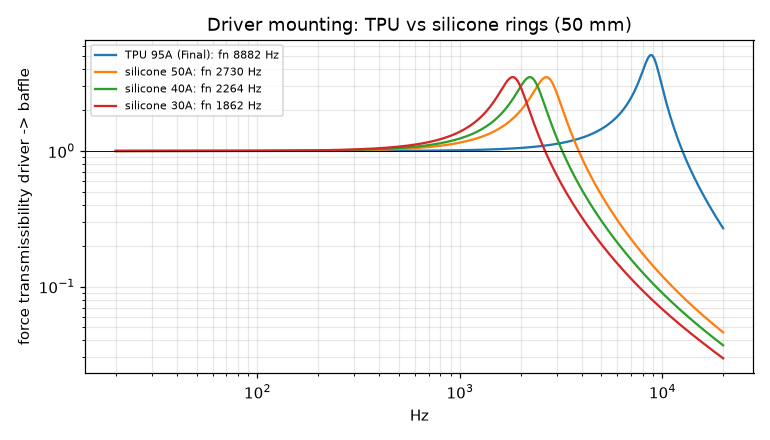

## 16. Acoustics

Acoustic model of the UMEH-2 module — LUMPED ELECTRO-MECHANO-ACOUSTIC
circuit plus closed-form radiation. NO acoustic FEM/BEM was run.

Validity: lumped elements need every cavity dimension < lambda/4
(cup ~ 60 mm -> ~1.4 kHz strict, ~3 kHz usable); the piston/edge
radiation formulas hold to ~8 kHz [A]; above that the pinna and head (HRTF)
dominate and nothing here is claimed. Everything above 3 kHz is labelled
"indicative".

Driver (per size): Thiele/Small values are REPRESENTATIVE ASSUMPTIONS [A]
(no manufacturer data available). Replace them with measured values
(impedance sweep, added-mass method, see report) and re-run.

Circuit (impedance analogy, SI):
  electrical   Ze  = Re + j w Le
  mechanical   Zm  = Rms + j w Mms + 1/(j w Cms)
  acoustic     Z_F (front load) and Z_B (rear load) seen by the diaphragm,
               reflected as Sd^2 (Z_F + Z_B)
  diaphragm velocity   u = Bl e / [ Ze (Zm + Sd^2 (Z_F + Z_B)) + Bl^2 ]
  volume velocity      U = Sd u
Front load, OPEN (off-ear): radiation impedance of a baffled piston
  Z_rad = rho c / S [ 1 - J1(2ka)/(ka) + j H1(2ka)/(ka) ]            (exact, Bessel/Struve)
  in series with the aperture tube (mass of the baffle hole incl. end corrections)
Front load, SEALED (seal-pad option): cavity compliance C_f = V_f/(rho c^2)
  in parallel with the leak (slit: mass + viscous resistance).
Rear load: cup volume compliance C_b = V_b/(rho c^2) in parallel with the
  outlet path (grille holes / vents: mass with end corrections, viscous
  resistance) in series with the felt resistance R_felt = sigma t / A.
Pressure at the ear (open front): on-axis piston near field
  p_F = rho c u [exp(-jkz) - exp(-jk sqrt(z^2 + a^2))]  x 2 (rigid head/pinna surface)
  z = aperture exit plane to the ear-canal entrance (ear_distance: CAD standoff
  and module face, mean pinna protrusion minus concha depth [A/LIT])
minus the rear wave (monopole of volume velocity U_out at the grille)
travelling around the module edge (path L_r) with an edge-diffraction
factor D = 1/sqrt(1 + (k r_edge)^2) per edge [estimate].

| D | Vb cm³ [CAD] | Vas cm³ | α = Vas/Vb | Qts | Qtc (closed) | Fs Hz | Fc Hz (closed) | grille holes | cup (1,1) Hz | cup axial Hz | gap λ/2 Hz |
|---|---|---|---|---|---|---|---|---|---|---|---|
| 40 | 8.16 | 536 | 65.7 | 0.400 | 3.27 | 120 | 980 | 52.0 | 5762 | 11385 | 5967 |
| 45 | 10.5 | 916 | 87.5 | 0.400 | 3.76 | 104 | 977 | 70.0 | 5148 | 10682 | 5967 |
| 50 | 13.0 | 1551 | 120 | 0.400 | 4.39 | 90.0 | 988 | 86.0 | 4652 | 10179 | 5967 |
| 55 | 16.8 | 2456 | 146 | 0.400 | 4.86 | 79.4 | 964 | 114 | 4182 | 9614 | 5967 |
| 60 | 21.4 | 3859 | 180 | 0.400 | 5.38 | 70.0 | 942 | 142 | 3791 | 9108 | 5967 |

**Consequence:** a closed rear raises the resonance to Fc = 942–988 Hz with Qtc = 3.27–5.38 — unusable. Hence the open, felt-damped rear (default) or a heavily vented rear.

Baffle aperture: diaphragm-to-aperture mini-cavity + aperture tube Helmholtz resonance f = c/2π·√(S/(V·L_eff)), L_eff = t + (0.5 + 1)·0.85a: the outer end correction is the baffled piston's radiation mass, the inner one is reduced by the chamfer and the nearby diaphragm [A] (the same aperture mass as in the response model):

| D | aperture 0.60 D | aperture 0.75 D | aperture 0.88 D (chosen) | aperture 1.00 D |
|---|---|---|---|---|
| 40 | 8.93 kHz | 10.1 kHz | 11.1 kHz | 11.9 kHz |
| 45 | 8.48 kHz | 9.60 kHz | 10.5 kHz | 11.2 kHz |
| 50 | 8.10 kHz | 9.15 kHz | 9.98 kHz | 10.7 kHz |
| 55 | 7.76 kHz | 8.76 kHz | 9.55 kHz | 10.2 kHz |
| 60 | 7.46 kHz | 8.42 kHz | 9.17 kHz | 9.82 kHz |

Aperture = 0.88 D [A] (not D): it clears the moving diaphragm and half the surround and overlaps the driver's front frame lip so the rim gasket seals; the 45° × 1.5 mm chamfer removes the sharp step. The front mini-cavity resonance is then at 9.17–11.1 kHz — inside the audio band and above the range where the lumped model is claimed, so its level and damping are left to measurement (§21, §22); widening the aperture to D raises it only to the last column.

Vent (rear port) Helmholtz, 50 mm cup, end corrections 0.85 r (flanged, inside) + 0.61 r (unflanged, outside) [STD]:

| n vents | Ø mm | f_b Hz | L_eff mm |
|---|---|---|---|
| 1 | 1.50 | 365 | 3.10 |
| 1 | 2.00 | 461 | 3.46 |
| 1 | 3.00 | 628 | 4.19 |
| 1 | 4.00 | 773 | 4.92 |
| 2 | 1.50 | 517 | 3.10 |
| 2 | 2.00 | 652 | 3.46 |
| 2 | 3.00 | 888 | 4.19 |
| 2 | 4.00 | 1093 | 4.92 |
| 3 | 1.50 | 633 | 3.10 |
| 3 | 2.00 | 798 | 3.46 |
| 3 | 3.00 | 1088 | 4.19 |
| 3 | 4.00 | 1339 | 4.92 |
| 4 | 1.50 | 731 | 3.10 |
| 4 | 2.00 | 922 | 3.46 |
| 4 | 3.00 | 1256 | 4.19 |
| 4 | 4.00 | 1546 | 4.92 |
| 6 | 1.50 | 895 | 3.10 |
| 6 | 2.00 | 1129 | 3.46 |
| 6 | 3.00 | 1539 | 4.19 |
| 6 | 4.00 | 1893 | 4.92 |

Sealed front (seal-pad option): V_f = 87.0 cm³ [C: skin to ring face inside the seal ID plus the module recess in the bore, minus 10 cm³ of pinna A]; leak = slit between pad and skin (R = 12μL/(h³b), M = 1.2ρL/(hb)).

Seal pad material × height at the pressure the preload can spare (0.5 kPa [A]): conformity δ = pH/E against a head irregularity of 1 mm [A] leaves a slit h = max(0.02 mm, a − δ); bass loss against a perfect seal:

| material | E kPa | H mm | δ mm | slit mm | loss 50 Hz dB | loss 100 Hz dB |
|---|---|---|---|---|---|---|
| TPU gyroid 10% | 520 | 10.0 | 0.00962 | 0.990 | 22.0 | 16.7 |
| TPU gyroid 10% | 520 | 20.0 | 0.0192 | 0.981 | 21.9 | 16.6 |
| TPU gyroid 10% | 520 | 29.0 | 0.0279 | 0.972 | 21.8 | 16.5 |
| TPU gyroid 15% | 1170 | 10.0 | 0.00427 | 0.996 | 22.1 | 16.7 |
| TPU gyroid 15% | 1170 | 20.0 | 0.00855 | 0.991 | 22.1 | 16.7 |
| TPU gyroid 15% | 1170 | 29.0 | 0.0124 | 0.988 | 22.0 | 16.6 |
| TPU gyroid 25% | 3250 | 10.0 | 0.00154 | 0.998 | 22.1 | 16.7 |
| TPU gyroid 25% | 3250 | 20.0 | 0.00308 | 0.997 | 22.1 | 16.7 |
| TPU gyroid 25% | 3250 | 29.0 | 0.00446 | 0.996 | 22.1 | 16.7 |
| PU foam 30 kg/m3 | 28.1 | 10.0 | 0.178 | 0.822 | 19.7 | 15.0 |
| PU foam 30 kg/m3 | 28.1 | 20.0 | 0.356 | 0.644 | 16.1 | 12.7 |
| PU foam 30 kg/m3 | 28.1 | 29.0 | 0.516 | 0.484 | 11.2 | 9.65 |
| PU foam 50 kg/m3 | 78.1 | 10.0 | 0.0640 | 0.936 | 21.4 | 16.2 |
| PU foam 50 kg/m3 | 78.1 | 20.0 | 0.128 | 0.872 | 20.5 | 15.5 |
| PU foam 50 kg/m3 | 78.1 | 29.0 | 0.186 | 0.814 | 19.6 | 14.9 |
| PU foam 80 kg/m3 | 200 | 10.0 | 0.0250 | 0.975 | 21.9 | 16.5 |
| PU foam 80 kg/m3 | 200 | 20.0 | 0.0500 | 0.950 | 21.5 | 16.3 |
| PU foam 80 kg/m3 | 200 | 29.0 | 0.0725 | 0.928 | 21.3 | 16.1 |

Closing the 1 mm irregularity down to the 0.02 mm slit with the softest material (PU foam 30 kg/m3, the tallest pad 29 mm) needs p = (a − h_min)·E/H = 0.950 kPa, 1.90 × the 0.5 kPa the preload can spare — so the Final is open (the seal pad stays an option for users who accept the pressure).
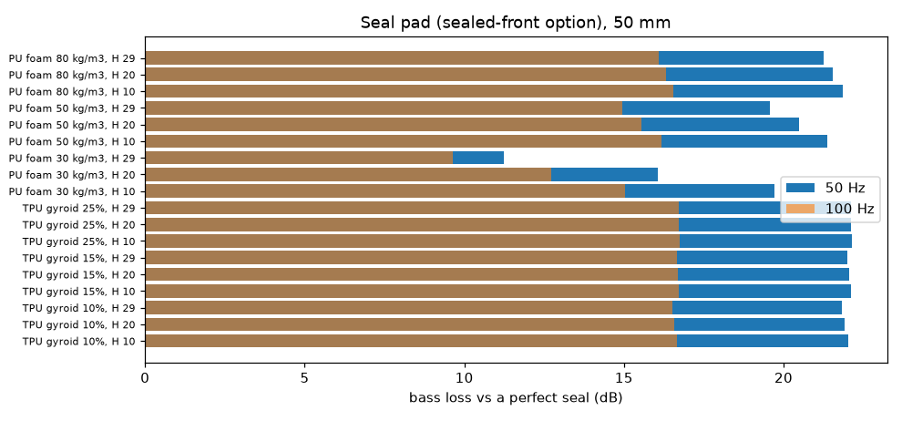

Damping: felt disc (flow resistivity σ, thickness t) at the cup end, R = σ t / A; it sits at the pressure antinode of the cup axial mode and in series with the grille, adding resistance behind the diaphragm (lower Q at Fs) and absorbing the cup modes above.

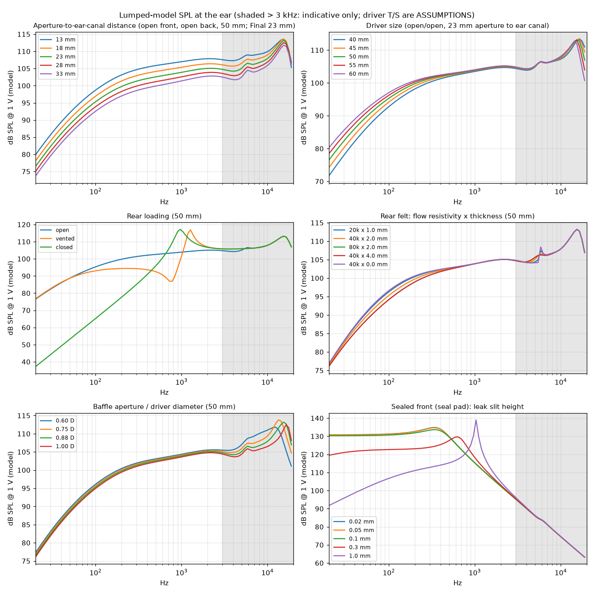
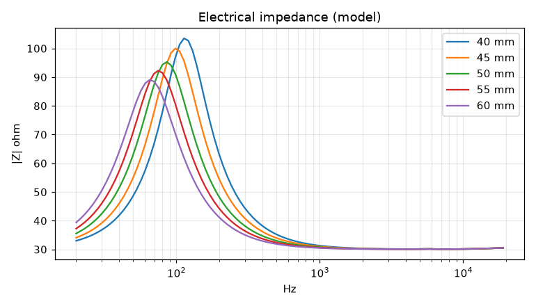
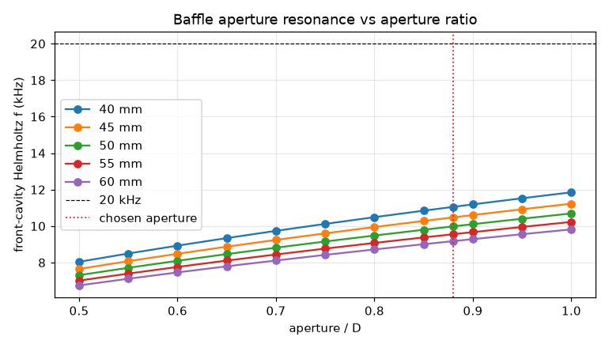

Open vs semi-open vs closed (50 mm, 23 mm from the aperture to the ear-canal entrance: standoff 29 + module recess 2 − (mean pinna protrusion 20 − concha depth 12) mm [CAD, A/LIT]; SPL at 100 Hz for the same drive: open 95.3 dB, vented 93.0 dB, closed 65.2 dB): open (grille + felt) keeps Fs low and the response smooth but, being open off the ear, loses bass to front/rear cancellation; vented is a compromise; closed is unusable with these cup volumes. Aperture-to-ear distance 13 → 33 mm costs 6.16 dB at 100 Hz and 5.59 dB at 1 kHz (near-field term e^{−jkz} − e^{−jk√(z²+a²)}) — keep the module close; the standoff is set by the p95 pinna.

## 17. Tolerance stack-ups

Tolerance stack-ups: worst case, RSS and Monte Carlo (100 000 samples, each
tolerance a normal distribution with +-tol = 3 sigma [A]).

FDM tolerances [A, typical well-tuned 0.4 mm nozzle printer, PETG]:
  XY feature +-0.15 mm, Z (layer-quantised) +-0.1 mm; printed hole and bore
  diameters enter the chains with the XY tolerance (a systematic hole undersize
  is a printer-calibration item: test print);
  linear shrink: both parts are the same material, so only the DIFFERENCE
  between two prints matters for a fit, +-0.2 % [A].
TPU parts: +-0.15 mm thickness.
Driver: rim OD and rim thickness as in design.DRIVERS (tol_d, tol_depth) [A].
Acceptance: the Monte-Carlo 0.135 % / 99.865 % values (+-3 sigma) must lie in
the window [min, max]; the worst case (every term at its limit at once) is
reported for information.

Driver 40 mm:

| chain | nominal mm | worst case | RSS | MC ±3σ | min | max | limiting component | MC ok | WC ok |
|---|---|---|---|---|---|---|---|---|---|
| UMI foam compression (anti-rattle strip) | 0.560 | 0.177 … 0.943 | 0.352 … 0.768 | 0.353 … 0.767 | 0.160 | 0.960 | foam sheet thickness (die-cut) | PASS | PASS |
| UMI radial clearance (diametral) | 0.400 | -0.0540 … 0.854 | 0.138 … 0.662 | 0.136 … 0.659 | 0 | 0.800 | shrink difference between prints | PASS | **FAIL** |
| lug radial overlap with lip | 2.30 | 1.95 … 2.65 | 2.07 … 2.53 | 2.08 … 2.52 | 1.20 | – | radial float (half clearance, worst side) | PASS | PASS |
| driver rim in pocket (diametral) | 0.440 | -0.01 … 0.890 | 0.105 … 0.775 | 0.107 … 0.774 | 0 | 0.800 | driver rim OD | PASS | **FAIL** |
| driver gasket squeeze | 0.300 | -0.150 … 0.750 | 0.0709 … 0.529 | 0.0674 … 0.530 | 0.0500 | 0.600 | driver gasket thickness | PASS | **FAIL** |
| pinna clearance to module (p95 ear) | 4.40 | 1.70 … 7.10 | 2.35 … 6.45 | 2.35 … 6.46 | 1.00 | – | p95 pinna protrusion | PASS | PASS |
| felt hole on the eye boss (interference) | 0.500 | 0.150 … 0.850 | 0.250 … 0.750 | 0.249 … 0.753 | 0 | – | felt hole (die-cut) | PASS | PASS |

Driver 50 mm:

| chain | nominal mm | worst case | RSS | MC ±3σ | min | max | limiting component | MC ok | WC ok |
|---|---|---|---|---|---|---|---|---|---|
| UMI foam compression (anti-rattle strip) | 0.560 | 0.177 … 0.943 | 0.352 … 0.768 | 0.353 … 0.767 | 0.160 | 0.960 | foam sheet thickness (die-cut) | PASS | PASS |
| UMI radial clearance (diametral) | 0.400 | -0.0540 … 0.854 | 0.138 … 0.662 | 0.136 … 0.659 | 0 | 0.800 | shrink difference between prints | PASS | **FAIL** |
| lug radial overlap with lip | 2.30 | 1.95 … 2.65 | 2.07 … 2.53 | 2.08 … 2.52 | 1.20 | – | radial float (half clearance, worst side) | PASS | PASS |
| driver rim in pocket (diametral) | 0.440 | -0.01 … 0.890 | 0.105 … 0.775 | 0.107 … 0.774 | 0 | 0.800 | driver rim OD | PASS | **FAIL** |
| driver gasket squeeze | 0.300 | -0.150 … 0.750 | 0.0709 … 0.529 | 0.0674 … 0.530 | 0.0500 | 0.600 | driver gasket thickness | PASS | **FAIL** |
| pinna clearance to module (p95 ear) | 4.40 | 1.70 … 7.10 | 2.35 … 6.45 | 2.35 … 6.46 | 1.00 | – | p95 pinna protrusion | PASS | PASS |
| felt hole on the eye boss (interference) | 0.500 | 0.150 … 0.850 | 0.250 … 0.750 | 0.249 … 0.753 | 0 | – | felt hole (die-cut) | PASS | PASS |

Driver 60 mm:

| chain | nominal mm | worst case | RSS | MC ±3σ | min | max | limiting component | MC ok | WC ok |
|---|---|---|---|---|---|---|---|---|---|
| UMI foam compression (anti-rattle strip) | 0.560 | 0.177 … 0.943 | 0.352 … 0.768 | 0.353 … 0.767 | 0.160 | 0.960 | foam sheet thickness (die-cut) | PASS | PASS |
| UMI radial clearance (diametral) | 0.400 | -0.0540 … 0.854 | 0.138 … 0.662 | 0.136 … 0.659 | 0 | 0.800 | shrink difference between prints | PASS | **FAIL** |
| lug radial overlap with lip | 2.30 | 1.95 … 2.65 | 2.07 … 2.53 | 2.08 … 2.52 | 1.20 | – | radial float (half clearance, worst side) | PASS | PASS |
| driver rim in pocket (diametral) | 0.440 | -0.01 … 0.890 | 0.105 … 0.775 | 0.107 … 0.774 | 0 | 0.800 | driver rim OD | PASS | **FAIL** |
| driver gasket squeeze | 0.300 | -0.150 … 0.750 | 0.0709 … 0.529 | 0.0674 … 0.530 | 0.0500 | 0.600 | driver gasket thickness | PASS | **FAIL** |
| pinna clearance to module (p95 ear) | 4.40 | 1.70 … 7.10 | 2.35 … 6.45 | 2.35 … 6.46 | 1.00 | – | p95 pinna protrusion | PASS | PASS |
| felt hole on the eye boss (interference) | 0.500 | 0.150 … 0.850 | 0.250 … 0.750 | 0.249 … 0.753 | 0 | – | felt hole (die-cut) | PASS | PASS |

Every chain meets the ±3σ window for every size checked (40 mm, 50 mm, 60 mm). At the worst case UMI radial clearance (diametral) leaves the window by up to 0.0540 mm; driver rim in pocket (diametral) leaves the window by up to 0.0900 mm; driver gasket squeeze leaves the window by up to 0.200 mm: each needs every term at its 3σ limit at once, which the statistical criterion accepts; the rare part pair that lands there is found at assembly (fit check).

## 18. Structural and support parameter sweeps (50 mm)

Arm (frame) thickness — bar, leg and foot scaled together:

| scale | bar/leg/foot mm | 5 g SF vM | at | 5 g SF interlayer | handling SF vM | at | handling SF interlayer | k_arm mastoid N/m | 5 g onset λ min |
|---|---|---|---|---|---|---|---|---|---|
| 0.600 | 3.30/3.30/2.70 | 0.831 | mastoid: bar at clamp edge (slot end) | 1.41 | 0.656 | saddle: bar at clamp edge (slot end) | 0.769 | 15721 | 0.0312 |
| 0.800 | 4.40/4.40/3.60 | 1.23 | temporal: bar at clamp edge (slot end) | 3.36 | 1.13 | saddle: bar at clamp edge (slot end) | 1.28 | 42103 | 0.0312 |
| 0.900 | 4.95/4.95/4.05 | 1.55 | temporal: bar at clamp edge (slot end) | 3.25 | 1.41 | saddle: bar at clamp edge (slot end) | 1.57 | 63737 | 0.0312 |
| 1.00 | 5.50/5.50/4.50 | 1.91 | temporal: bar at clamp edge (slot end) | 3.92 | 1.72 | saddle: bar at clamp edge (slot end) | 1.89 | 92963 | 0.0312 |
| 1.20 | 6.60/6.60/5.40 | 2.58 | mastoid: bar at clamp edge (slot end) | 5.42 | 2.40 | saddle: bar at clamp edge (slot end) | 2.58 | 181578 | 0.0312 |
| 1.40 | 7.70/7.70/6.30 | 3.29 | mastoid: bar at clamp edge (slot end) | 6.83 | 3.13 | saddle: bar at clamp edge (slot end) | 3.22 | 325600 | 0.0625 |

Arm screw size and torque (serrated joint under the 5 g envelope and the handling load):

| screw | T N·m | min SF | governing | F_i N | F_i aged N | D_screw N | SF engage | SF pull-out | SF spin | SF slot | pair mass g |
|---|---|---|---|---|---|---|---|---|---|---|---|
| M2 | 0.0600 | 0.491 | saddle (handling 10 N) | 107 | 61.6 | 105 | 0.588 | 0.491 | 5.83 | 487 | 0.940 |
| M2 | 0.100 | 0.352 | saddle (handling 10 N) | 179 | 71.8 | 105 | 0.686 | 0.352 | 3.50 | 487 | 0.940 |
| M2 | 0.150 | 0.261 | saddle (handling 10 N) | 268 | 71.8 | 105 | 0.686 | 0.261 | 2.33 | 487 | 0.940 |
| M2 | 0.250 | 0.171 | saddle (handling 10 N) | 446 | 73.2 | 105 | 0.699 | 0.171 | 1.40 | 487 | 0.940 |
| M2 | 0.400 | 0.113 | saddle (handling 10 N) | 714 | 117 | 105 | 1.12 | 0.113 | 0.875 | 487 | 0.940 |
| M2.5 | 0.0600 | 0.519 | saddle (handling 10 N) | 85.7 | 54.4 | 105 | 0.519 | 0.845 | 10.0 | 608 | 1.50 |
| M2.5 | 0.100 | 0.623 | saddle (handling 10 N) | 143 | 79.3 | 105 | 0.757 | 0.623 | 6.00 | 608 | 1.50 |
| M2.5 | 0.150 | 0.469 | saddle (handling 10 N) | 214 | 79.3 | 105 | 0.757 | 0.469 | 4.00 | 608 | 1.50 |
| M2.5 | 0.250 | 0.314 | saddle (handling 10 N) | 357 | 79.3 | 105 | 0.757 | 0.314 | 2.40 | 608 | 1.50 |
| M2.5 | 0.400 | 0.210 | saddle (handling 10 N) | 571 | 93.7 | 105 | 0.895 | 0.210 | 1.50 | 608 | 1.50 |
| M3 | 0.0600 | 0.480 | saddle (handling 10 N) | 71.4 | 49.7 | 103 | 0.480 | 1.35 | 16.7 | 736 | 2.56 |
| M3 | 0.100 | 0.800 | saddle (handling 10 N) | 119 | 82.8 | 103 | 0.800 | 1.02 | 10.0 | 736 | 2.56 |
| M3 | 0.150 | 0.778 | saddle (handling 10 N) | 179 | 86.9 | 103 | 0.840 | 0.778 | 6.67 | 736 | 2.56 |
| M3 | 0.250 | 0.529 | saddle (handling 10 N) | 298 | 86.9 | 103 | 0.840 | 0.529 | 4.00 | 736 | 2.56 |
| M3 | 0.400 | 0.357 | saddle (handling 10 N) | 476 | 86.9 | 103 | 0.840 | 0.357 | 2.50 | 736 | 2.56 |
| M4 | 0.0600 | 0.438 | saddle (handling 10 N) | 53.6 | 39.3 | 89.7 | 0.438 | 2.73 | 30.0 | 1087 | 5.00 |
| M4 | 0.100 | 0.731 | saddle (handling 10 N) | 89.3 | 65.5 | 89.7 | 0.731 | 2.10 | 18.0 | 1087 | 5.00 |
| M4 | 0.150 | 1.02 | saddle (handling 10 N) | 134 | 91.8 | 89.7 | 1.02 | 1.62 | 12.0 | 1087 | 5.00 |
| M4 | 0.250 | 1.02 | saddle (handling 10 N) | 223 | 91.8 | 89.7 | 1.02 | 1.12 | 7.20 | 1087 | 5.00 |
| M4 | 0.400 | 0.763 | saddle (handling 10 N) | 357 | 91.8 | 89.7 | 1.02 | 0.763 | 4.50 | 1087 | 5.00 |

| pad (TPU) h mm | static mastoid p kPa | static tilt deg | static μ demand | 1 g % | 1 g tilt | 2 g % |
|---|---|---|---|---|---|---|
| 3.00 | 2.33 | 0.0888 | 0.802 | 0 | 0.380 | 3.05 |
| 4.50 | 2.33 | 0.0898 | 0.801 | 0 | 0.385 | 3.05 |
| 6.00 | 2.33 | 0.0909 | 0.799 | 0 | 0.390 | 3.05 |
| 8.00 | 2.33 | 0.0924 | 0.795 | 0 | 0.396 | 3.05 |
| 10.0 | 2.33 | 0.0939 | 0.791 | 0 | 0.402 | 3.05 |

| pad radius scale (support spacing) | static | 1 g % | 1 g tilt | 2 g % |
|---|---|---|---|---|
| 0.900 | yes | 0 | 1.15 | 4.05 |
| 0.950 | yes | 0 | 0.466 | 3.45 |
| 1.00 | yes | 0 | 0.390 | 3.05 |
| 1.05 | yes | 0 | 0.344 | 2.73 |
| 1.10 | yes | 0 | 0.309 | 2.43 |

| Δ temporal angle | Δ post angle | static | 1 g % | 1 g tilt | 2 g % |
|---|---|---|---|---|---|
| -15.0 | 0 | yes | 0 | 1.80 | 2.77 |
| -10.0 | 10.0 | yes | 0 | 3.86 | 5.92 |
| 0 | -15.0 | yes | 0 | 0.393 | 0.825 |
| 0 | 0 | yes | 0 | 0.390 | 3.05 |
| 0 | 15.0 | yes | 0.0713 | 4.93 | 8.12 |
| 10.0 | -10.0 | yes | 0 | 0.323 | 1.77 |
| 15.0 | 0 | yes | 0 | 0.357 | 3.90 |

| arch ('hook') R mm | half-angle ° | root p kPa (static) | 1 g % | 2 g % |
|---|---|---|---|---|
| 16.0 | 25.0 | 3.44 | 0 | 3.77 |
| 16.0 | 35.0 | 3.23 | 0 | 3.05 |
| 16.0 | 45.0 | 2.90 | 0 | 2.85 |
| 22.0 | 25.0 | 3.48 | 0 | 3.70 |
| 22.0 | 35.0 | 3.27 | 0 | 3.05 |
| 22.0 | 45.0 | 2.94 | 0 | 2.88 |
| 30.0 | 25.0 | 3.52 | 0 | 3.80 |
| 30.0 | 35.0 | 3.31 | 0 | 3.12 |
| 30.0 | 45.0 | 2.98 | 0 | 2.88 |

Saddle liner thickness (60 mm module, its own eye):

| liner mm | root p kPa (static) | static μ demand | 1 g % | 1 g tilt deg | 2 g % |
|---|---|---|---|---|---|
| 0 | 4.63 | 0.800 | 0 | 0.405 | 3.80 |
| 1.00 | 4.51 | 0.809 | 0 | 0.405 | 3.40 |
| 1.50 | 4.27 | 0.826 | 0 | 0.405 | 3.43 |
| 2.00 | 3.96 | 0.849 | 0 | 0.405 | 3.43 |
| 2.50 | 3.61 | 0.874 | 0 | 0.405 | 3.52 |
| 3.00 | 3.28 | 0.899 | 0 | 0.405 | 3.60 |

| liner material (60 mm) | root p kPa (static) | static μ demand | 1 g % | 2 g % |
|---|---|---|---|---|
| gel modulus x0.5 | 2.96 | 0.922 | 0 | 3.92 |
| gel modulus x2 (or stiffer confinement) | 4.06 | 0.842 | 0 | 3.43 |
| nominal | 3.61 | 0.874 | 0 | 3.52 |

Tangential/normal contact-stiffness ratio k_t/k_n [A] (it decides how much weight the pads take by friction):

| k_t/k_n (60 mm) | root p kPa (static) | static μ demand | 1 g % | 1 g tilt deg | 2 g % |
|---|---|---|---|---|---|
| 0.330 | 4.59 | 0.787 | 0 | 0.405 | 3.75 |
| 0.500 | 3.61 | 0.874 | 0 | 0.405 | 3.52 |
| 0.670 | 3.05 | 0.936 | 0 | 0.405 | 3.48 |

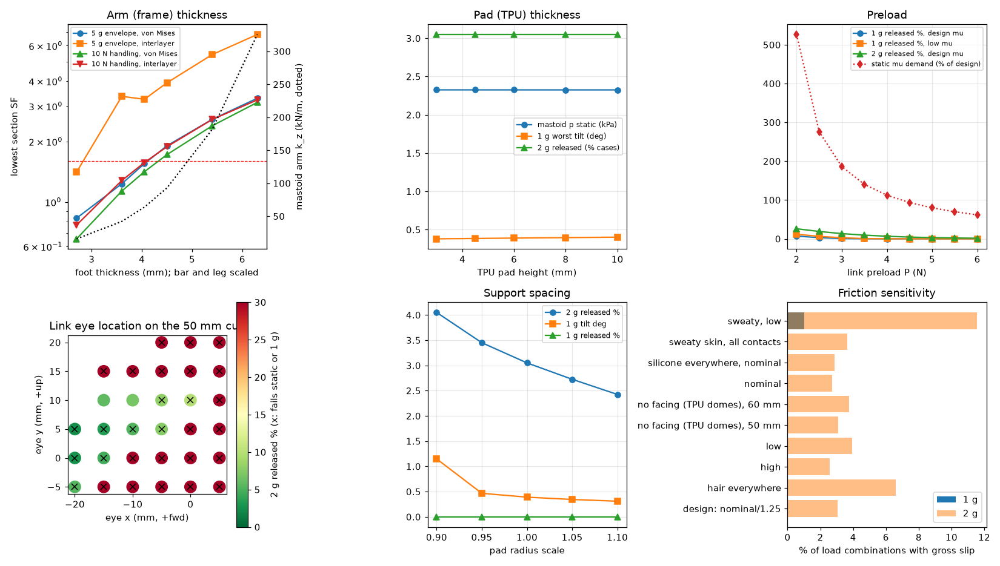
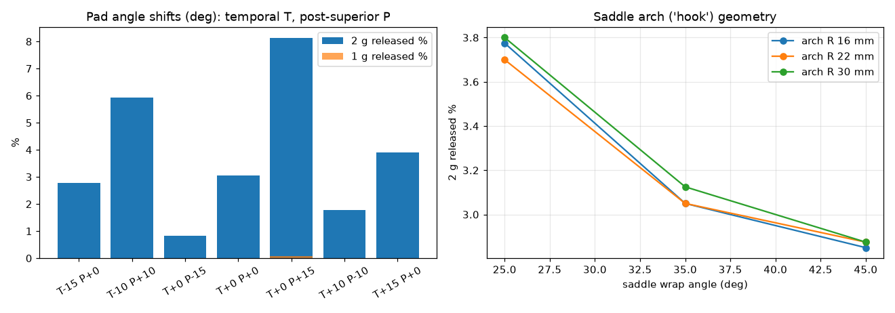

## 19. Worst-case summary and limiting components

Sorted by utilisation (demand / allowed; 1 = at the limit). The 2 g retention is not a utilisation: it is the released fraction of the 2 g set of load combinations (§8):

| check | where | value | requirement | utilisation |
|---|---|---|---|---|
| auricle-root pressure in use, after the head-motion shakedown (60 mm) | arch zones | 21.4 | ≤ 4.00 kPa sustained; NOT met (§6) | 5.35 |
| auricle-root pressure in use, after the head-motion shakedown (55 mm) | arch zones | 20.5 | ≤ 4.00 kPa sustained; NOT met (§6) | 5.12 |
| auricle-root pressure in use, after the head-motion shakedown (50 mm) | arch zones | 19.4 | ≤ 4.00 kPa sustained; NOT met (§6) | 4.86 |
| root pressure if hung on the ear before clamping (donning B, 60 mm) | arch zones | 18.6 | ≤ 4.00 kPa sustained (as donned); not met → clamp-first donning (A) is the instruction | 4.65 |
| auricle-root pressure in use, after the head-motion shakedown (45 mm) | arch zones | 18.4 | ≤ 4.00 kPa sustained; NOT met (§6) | 4.59 |
| auricle-root pressure in use, after the head-motion shakedown (40 mm) | arch zones | 18.0 | ≤ 4.00 kPa sustained; NOT met (§6) | 4.50 |
| arm section, 5 g onset envelope, 40 °C | 55 mm, mastoid: bar at clamp edge (slot end) (vM) | 1.40 | SF ≥ γM 1.60 | 1.14 |
| arm section, fatigue 1e7 cycles (2 g held envelope, zero-to-peak) | 60 mm, mastoid: bar at clamp edge (slot end) | 1.71 | SF ≥ γM 1.60 | 0.938 |
| arm section, 10 N handling, 40 °C | 40 mm, saddle: bar at clamp edge (slot end) (vM) | 1.72 | SF ≥ γM 1.60 | 0.931 |
| auricle-root pressure, donning A (60 mm) | arch zones | 3.61 | ≤ 4.00 kPa sustained (as donned; in use see the shakedown rows) | 0.902 |
| arm joint engagement (50 mm) | saddle, handling 10 N | 1.14 | SF ≥ 1 with aged preload | 0.874 |
| arm joint engagement (60 mm) | saddle, handling 10 N | 1.14 | SF ≥ 1 with aged preload | 0.874 |
| static friction demand (60 mm) | posterior-superior pad | 0.874 | μ_req/μ_design ≤ 1 | 0.874 |
| arm joint insert pull-out (50 mm) | saddle, handling 10 N | 1.15 | SF ≥ 1 on the design value (γ = 2 inside) | 0.869 |
| arm joint insert pull-out (60 mm) | saddle, handling 10 N | 1.15 | SF ≥ 1 on the design value (γ = 2 inside) | 0.869 |
| cable anchor insert pull-out | clip + plug in series (upper) | 1.16 | SF ≥ 1 (γ = 2 inside) | 0.864 |
| auricle-root pressure, donning A (55 mm) | arch zones | 3.44 | ≤ 4.00 kPa sustained (as donned; in use see the shakedown rows) | 0.860 |
| static friction demand (55 mm) | posterior-superior pad | 0.848 | μ_req/μ_design ≤ 1 | 0.848 |
| static friction demand (40 mm) | posterior-superior pad | 0.846 | μ_req/μ_design ≤ 1 | 0.846 |
| auricle-root pressure, donning A (50 mm) | arch zones | 3.27 | ≤ 4.00 kPa sustained (as donned; in use see the shakedown rows) | 0.817 |
| static friction demand (50 mm) | posterior-superior pad | 0.799 | μ_req/μ_design ≤ 1 | 0.799 |
| static friction demand (45 mm) | posterior-superior pad | 0.785 | μ_req/μ_design ≤ 1 | 0.785 |
| skin pressure static (50 mm) | max pad | 3.11 | ≤ 4.00 kPa | 0.776 |
| skin pressure static (60 mm) | max pad | 3.10 | ≤ 4.00 kPa | 0.775 |
| auricle-root pressure, donning A (45 mm) | arch zones | 3.07 | ≤ 4.00 kPa sustained (as donned; in use see the shakedown rows) | 0.768 |
| skin pressure static (55 mm) | max pad | 3.06 | ≤ 4.00 kPa | 0.765 |
| skin pressure static (45 mm) | max pad | 2.99 | ≤ 4.00 kPa | 0.746 |
| auricle-root pressure, donning A (40 mm) | arch zones | 2.96 | ≤ 4.00 kPa sustained (as donned; in use see the shakedown rows) | 0.740 |
| skin pressure static (40 mm) | max pad | 2.67 | ≤ 4.00 kPa | 0.666 |
| arm section, 1 g sustained | 60 mm, mastoid: bar at clamp edge (slot end) (vM) | 4.12 | SF ≥ γM 1.60 | 0.388 |
| retention, 2 g set (60 mm) | friction at pads + arch | 2.52 % combos released | 0 % (strict) — not met | – |
| tolerance chain with least margin (60 mm) | driver gasket squeeze | MC low 0.0674 vs min 0.0500 | driver gasket thickness | – |

## 20. Print orientation (per part) and why

| part | material | orientation | reason (anisotropy / supports / accuracy) |
|---|---|---|---|
| ring | PETG | head face down | groove floor = flat top surface, lip underside is a 45° cone (self-supporting); tab serration grooves on the bed face; lug-contact stress is in-layer compression; tabs end in a full round around the outer insert (wall ≥ 3.2 mm) |
| arms (4) | PETG | on the side (profile on the bed) | all bending stress is along the arm in the layer plane; only transverse/torsion shear crosses layers (interlayer column, §12); serration teeth profile lies in the print plane (accurate) |
| baffle | PETG | head face down | lugs on the bed (flat bearing face); driver pocket floor is a top surface; aperture chamfer 45° |
| cup | PETG | outer end down | grille/vents and the eye-boss insert hole on the bed; the eye boss rises inside the cup as a plain column; screw bosses full height; 1.2 mm wall = 3 perimeters of 0.42 mm lines at 0.2 mm layers |
| rear felt | felt + PSA rim | die-cut (not printed) | pushed over the eye boss, bonded to the inside of the cup end |
| cable anchor | PETG | on its side (tangential face on the bed; the STL is exported so) | clip-post bending in-layer (§14: lowest SF 5.01 printed on its side, 4.59 if printed upright) |
| pads (3) | TPU 95A 15 % gyroid | flat base down | dome needs no support; captive nut pocket in the base |
| pad facings (2) | silicone Shore 10–30A | cast (not printed) | 0.8 mm layer brushed or cast on the temporal and mastoid domes; mould reference STLs in stl/common/cast_reference |
| saddle cap | TPU 95A | flat, skin face down | arched bar in the bed plane (no overhang); open-top sleeve (no bridging); pin hole horizontal; bearing face recessed for the liner |
| saddle liner | silicone Shore 00-30 | cast into the cap (not printed) | mould reference STL in stl/common/cast_reference; prime the TPU (silicone does not bond to it unprimed) or key it; replaced with the cap |
| driver gasket, clip, seal pad | TPU 95A | flat | thin rings |
| UMI foam strips | PU foam, PSA | die-cut | template STL |

## 21. Where FEA, acoustic simulation or tests are required

No FEA or BEM was run for this report; nothing here is presented as simulated.
* **Ring tab root and lug root** (3-D stress concentration where the tab joins the ring; lugs under drop impact): beam theory gives nominal values → solid FEA with orthotropic printed properties, and a drop test (1.5 m onto a hard floor [A]).
* **Arm bar at the clamp edge** (governs the handling load): a notched plate under combined bending and torsion; an FE model with the serration and slot geometry would replace the Kt = 2 hole factor.
* **Heat-set insert bosses**: the hoop-stress estimate assumes a 30° knurl flank → FEA or, better, pull-out tests on printed coupons (§22). The link-eye insert sits in a column rising from the cup end and is loaded sideways by the link: FE of the boss or a lateral pull test.
* **Arm compliance** (it sets how much weight the auricle root carries, §6, §12): Timoshenko beams along the arm centreline; the corners (foot–leg, leg–bar) are stiffer than beam theory assumes, so the model errs towards softer arms → FE of one arm, or a load–deflection test of a printed arm at its pad.
* **Saddle cap on the auricle root** and the pads on skin: contact pressure on curved, layered soft tissue is not Hertzian → FE contact model or pressure-film measurement. The liner's compression modulus comes from the bonded-layer formula and the datasheet modulus: a load–deflection test of the lined cap on a skin simulant calibrates it (the §18 gel-modulus rows show what a factor of 2 does).
* **Acoustics above ~3 kHz** (pinna, cup modes, grille, felt as a porous layer): BEM/FEM or measurement on a head-and-torso simulator; the lumped model is not claimed there.
* **Retention under real head motion**: IMU-recorded head kinematics replayed on a head form, or wear trials.
* **Weight migration onto the auricle root in use** (§6 shakedown): the model's friction is elastic–Coulomb without skin creep or
  re-sticking; the in-use root pressure it predicts is the first quantity to measure (pressure film at the root after wear with head motion).

## 22. Limitations and the measurements that replace the assumptions

| assumption | why it matters | measure |
|---|---|---|
| driver mass/geometry/T-S | mass, COM, acoustics | scale, calipers, impedance sweep + added-mass Vas |
| tissue moduli and thicknesses | contact stiffness → load sharing | not needed exactly: §9 sweep shows the sensitivity; comfort trials |
| friction μ (TPU and silicone on skin) | retention | incline test of a pad on forearm skin (dry/sweaty) |
| TPU pad effective modulus | contact stiffness, pressure | load–deflection of a printed pad |
| PETG strength/creep | joint preload loss | torque-retention test on a printed tab over 1 week at 40 °C |
| wave-washer rate and flat load | aged joint preload | washer datasheet; load–deflection check |
| tightening torque → preload (nut factor 0.20–0.35) | insert pull-out at the highest preload, serration engagement at the lowest | torque–tension test of the M3 screw in a printed insert coupon |
| printed-arm stiffness (E, G at 40 °C) | load sharing between the pads and the auricle root | load–deflection of a printed arm at its pad |
| PSA peel strength on printed PETG | rear-felt bond | 90° peel of the chosen tape from a printed coupon |
| heat-set insert pull-out | arm and anchor joints | pull-out of inserts set in printed coupons |
| head angular accelerations | 2 g/3 g retention | phone IMU on a headband while walking/running |
| skin friction under cyclic load (elastic–Coulomb, no creep or re-sticking) | how fast and how far the weight migrates to the auricle root in use (§6 shakedown) | pressure film at the auricle root after 30 min of wear with walking, nodding and looking down |
| auricle root arch radius | saddle fit | photograph with a scale; the arch R is a CAD parameter |
| saddle-liner compression modulus (datasheet 100 % modulus, Gent–Lindley confinement) | auricle-root pressure vs mastoid friction | load–deflection of the lined cap; pressure film at the root in wear trials |
| k_t/k_n = 0.5 for skin contacts | how much weight the pads take by friction | §18 sweep; shear load–deflection of a pad on the forearm |
| foam CFD25 | twist-lock feel, rattle | foam datasheet; compress a strip with a known weight |
| response above ~3 kHz: front mini-cavity (aperture) resonance, driver-on-gasket resonance, cup modes | treble balance | frequency response on an ear simulator / head-and-torso simulator |
| saddle-arm free mode (Rayleigh, no skin contact) | possible buzz in the bass band | sine sweep 20–500 Hz at full level on a head form; accelerometer or listening at the saddle arm |

The contact model is linear-elastic with small rotations (valid to ~5°); once a case releases it is classified, not followed. The pinna capture that retains the cradle after slip is not modelled.

## 23. Files

* `cad/umeh2.scad` + `cad/generated_params.scad` (50 mm default) + `cad/params_<D>.scad` — parametric CAD and the generated parameters.
* `stl/common/` — cradle parts (identical for every driver); `stl/common/cast_reference/` — silicone facing geometry; `stl/module_<D>mm/` — module parts per driver size (cups handed: eye position).
* `calc/umeh2/*.py` — the models (materials, design, massprops, support, layout, linkspring, structure, cable, dynamics, acoustics, tolerance, extras, analysis).
* `calc/legs_liner.py`, `calc/tune_eye.py`, `calc/run_all.py`, `calc/shakedown.py`, `calc/sweeps.py`, `calc/figures.py`, `calc/build_stl.py`, `calc/bom.py`, `calc/make_report.py`.
* `results/*.json` — every computed number; `report/fig/*.png`.
* `BOM.csv`, `docs/bom_table.md`.
