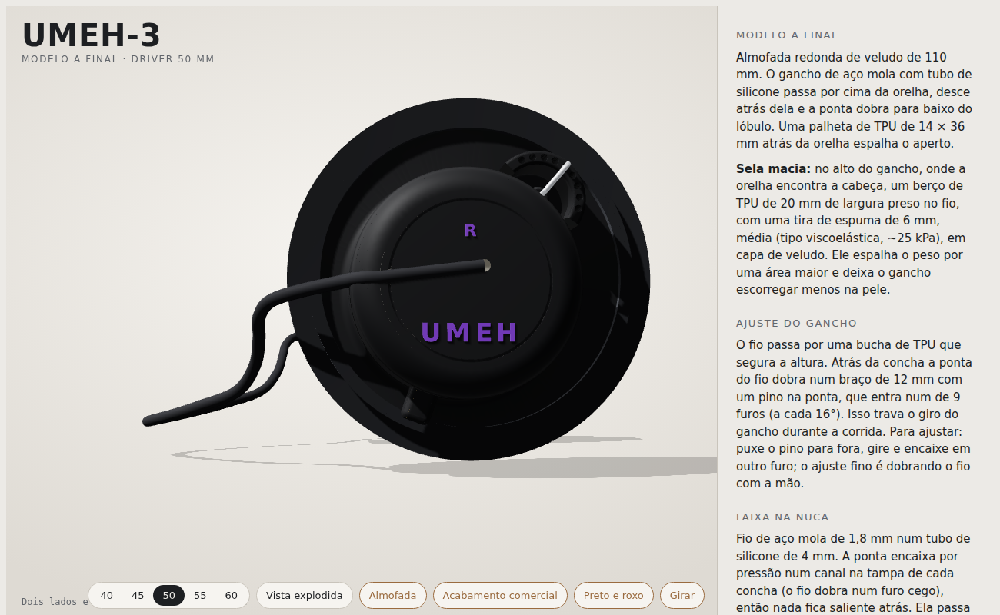

# UMEH-3: impressão das peças

Os arquivos estão em `umeh3/stl/print/`, em milímetros, já na posição de imprimir. Todas as peças são FDM; nenhuma
precisa de cola nem de parafuso.

## Peças

| Arquivo | Quantas | Material | Paredes / topo-fundo / preenchimento | Observação |
|---|---|---|---|---|
| `concha_R.stl`, `concha_L.stl` | 1 de cada | PETG de uma cor só (a logo sai em relevo na mesma cor); bronze opcional | 3 / 4 / 20 % | Placa para baixo. Suporte em árvore **só dentro do copo** (o teto interno é uma ponte de ~49 mm); ele sai pela abertura do driver. Troca de filamento para a logo: veja abaixo. |
| `anel_baioneta.stl` | 2 | PETG (mesma cor da concha; bronze opcional) | 3 / 4 / 30 % | Face com os entalhes para baixo, sem suporte. |
| `adaptador_40mm.stl` … `adaptador_60mm.stl` | 2 do tamanho do seu driver | TPU 95A | 2 / sólido (100 %) | Imprimir devagar (20-25 mm/s). Serve nos dois lados. |
| `bucha_teste_furo_1.35.stl`, `_1.45`, `_1.55` | 1 de cada para testar, depois 2 da escolhida | TPU 95A | sólido | Furo para o fio de 1,6 mm. Escolha a que desliza firme no fio (teste 2 do roteiro). |
| `palheta.stl` | 2 | TPU 95A | 2 / 3 / 15 % giroide | Peça plana; o fatiador deita na face maior. |
| `berco_sela_R.stl`, `berco_sela_L.stl` | 1 de cada | TPU 95A | 2 / 3 / 30 % | Imprimir em pé, como está no arquivo (20 mm de altura), sem suporte. |
| `gabarito_dobra_R.stl`, `gabarito_dobra_L.stl` | 1 de cada | PLA ou PETG | 2 / 3 / 20 % | Ferramenta para dobrar o fio do gancho. Não vai no fone. |
| `gabaritos/gabarito_gancho_R.stl`, `_L.stl` | 1 de cada | PLA ou PETG | 2 / 3 / 20 % | Berço 3D para conferir o fio do gancho dobrado. Não vai no fone. |
| `gabaritos/chave_trava.stl` | 1 | PLA ou PETG | 2 / 3 / 50 % | Chave para dobrar a trava do gancho e cortar o pino. Não vai no fone. |
| `gabaritos/gabarito_faixa.stl` | 1 | PLA ou PETG | 2 / 3 / 20 % | Placa com a forma solta da faixa da nuca (231 × 146 mm, cabe na mesa de 256 mm). Não vai no fone. |

Configuração geral: bico 0,4 mm, camada 0,2 mm (0,15 mm na concha deixa a curva da tampa mais lisa), PETG a 235-245 °C,
mesa 75-80 °C; TPU a 220-230 °C, sem retração ou com retração curta.

## Logo em bronze (opcional, troca de filamento)

Na versão econômica tudo sai numa cor só e a logo fica em relevo, sem troca de filamento. Para destacá-la:

A logo UMEH, a letra do lado (L/R) e o aro que emoldura a tampa ficam 0,4 mm em relevo, que é o topo da concha na impressão. Para elas
saírem em bronze:

1. No fatiador, coloque uma pausa / troca de filamento (M600 ou "pause at height") na **primeira camada acima de
   31,0 mm** (com camada de 0,2 mm, a camada que começa em 31,0 mm).
2. Quando a impressora parar, troque o PETG grafite pelo PETG bronze e retome. Só as letras e o aro são impressos depois disso.

Se preferir não trocar filamento, imprima tudo em grafite e pinte só o topo das letras com tinta acrílica bronze e um
pincel quase seco.

## Versão preto e roxo

Mesmas peças e configurações: concha em PETG preto; anéis, logo e aro da tampa em PETG roxo (a troca de filamento é a
mesma); palheta em TPU roxo; capinha da sela em suede roxo; capa da faixa em silicone roxo (ou termo-retrátil roxo
por cima do silicone preto). Adaptadores, bucha, berço da sela, almofada e tubos do gancho em preto.

## Conferências antes de montar

- Tire o suporte de dentro do copo pela abertura do driver; o canal da faixa e o furo cego na tampa ficam abertos.
- O anel deve entrar na concha e girar 30° com a mão, sem forçar.
- O fio de 1,6 mm deve passar pelo furo da concha (1,9 mm) sem raspar.
