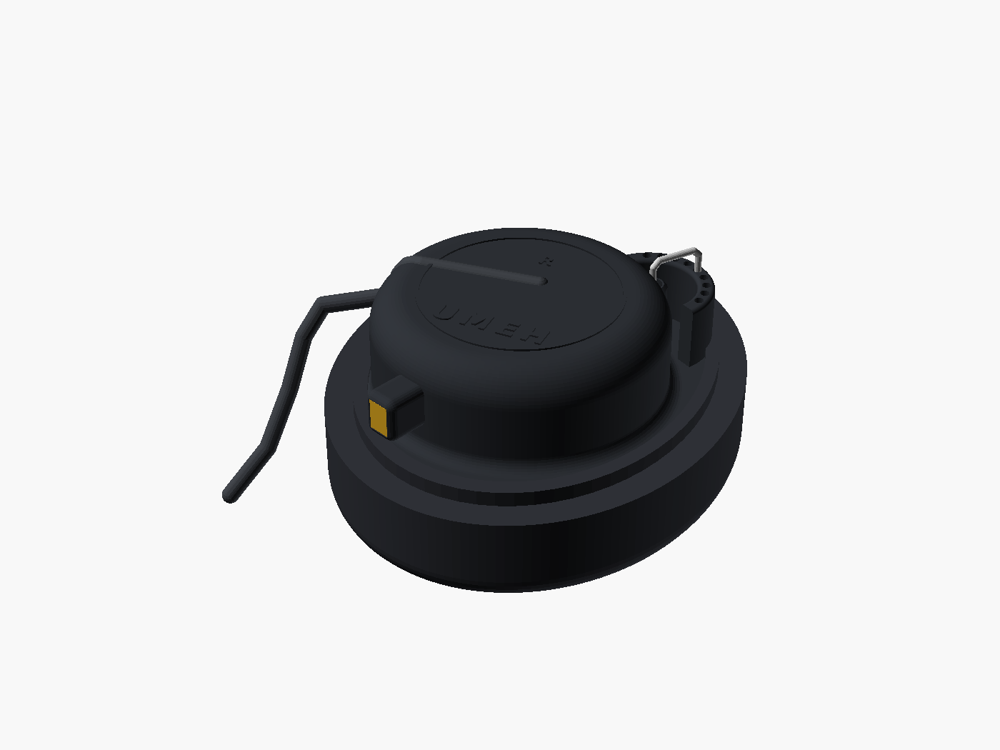
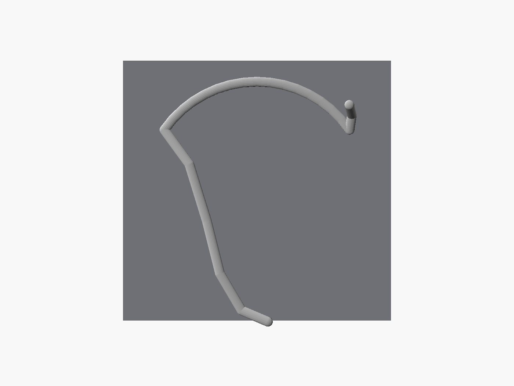
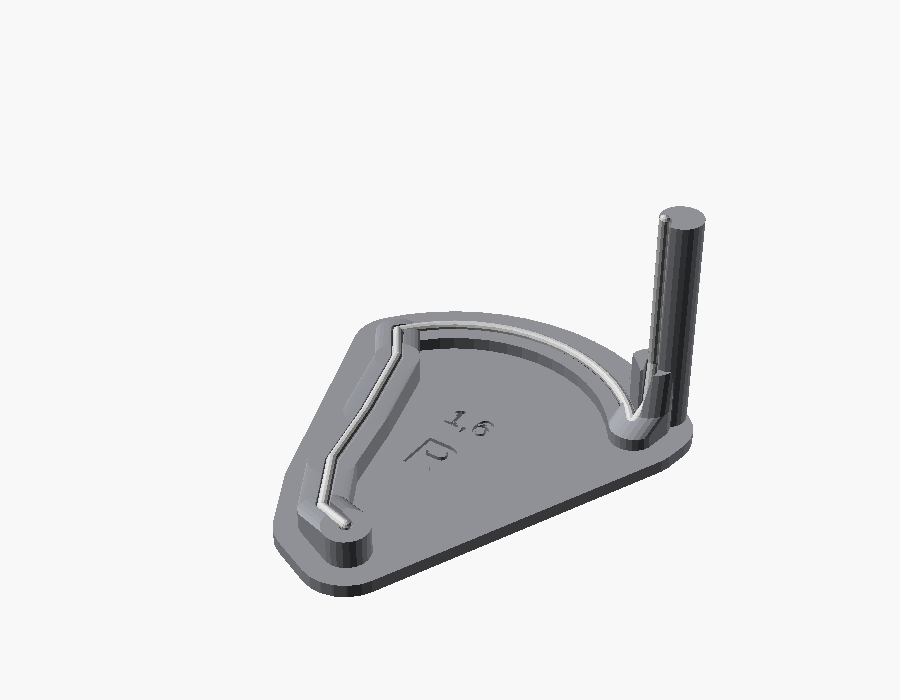
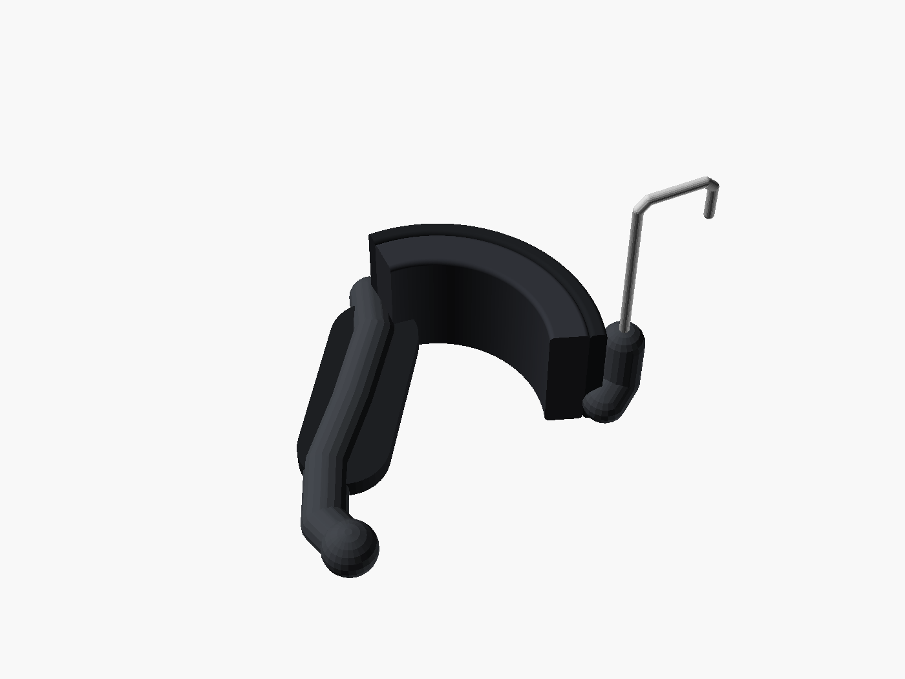
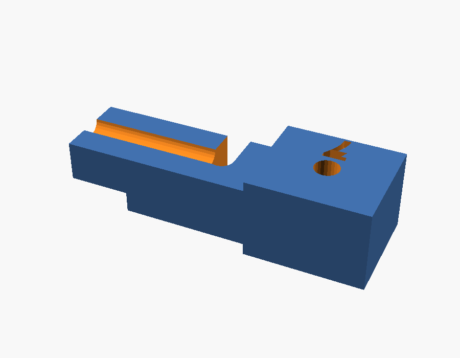
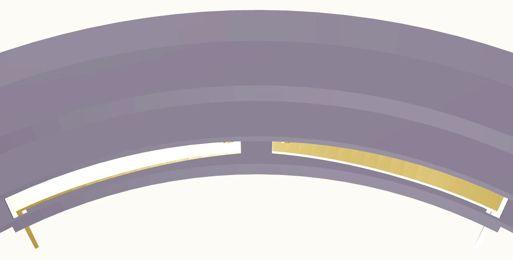
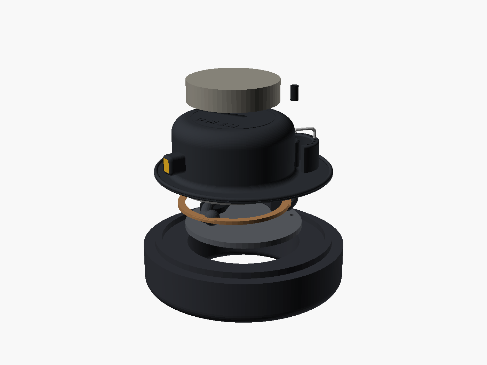
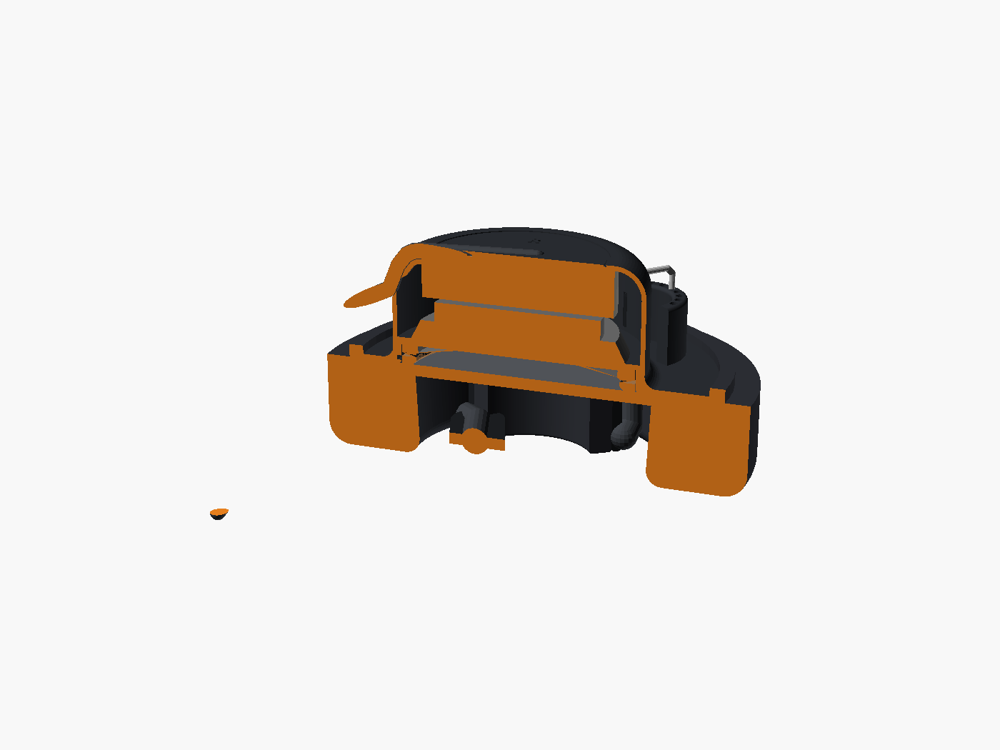
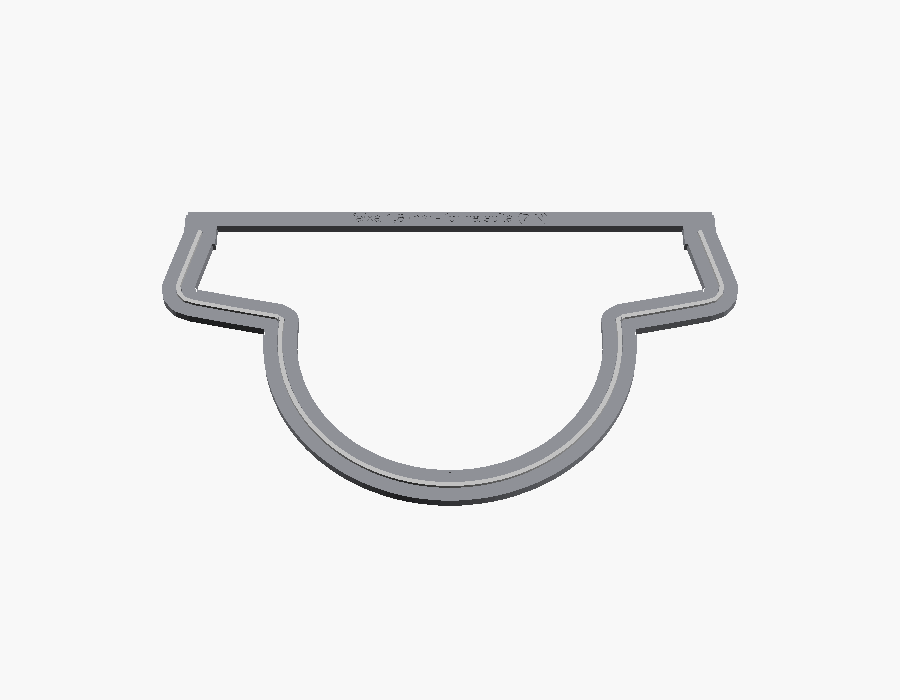
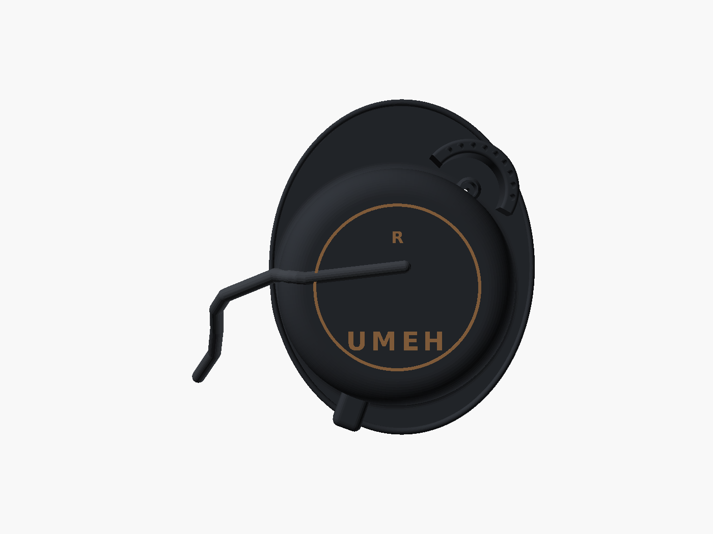

# UMEH-3: guia de montagem

Um lado de cada vez; o lado esquerdo é o espelho do direito (use as peças `_L`). Modelo 3D para consultar de qualquer
ângulo: https://claude.ai/artifact/Sx1FKkQEhf4qXN1DecbGXC

## 1. Dobrar o fio do gancho (corda de piano 1,6 mm)

1. Corte 200 mm de fio (sobra margem para a trava).
2. Ponha o fio no sulco do gabarito (`gabarito_dobra_R` para o lado direito) a partir da ponta de baixo e dobre com os
   dedos e o alicate seguindo o sulco: perna atrás da orelha, arco por cima, e o início da descida. Deixe reta a parte
   que sobra depois do pino do gabarito: ela vai atravessar a concha.

   

3. Fora do gabarito plano, faça as dobras que saem do plano e confira no **berço 3D** (`gabaritos/gabarito_gancho_R` ou
   `_L`): o fio tem que cair no sulco **em todo o comprimento**, do trecho reto em pé (na coluna) até a ponta. O aço mola
   volta um pouco depois de dobrado: dobre um pouco além e corrija até ele assentar sozinho, sem você segurar.

   

4. Lixe a ponta cortada (fio de aço corta a pele).

## 2. Vestir o gancho

Na ordem, pela ponta da perna:

1. **Palheta** (TPU): passe o fio pelo furo da palheta até a altura em que a perna encosta atrás da orelha.
2. **Tubo de PTFE 2 × 4** cortado em três pedaços: perna abaixo da palheta, perna acima dela até o arco, e o arco
   inteiro com a descida (~50 mm + 10 mm).
3. **Silicone 4 × 7** por cima do PTFE na perna e na descida (não no arco). Feche a ponta da perna com uma gota de
   silicone de vedação ou um pedaço de silicone dobrado.
4. **Sela**: corte uma tira de espuma viscoelástica (de travesseiro NASA, pode ser um velho) de 20 × 40 × 6 mm, costure
   uma capinha de pano macio (camiseta velha, microfibra ou suede) que a vista
   junto com a placa do berço, e encaixe o clipe do berço no PTFE do arco (ele entra por pressão). A espuma fica do
   lado de dentro do arco, que apoia na raiz da orelha.

## 3. Gancho na concha

1. Passe a ponta reta do fio por dentro da concha (do lado da almofada para trás) pelo furo ao lado do copo.
2. Empurre a **bucha de TPU** escolhida no teste pelo fio até entrar no furo da bucha atrás da concha.
3. Ajuste a altura do arco (o fio desliza na bucha) e dobre a trava com a **chave da trava** (`gabaritos/chave_trava`):
   encaixe a fenda da chave no fio, com a chave deitada em cima do ressalto e a ponta comprida virada para a parede de
   furos. Dobre o fio 90° por cima da chave, dentro do sulco, e depois 90° para baixo na ponta dela (isso dá a altura e
   os 12 mm certos). Tire a chave de lado, passe o pino pelo furo da aba marcada "7" até a dobra encostar e corte rente
   embaixo: o pino fica com 7 mm. Esse pino entra num dos 9 furos da parede da trava.

   
4. Para girar o gancho depois: puxe o pino para cima, gire, solte em outro furo.

## 4. Conector e contatos de mola (solda só aqui, uma vez)

O driver nunca é soldado: ele encosta em duas lâminas de mola presas no adaptador. A solda é só entre o soquete e as
lâminas, feita uma vez na montagem; depois qualquer driver de 40 a 60 mm troca sem ferro de solda.

1. Corte duas lâminas de **bronze fosforoso 0,2 mm** de **2 × 15 mm** com tesoura. Lixe as rebarbas.
2. Dobre 3 mm de uma ponta a 90° (a aba). Na outra ponta, marque um ponto a 0,6 mm da borda com um prego e uma batida
   leve de martelo: é o calombo que encosta no terminal do driver.
3. Encaixe cada lâmina no rebaixo da face de dentro do adaptador, com a aba passando pela fenda para trás. A parte
   solta (8 mm, do lado da nervura central) fica sobre a janela rasa.
4. Curve a parte solta com a unha para que a ponta fique **~0,5 mm** acima da face, para o lado do driver. Mais que
   isso não precisa: o fundo da janela limita a dobra.
5. Solde dois fios finos (28 AWG) nos pinos do **soquete 0,78 mm**. Marque o positivo (vermelho).
6. Solde cada fio na aba de uma lâmina, por trás do adaptador, e deite o fio no sulco da face de trás. O positivo vai na
   lâmina do lado marcado "+" (a sua escolha; anote).
7. Passe os fios pelo furo da caixa do conector para dentro do copo e encaixe o soquete por pressão na caixa (pinos
   para fora, apontando para baixo e para trás).

## 5. Driver, adaptador e anel (sem cola)

1. Ponha **um pouco de fibra siliconada** (~0,5 g, um tufo solto; serve a de uma almofada velha) no fundo do copo. Não aperte.
2. Gire o **driver** até os dois terminais dele ficarem um de cada lado da **marca** do adaptador (a nervura entre as
   lâminas), com o + do lado da lâmina positiva, e encaixe: a borda do driver entra no assento. Os terminais devem estar
   limpos e planos: raspe a solda velha de um driver reaproveitado. Se a traseira do driver for de **metal**, cole um
   pedacinho de fita isolante no metal sob as lâminas (deixando só os terminais livres), senão o metal liga uma lâmina
   na outra.
3. Coloque o adaptador no bolso da concha com a marca virada para o conector.
4. Teste antes de fechar: ligue o cabo e toque música. Se um lado ficar mudo ou chiar, gire o driver 1 ou 2 mm e
   encaixe de novo.
5. Ponha o **anel de baioneta**: os três ressaltos entram nos três canais, empurre e gire 30° até travar: sentido horário
   olhando de frente no lado direito, anti-horário no esquerdo. Os dois entalhes da face ajudam a girar com a unha. A aba do adaptador fica levemente
   apertada; é isso que segura o driver sem cola e sem chiado.

## 6. Espuma da frente e almofada

1. Corte um disco de **72 mm** de **TNT ou voal** (tecido bem fino, que o som atravessa), com um corte pequeno onde o
   fio do gancho passa, e apoie sobre o anel. Ele só segura poeira; a almofada prende a borda. (Se preferir, serve
   também espuma de filtro de 3 mm, como no projeto original.)
2. Vista a **almofada**: estique a borda elástica de tecido por cima da aba da placa até ela prender atrás do friso.

## 7. Faixa da nuca (corda de piano 1,8 mm)

1. Corte 430 mm de fio de 1,8 mm e dobre 90° os últimos 3,5 mm de cada ponta (esses pinos entram nos furos cegos das
   tampas).
2. Vista a mangueira de silicone 2 × 4 mm no fio, deixando os pinos de fora.
3. Dê a forma da faixa na **placa da faixa** (`gabaritos/gabarito_faixa`): ponha um pino no furo de uma ponta e vá
   dobrando o fio para dentro do sulco até a outra ponta, curvando a parte da nuca com as mãos (dobre um pouco além,
   porque o aço volta). Está certo quando o fio inteiro fica no sulco e os dois pinos caem nos furos sem forçar.
4. **Força (2 N):** a placa já tem a forma solta certa: pontas a ~217 mm uma da outra, que abrem para ~258 mm na
   cabeça. Conferência opcional: abrindo as pontas para 258 mm, uma balança de bagagem presa numa ponta marca ~200 g.

   

5. Encaixe cada ponta: o pino no furo cego e a mangueira no canal da tampa, apertando com o polegar até entrar.

## 8. Cabo e ajuste na cabeça

1. Ligue o cabo 2 pinos nos dois lados (marcação L/R do cabo com o L/R das tampas).
2. Prenda o cabo na faixa perto de cada concha com um anel de silicone ou velcro fino: assim o puxão do cabo vai para a
   faixa e não para a orelha.
3. Vista: passe o gancho por cima da orelha, ajuste a altura (fio deslizando na bucha) para a sela apoiar na raiz da
   orelha e não no topo dela; escolha o furo da trava em que a almofada fica centrada; ajuste fino dobrando o fio com a
   mão.

Se a almofada comprada tiver altura diferente de 25 mm (a encontrada tem 23 mm), o ajuste de altura da bucha compensa.
