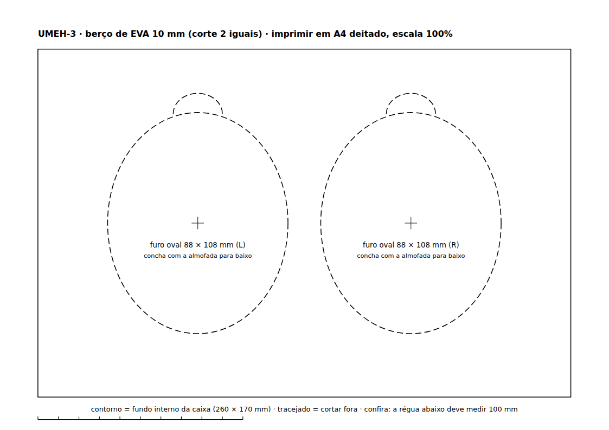
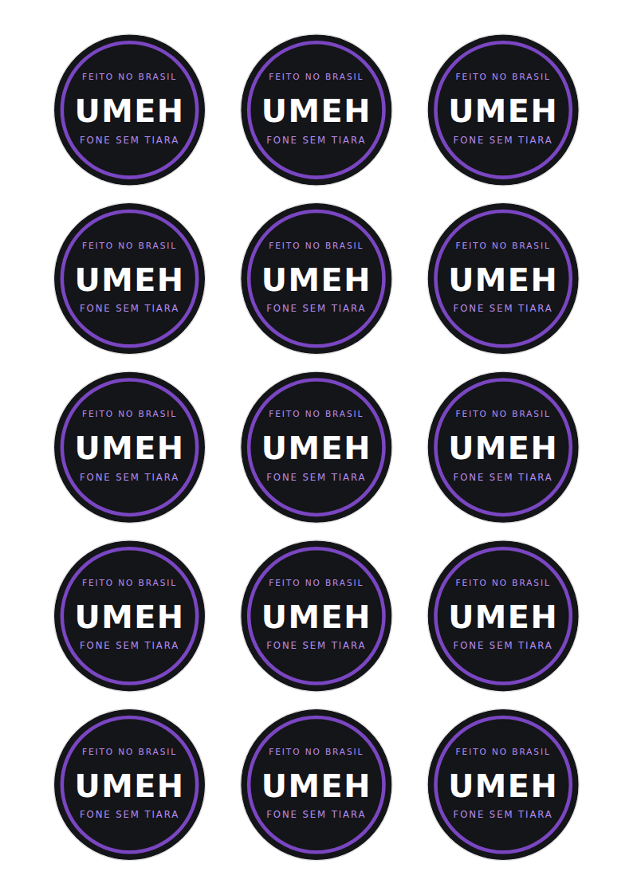
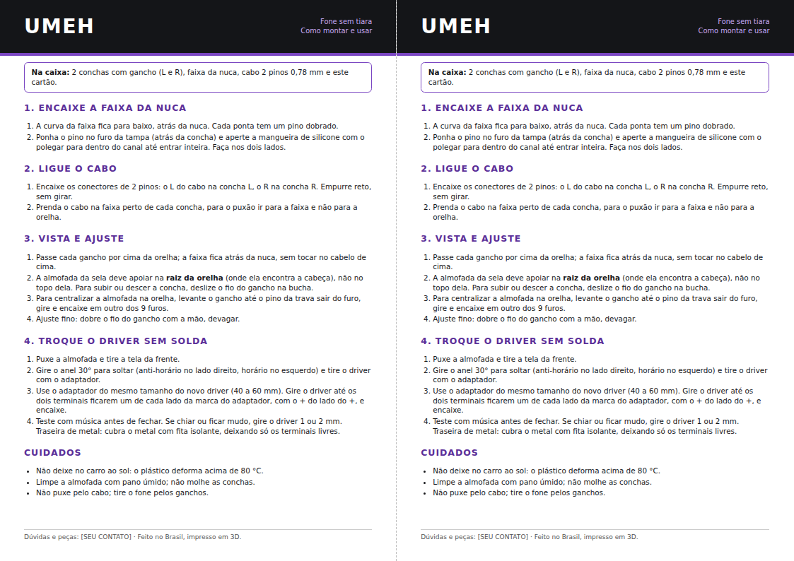

# 7. Embalagem (caixa pronta + adesivo)

Escolhido em 7/10/2026: menos de 50 caixas por mês, caixa de papelão pronta marcada com adesivo do logo, levando o
fone completo, o cabo e o manual. Tudo é feito em casa.

## Medidas do que vai dentro (do modelo 3D)

| Item | Medida | Como vai |
|---|---|---|
| Cada concha com almofada e gancho | 110 × 110 × 56 mm | almofada para baixo, num furo do berço |
| Faixa da nuca (solta das tampas) | ~230 × 120 mm, 46 mm de altura | por cima da placa, com a curva da nuca para baixo |
| Cabo 0,78 mm enrolado | ~80 mm | num saquinho, dentro da curva da faixa |
| Manual / cartão | A6 dobrado | por cima de tudo |

A faixa vai solta para a caixa ficar pequena e a faixa não forçar as conchas na viagem. O cliente encaixa as pontas
como no passo 7.5 da montagem (`03_montagem.md`); o manual precisa ter esse passo.

## Caixa

- **Medida interna mínima: 26 × 17 × 12 cm.** Procure no Mercado Livre por "caixa de papelão correio 27x18x12" ou
  "caixa kraft fechamento automático"; serve qualquer uma com medida interna igual ou um pouco maior (sobra até ~1 cm
  em cada lado se resolve com o berço).
- Preço estimado (não conferido): R$ 2 a 4 a unidade em pacote de 25 a 50.
- Peso total para frete: cerca de 400 g (fone ~180–230 g, cabo ~20 g, caixa ~120 g, EVA ~30 g).

## Berço de EVA (2 camadas iguais)

Molde 1:1: [`embalagem/berco_eva.pdf`](embalagem/berco_eva.pdf) (A4 deitado, imprimir em **escala 100%**, a régua deve
medir 100 mm).

1. Compre placas de **EVA 10 mm** (papelaria, "EVA 10mm 40x60"); uma placa dá 2 berços.
2. Cole o molde no EVA com fita, corte o contorno e os dois furos de 108 mm com estilete de lâmina nova (vá em
   várias passadas, sem forçar). Os entalhes da borda são para o dedo tirar as conchas.
3. Corte **2 camadas** e empilhe no fundo da caixa (20 mm). Se a caixa for maior que 26 × 17 cm, aumente o retângulo
   para a medida interna dela e mantenha os furos centrados.
4. Por cima das conchas vai uma **placa de papelão** do tamanho do fundo (um pedaço de outra caixa), que separa a
   faixa e os acessórios.

O furo de 108 mm é 2 mm menor que a almofada de 110 mm, para ela entrar apertada e a concha não sair do lugar.

## Adesivo do logo

Folha A4 com 15 adesivos de 5 cm: [`embalagem/adesivos_logo.pdf`](embalagem/adesivos_logo.pdf) (escala 100%).

- Imprima em **papel adesivo fotográfico A4** (vinil se quiser resistente a água) numa jato de tinta comum e
  recorte pela linha cinza. Um furador de 5 cm ("furador de papel 5cm") deixa o corte redondo e rápido.
- Use 1 adesivo na tampa e, se quiser, 1 fechando a aba (lacre).

## Cartão "como montar e usar"

Folha A4 deitada com 2 cartões A5: [`embalagem/cartao.pdf`](embalagem/cartao.pdf). Imprima, corte ao meio pela
linha tracejada e dobre ao meio (fica A6). Antes de imprimir, troque **[SEU CONTATO]** em `embalagem/cartao.html`
e gere de novo com `node embalagem/render_cartao.js`.

## Ordem para fechar a caixa

1. 2 camadas de EVA no fundo.
2. Conchas L e R nos furos, almofada para baixo, ganchos virados para o centro.
3. Placa de papelão por cima.
4. Faixa da nuca com a curva para baixo; o cabo enrolado no saquinho dentro da curva.
5. Cartão por cima.
6. Feche, cole o adesivo na tampa e o lacre na aba.

Arquivos gerados por `embalagem/gen.py` (molde e adesivos em SVG) e `embalagem/render.js` (PDF e PNG).
